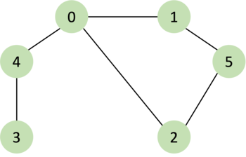
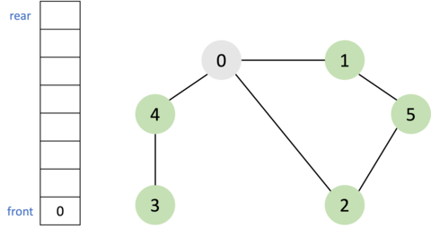
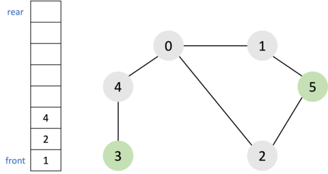
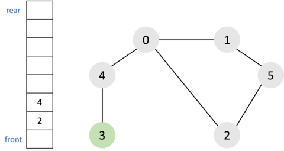

<br />

BFS에 대해 알아보기 전에 우선 그래프(graph), 큐(queue)에 대한 이해가 필요하다. 그래프에 대한 설명은 [[자료구조] 그래프(Graph)란?](https://chamdom.blog/graph/), 큐에 대한 설명은 [[자료구조] JavaScript로 구현하는 큐](https://chamdom.blog/queue-using-js/)에 자세히 정리해두었다.

# BFS란?

**BFS(Breadth First Search)**는 너비 우선 탐색이라고 하며 시작 노드로부터 가까운 노드를 먼저 방문하고 멀리 떨어져 있는 노드를 나중에 방문하는 탐색 방법이다. DFS는 최대한 멀리 있는 노드를 우선으로 탐색하는데, BFS는 그 반대다. BFS는 선입선출 방식인 큐 자료구조를 이용하는 것이 일반적이다. 다른 언어의 경우는 보통 내장 라이브러리에 큐를 제공하고 있다. 하지만 자바스크립트는 큐와 관련된 객체가 내장되어 있지 않다. 따라서 큐를 이용하기 위해서는 직접 자료구조를 구현할 필요가 있다.

### BFS의 동작 방식

1. 탐색 시작 노드를 큐에 삽입하고 방문 처리한다.
2. 큐에서 노드를 꺼내 해당 노드의 인접 노드 중에서 방문하지 않은 노드를 모두 큐에 삽입하고 방문 처리한다.
3. `2`번의 과정을 더 이상 수행할 수 없을 때까지 반복한다.

# BFS 구현

<div class='resize-wrapper'>



</div>

위 그래프를 BFS로 탐색해보자. 인접한 노드가 여러 개 있을 때는 가장 숫자가 작은 노드부터 먼저 큐에 삽입한다고 가정한다.

1. 시작 노드인 `0`을 큐에 삽입하고 방문 처리를 한다.

<div class='resize-wrapper'>



</div>

1. 큐에서 `0`을 꺼내고 방문하지 않은 인접 노드 `1`,`2`,`4`를 큐에 삽입하고 모두 방문 처리를 한다.

<div class='resize-wrapper'>



</div>

1. 큐에서 `1`을 꺼내고 방문하지 않은 인접 노드 `5`를 큐에 삽입하고 방문 처리를 한다.

<div class='resize-wrapper'>



</div>

4. 큐에서 `2`를 꺼내고 방문하지 않은 인접 노드가 없으므로 무시한다.

<div class='resize-wrapper'>


</div>

5. 큐에서 `4`를 꺼내고 방문하지 않은 인접 노드 `3`을 큐에 삽입하고 방문 처리를 한다.

<div class='resize-wrapper'>


</div>

6. 남아 있는 노드에 방문하지 않은 인접 노드가 없다. 따라서 모든 노드를 큐에서 차례대로 꺼낸다.

<div class='resize-wrapper'>


</div>

결과적으로 그래프의 탐색 순서는 다음과 같다. <br/>
`0` → `1` → `2` → `4` → `5` → `3`

## BFS 구현 코드

```js
function BFS(graph, start, visited) {
  const queue = new Queue();
  queue.push(start);
  visited[start] = true;

  while (queue.size()) {
    const v = queue.popleft();
    console.log(v);

    for (const node of graph[v]) {
      if (!visited[node]) {
        queue.push(node);
        visited[node] = true;
      }
    }
  }
}

const graph = [[1, 2, 4], [0, 5], [0, 5], [4], [0, 3], [1, 2]];
const visited = Array(6).fill(false);
BFS(graph, 0, visited);
// 0 1 2 4 5 3
```

## 큐(Queue) 구현 코드

```js
class Queue {
  constructor() {
    this.store = {};
    this.front = 0;
    this.rear = 0;
  }

  size() {
    if (this.store[this.rear] === undefined) {
      return 0;
    } else {
      return this.rear - this.front + 1;
    }
  }

  push(value) {
    if (this.size() === 0) {
      this.store['0'] = value;
    } else {
      this.rear += 1;
      this.store[this.rear] = value;
    }
  }

  popleft() {
    let temp;
    if (this.front === this.rear) {
      temp = this.store[this.front];
      delete this.store[this.front];
      this.front = 0;
      this.rear = 0;
      return temp;
    } else {
      temp = this.store[this.front];
      delete this.store[this.front];
      this.front += 1;
      return temp;
    }
  }
}
```

# BFS의 시간 복잡도

BFS는 그래프가 인접 리스트로 표현되어 있으면 전체 수행시간이 $O(n+e)$이며, 인접 행렬로 표현된 경우는 $O(n^2)$ 시간이 걸린다. BFS도 DFS와 같이 `희소 그래프`를 사용할 때 인접 리스트를 사용하는 것이 효율적이다.

<br />

# 참고

- [이것이 취업을 위한 코딩테스트다](http://www.yes24.com/Product/Goods/91433923)
- [C언어로 쉽게 풀어쓴 자료구조](http://www.yes24.com/Product/Goods/69750539)
