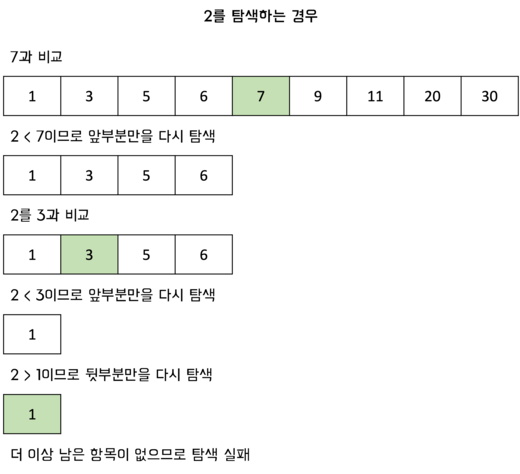

# 이진 탐색이란?

**이진 탐색(binary search)**은 <u>검색 범위를 줄여 나가면서 원하는 데이터를 검색하는 알고리즘이다.</u>

이진 탐색은 데이터가 정렬되어 있어야만 사용할 수 있는 알고리즘이다. 데이터가 무작위일 때는 사용할 수 없지만, 정렬된 데이터에서 매우 빠르게 데이터를 찾을 수 있다. 이진 탐색은 실제로 우리가 일상생활에서 많이 이용하고 있는 방법이다. 영어 사전에서 단어를 찾을 때 항상 사용하고 있는 방법이 이진 탐색이다.

# 이진 탐색 과정

이진 탐색은 배열의 중앙에 있는 값을 조사하여 찾고자 하는 항목이 왼쪽 또는 오른쪽 부분 배열에 있는지를 알아내어 탐색의 범위를 반으로 줄인다. 이러한 방법을 따라 매 단계에서 검색해야 할 리스트의 크기를 반으로 줄인다.

<br/>

이진 탐색은 위치를 나타내는 변수 3개를 시용하는데 탐색하고자 하는 범위의 **시작점(start)**, **끝점(end)**, 그리고 **중간점(mid)**이다. 찾으려는 데이터와 중간점 위치에 있는 데이터를 반복적으로 비교해서 원하는 데이터를 찾는 게 이진 탐색 과정이다.

그림을 통해 이진 탐색의 과정을 살펴보자.

#### 탐색 성공


#### 탐색 실패



# 코드 구현

### 재귀를 이용한 이진 탐색

```js
function binarySearch(dataList, target, start, end) {
  if (start > end) return null;

  const mid = Math.floor((start + end) / 2);
  // 찾은 경우 중간점 인덱스 반환
  if (dataList[mid] === target) return mid;
  // 중간점의 값보다 찾고자 하는 값이 작은 경우 왼쪽 탐색
  else if (dataList[mid] > target)
    return binarySearch(dataList, target, start, mid - 1);
  // 중간점의 값보다 찾고자 하는 값이 큰 경우 오른쪽 탐색
  else return binarySearch(dataList, target, mid + 1, end);
}

const array = [1, 3, 5, 6, 7, 9, 11, 20, 30];
const result = binarySearch(array, 11, 0, array.length - 1);
console.log(result); // 6
```

### 반복문을 이용한 이진 탐색

```js
function binarySearch(dataList, target, start, end) {
  let mid = 0;

  while (start <= end) {
    mid = Math.floor((start + end) / 2);
    // 찾은 경우 중간점 인덱스 반환
    if (dataList[mid] === target) return mid;
    // 중간점의 값보다 찾고자 하는 값이 작은 경우 왼쪽 탐색
    else if (dataList[mid] > target) end = mid - 1;
    // 중간점의 값보다 찾고자 하는 값이 큰 경우 오른쪽 탐색
    else start = mid + 1;
  }
  return null;
}
const array = [1, 3, 5, 6, 7, 9, 11, 20, 30];
const result = binarySearch(array, 11, 0, array.length - 1);
console.log(result); // 6
```

# 이진 탐색의 시간 복잡도

이진 탐색에서는 비교가 이루어질 때마다 탐색 범위가 급격하게 줄어든다. 찾고자 하는 항목이 속하지 않은 부분은 전혀 고려할 필요가 없기 때문이다.

이진 탐색은 한 번 확인할 때마다 확인하는 원소의 개수가 절반씩 줄어든다는 점에서 시간 복잡도가 $O(logN)$이다. 단계마다 2로 나누는 것과 같으므로 <u>연산 횟수는 $log_2N$에 비례한다고 할 수 있다.</u>

빅오 표기법에 따라서 간단히 **$O(logN)$**이라고 작성한다.

<br />

# 참고

- [C언어로 쉽게 풀어쓴 자료구조](http://www.yes24.com/Product/Goods/69750539)
- [이것이 취업을 위한 코딩테스트다](http://www.yes24.com/Product/Goods/91433923)
- [파이썬 알고리즘 인터뷰](http://www.yes24.com/Product/Goods/91084402)
- https://bigsong.tistory.com/33
