<br />

dfs에 대해 알아보기 전에 우선 그래프에 대한 이해가 필요하다. 그래프에 대한 설명은 [여기](https://chamdom.blog/graph/)에 자세히 정리해두었다.

# DFS란?

**DFS(Depth-First-Search)**는 **깊이 우선 탐색**이라고 하며 그래프에서 깊은 부분을 우선으로 탐색하는 알고리즘이다. DFS는 트리에서 생각하면 이해하기 쉽다(트리도 그래프의 일종이다). 트리를 탐색할 때 시작 노드에서 한 방향으로 계속 탐색하다가 더 이상 갈 수 없을 때 다시 가장 가까운 노드로 되돌아와 다시 탐색을 진행하는 방법과 유사하다.

DFS를 구현하는 데는 2가지의 방법이 있다. 첫 번째는 재귀를 이용하는 것이고 두 번째는 스택(반복문)을 이용하는 것이다.

# DFS 구현

## 재귀를 이용한 DFS(Recursive DFS)

### Recursive DFS의 동작 방식

1. 방문 여부를 기록하기 위해 배열 visited를 사용하며, 배열 visited의 값을 `false`로 초기화한다.
2. 노드를 방문할 때마다 해당 노드의 visited 배열 값을 `true`로 변경한다.
3. 해당 노드(`v`)와 연결된 노드 중에 방문하지 않은 노드(`node`)이 있다면 방문하지 않은 노드(`node`)를 시작점으로 하여 DFS를 다시 시작한다.

```jsx
function dfs(graph, v, visited) {
  // 현재 노드를 방문 처리
  visited[v] = true;
  console.log(v);

  // 현재 노드와 연결된 다른 노드를 재귀적으로 방문
  for (let node of graph[v]) {
    if (!visited[node]) {
      dfs(graph, node, visited);
    }
  }
}

const graph = [[1, 2, 3], [0, 6], [0], [0, 4, 5], [3], [3], [1]];
const visited = Array(6).fill(false);

dfs(graph, 0, visited);
// 0 1 6 2 3 4 5
```

## 스택을 이용한 DFS(Iterative DFS)

### Iteractive DFS의 동작 방식

1. 스택에 시작 노드를 push 한다.
2. 스택에서 노드를 pop하고 해당 노드(`v`)가 방문하지 않은 노드라면 방문처리 한다.
3. 노드(`v`)와 연결된 노드 중에서 방문하지 않은 노드(`node`)이 있다면 stack에 push 한다.
4. stack의 길이가 0이 될 때까지 `2`, `3`번 과정을 반복한다.

그림을 통해 먼저 구현과정을 보자. 아래 그래프를 DFS로 탐색할 것이다. 인접한 노드 중에서 방문하지 않은 노드가 여러 개 있으면 숫자가 큰 노드부터 탐색(스택으로 구현하기 때문에)한다고 가정한다.
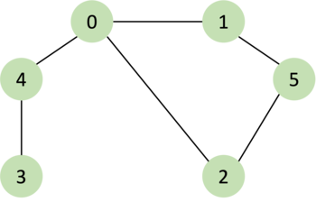

1. 시작 노드인 `0`을 스택에 삽입한다.

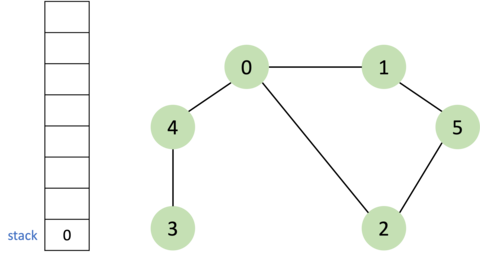

<br />

2. 스택에서 `0`을 제거하고 방문 처리를 한다. `0` 노드의 방문하지 않은 인접 노드 `1`, `2`, `4`를 스택에 삽입한다.

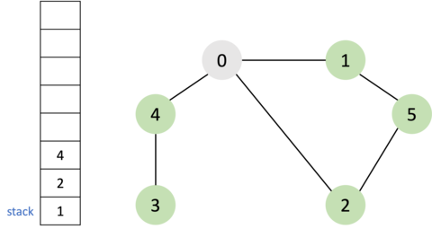

<br />

3. 스택의 제일 상위에 있는 `4`를 제거하고 방문 처리를 한다. `4` 노드의 방문하지 않은 인접 노드 `3`을 스택에 삽입한다.

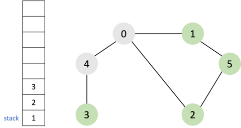

<br />

4. 스택에서 `3`을 제거하고 방문 처리를 한다. 노드 `3`의 방문하지 않은 인접 노드는 없으므로 무시된다.

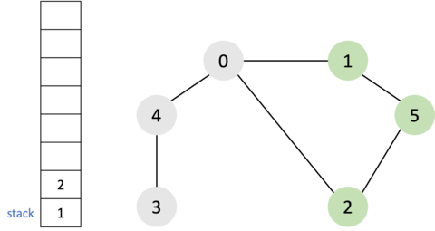

<br />

5. 스택에서 `2`를 제거하고 방문 처리를 한다. 노드 `2`의 방문하지 않은 인접 노드 `5`를 스택에 삽입한다.

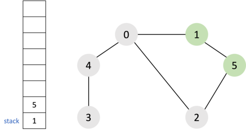

<br />

6. 스택에서 `5`를 제거하고 방문 처리를 한다. 노드 `5`의 방문하지 않은 인접 노드 `1`을 스택에 삽입한다.

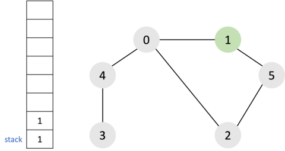

<br />

7. 스택에서 `1`을 제거하고 방문 처리를 한다. 노드 `1`의 방문하지 않은 인접 노드는 없으므로 무시된다.


<br />

8. 스택에서 `1`을 제거한다. 노드 `1`은 이미 방문한 노드이므로 무시된다.

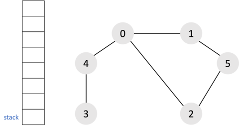

<br />

결과적으로 그래프의 탐색 순서는 다음과 같다. <br/>
`0` → `4` → `3` → `2` → `5` → `1`

### 코드 구현

```jsx
function dfs(graph, start, visited) {
  const stack = [];
  stack.push(start);

  while (stack.length) {
    let v = stack.pop();
    if (!visited[v]) {
      console.log(v);
      visited[v] = true;

      for (let node of graph[v]) {
        if (!visited[node]) {
          stack.push(node);
        }
      }
    }
  }
}
const graph = [[1, 2, 4], [0, 5], [0, 5], [4], [0, 3], [1, 2]];
const visited = Array(7).fill(false);

dfs(graph, 0, visited);
// 0 4 3 2 5 1
```

출력된 결과를 보면 Recursive DFS는 `사전식 순서`로 방문한 데 반해 와 Iteractive DFS는 역순으로 방문한 것을 알 수 있다. 이는 Iteractive DFS가 스택으로 구현하다 보니 가장 마지막에 삽입된 노드부터 꺼내서 반복하게 되고 인접 노드를 한꺼번에 추가하기 때문에 가장 마지막에 스택에 담긴 노드부터 방문하기 때문이다. 두 경우 모두 DFS 알고리즘에 따라 정상적으로 모든 노드의 방문을 마쳤기 때문에 잘못된 결과가 아니다.

> DFS의 기능을 생각하면 순서와 상관없이 처리해도 되지만, 코딩 테스트에서는 번호가 낮은 순서부터 처리하도록 명시하는 경우가 종종 있다. 따라서 관행적으로 번호가 낮은 순서부터 처리하도록 구현하는 편이다.

### 스택을 사용한 DFS의 문제점

자바스크립트로 재귀를 사용한 DFS(이하 Recursive DFS)로 알고리즘 문제를 풀다 보면 시간초과가 나는 상황이 발생한다.
파이썬은 `sys.setrecursionlimit`을 사용하여 재귀의 최대 깊이를 설정할 수 있어서 Recursive DFS로 문제를 풀더라도 대부분 해결된다.🥲 자바스크립트로 문제를 해결하기 위해서는 스택을 이용한 DFS(이하 Iteractive DFS)를 이용해야 한다.

알고리즘 문제 중에 리프노드에서 어떤 연산을 시작하여 부모 노드로 결과 값을 전달하는 경우가 있는데 Recursive DFS는 해당 연산을 모든 탐색이 끝나는 지점에서 수행할 수 있다. Iteractive DFS의 문제점이 여기서 발생하는데, 바로 `더 이상 탐색할 수 없는 노드`의 탐색이 끝나면 Recursive DFS는 부모로 돌아오는 로직이 존재하지만, Iteractive DFS는 존재하지 않는 것이다. 현재 노드가 stack에서 pop 되기 때문에 부모로 돌아오는 것이 아니라 제일 상위에 있는 부모의 자식 노드로 넘어가게 된다. 따라서 Iteractive DFS를 **Recursive DFS와 같이 만들어주는 작업**이 필요하다.

## 개선된 Iterative DFS

Recursive DFS와 같이 동작하도록 Iteractive DFS 코드를 개선해보자.

```jsx
function dfs(graph, visited) {
  // 루트 노드는 부모가 없으므로 -1, null, undefined 등 존재할 수 없는 수를 넣어준다.
  const stack = [[0, -1]];

  while (stack.length) {
    // 구조 분해를 통해 현재 노드와 부모 노드를 선언
    let [cur, parent] = stack.pop();

    ...

    // stack 다시 push해준다.
    stack.push([cur, parent]);

    ...

  }
}
```

부모 노드를 추적하고 부모 노드로 되돌아가는 로직을 수행하기 위해 stack에서 pop하고 다시 push를 해주는 작업을 하게 된다. 이때 유의할 점이 pop 이후에 이미 방문한 노드를 바로 push 하면 무한루프에 빠질 수 있기 때문에 pop과 push 사이에 조건을 넣어줘야 한다. 이 부분이 **기존의 Iteractive DFS에서 빠져 있던 부분이고 Recursive DFS와 같게 만들어 주는데 필요한 로직**이다.

```jsx
function dfs(graph, visited) {
  const stack = [[0, -1]];

  while (stack.length) {
    let [cur, parent] = stack.pop();

    // 기존 DFS에서 빠져있던 로직이다!
    // 이미 방문한 노드라면 다른 노드의 부모 노드이거나 리프노드인 경우이다.
    if (visited[cur]) {
      continue;
    }

    stack.push([cur, parent]);
    visited[cur] = true;

    ...

  }
}
```

방문하지 않았던 노드라면 `cur`은 부모 노드가 되어 다음 노드를 계속 탐색하게 된다.

```jsx
function dfs(graph, visited) {
  const stack = [[0, -1]];

  while (stack.length) {
    let [cur, parent] = stack.pop();

    if (visited[cur]) {
      continue;
    }

    stack.push([cur, parent]);
    visited[cur] = true;
    console.log(cur);

    // 현재 노드 cur는 다음 node의 부모 노드가 된다.
    for (const node of graph[cur]) {
      // 방문하지 않았다면 stack에 push한다.
      if (!visited[node]) stack.push([node, cur]);
    }
  }
}
```

개선된 Iteractive DFS의 동작 과정 그림으로 통해 알아보자. 그래프는 위와 같은 그래프로 사용한다.

1. 시작 노드인 `0`을 스택에 삽입한다. 이때 0은 루트 노드(부모가 없는 노드)이므로 부모노드는 `-1`,`undefined`,`null`과 같은 존재하지 않는 수를 넣어준다. 이 예제에서는 `-1`을 부모 노드로 삽입한다.

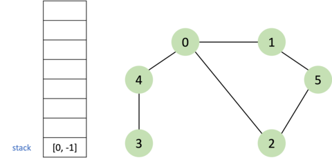

<br />

2. 스택에서 `[0, -1]`을 제거하고 방문한 노드인지 체크한다. 노드 `0`은 방문하지 않은 노드이므로 다시 스택에 삽입하고 방문처리를 한다. `0` 노드의 방문하지 않은 인접 노드 `1`, `2`, `4`를 부모 노드인 `0`과 함께 `[1, 0]`, `[2, 0]`, `[4, 0]` 형태로 스택에 삽입한다.

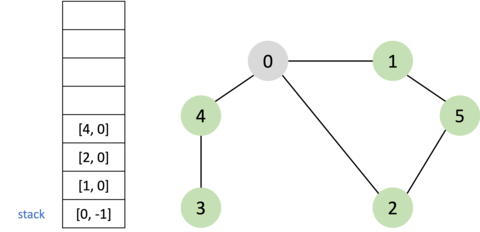

<br />

3. 스택의 제일 상위에 있는 `[4, 0]`을 제거하고 방문한 노드인지 체크한다. 노드 `4`는 방문하지 않은 노드이므로 다시 스택 삽입하고 방문처리를 한다. `4` 노드의 방문하지 않은 인접 노드 `3`을 부모 노드인 `4`와 함께 `[3, 4]` 형태로 스택에 삽입한다.

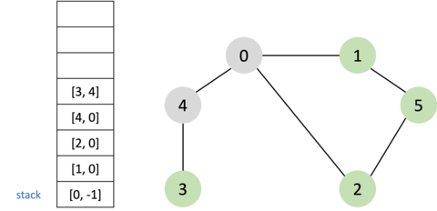

<br />

4. 스택에서 `[3, 4]`를 제거하고 방문한 노드인지 체크한다. 노드 `3`은 방문하지 않은 노드이므로 다시 스택에 삽입하고 방문처리를 한다. 노드 `3`의 인접 노드 중에 방문하지 않은 노드가 없으므로 다음 과정은 무시된다.


<br />

5. 스택에서 `[3, 4]`를 제거한다. 노드 `3`은 방문한 노드이므로 다음 과정은 무시하고 다음 반복으로 넘어간다.

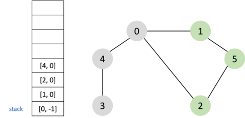

<br />

6. 스택에서 `[4, 0]`를 제거한다. 노드 `4`는 방문한 노드이므로 다음 과정은 무시하고 다음 반복으로 넘어간다.


<br />

7. 스택에서 `[2, 0]`를 제거한고 방문한 노드인지 체크한다. 노드 `2`는 방문하지 않은 노드이므로 다시 스택 삽입하고 방문처리를 한다. `2` 노드의 방문하지 않은 인접 노드 `5`를 부모 노드인 `2`와 함께 `[5, 2]` 형태로 스택에 삽입한다.

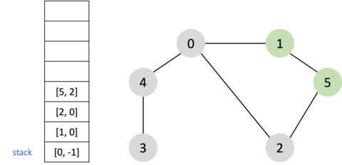

<br />

8. 스택에서 `[5, 2]`를 제거하고 방문한 노드인지 체크한다. 노드 `5`는 방문하지 않은 노드이므로 다시 스택에 삽입하고 방문처리를 한다. 노드 `5`의 방문하지 않은 인접 노드 `1`을 부모 노드인 `5`와 함께 `[1, 5]` 형태로 스택에 삽입한다.

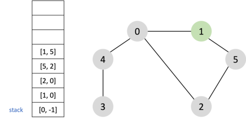

<br />

9. 스택에서 `[1, 5]`를 제거하고 방문한 노드인지 체크한다. 노드 `1`은 방문하지 않은 노드이므로 다시 스택에 삽입하고 방문처리를 한다. 노드 `1`의 인접 노드 중에 방문하지 않은 노드가 없으므로 다음 과정은 무시된다.

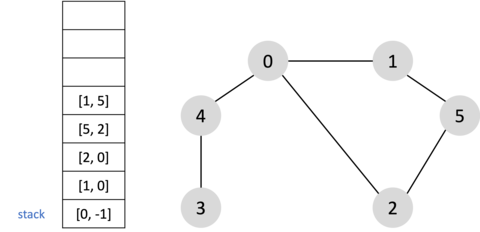

<br />

10. 나머지 노드들은 모두 방문한 노드이므로 스택에서 하나씩 제거하고 반복이 종료된다.

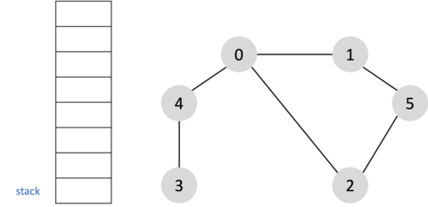

<br />

# DFS의 시간 복잡도

노드의 수가 **$N$**이고 간선의 수가 **$E$**인 그래프에서 그래프가 **인접 리스트**로 표현되어 있다면 **$O(N+E)$**이고, **인접 행렬**로 표시되어 있다면 **$O(N^2)$**이다. 이는 희소 그래프인 경우 DFS는 인접 리스트의 사용이 인접 행렬보다 시간적으로 유리함을 의미한다.

<br />

---

# 참고

- [자료구조-Stack을-이용한-Iterative-DFS-구현](https://velog.io/@longroadhome/%EC%9E%90%EB%A3%8C%EA%B5%AC%EC%A1%B0-Stack%EC%9D%84-%EC%9D%B4%EC%9A%A9%ED%95%9C-Iterative-DFS-%EA%B5%AC%ED%98%84#iterative-dfs-%EB%B0%A9%EB%AC%B8-%EA%B5%AC%ED%98%84)
- [이것이 취업을 위한 코딩테스트다](http://www.yes24.com/Product/Goods/91433923)
- [C언어로 쉽게 풀어쓴 자료구조](http://www.yes24.com/Product/Goods/69750539)
