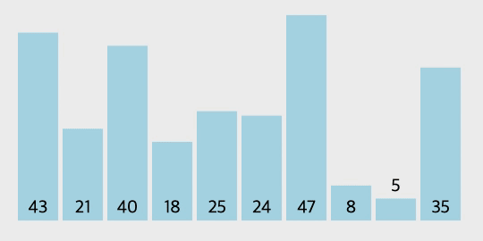

# 삽입 정렬(Insertion Sort)이란?

삽입 정렬은 선택 정렬처럼 동작 원리를 직관적으로 이해하기 쉬운 알고리즘이다. 삽입 정렬은 특정한 데이터를 적절한 위치에 삽입한다는 의미에서 **삽입 정렬(Insertion Sort)**이라고 한다. 삽입 정렬은 필요할 때만 위치를 바꾸므로 **데이터가 거의 정렬 되어 있을 때** 훨씬 효율적이다. 선택 정렬은 현재 데이터의 상태와상관없이 무조건 모든 원소를 비교하고 위치를 바꾸는 반면 삽입 정렬은 그렇지 않다.

삽입 정렬은 손안의 카드를 정렬하는 방법과 유사하다. 새로운 카드가 들어오면 새로운 카드를 기존의 정렬된 카드 사이의 올바른 자리를 찾아 삽입 함으로써 정렬이 유지되게 한다. 이와 같은 작업을 카드의 수만큼 반복하게 되면 전체 카드가 정렬된다. 삽입 정렬은 특정한 데이터가 적절한 위치에 들어가기 이전에, 그 앞까지의 데이터는 이미 정렬되어 있다고 가정한다. 정렬되어 있는 데이터 리스트에서 적절한 위치를 찾은 뒤, 그위치에 삽입된다는 점이 특징이다.

### 삽입 정렬의 원리

삽입 정렬은 두 번째 데이터부터 시작한다. 왜냐하면 이전 데이터(시작할 때는 첫 번째 데이터)는 그 자체로 정렬되어 있다고 판단하기 때문이다. 정렬되어 있지 않은 부분의 첫 번째 데이터가 정렬된 부분의 어느 위치에 삽입되어야 하는가를 판단한 후 해당 위치에 이 데이터를 삽입하게 되면, 정렬된 부분의 크기는 하나 커지게 되고 정렬되지 않은 부분의 크기는 하나 줄게된다.

### GIF로 보는 삽입 정렬



<br />

# 코드 구현

### JavaScript 코드

```js
const insertionSort = data => {
  for (let i = 1; i < data.length; i++) {
    for (let j = i - 1; j > 0; j--) {
      if (data[j] < data[j - 1])
        [data[j], data[j - 1]] = [data[j - 1], data[j]];
    }
  }
  return data;
};

const dataList = [43, 21, 40, 18, 25, 24, 47, 8, 5, 35];
console.log(selectionSort(dataList));
// [5, 8, 18, 21, 24, 25, 35, 40, 43, 47]
```

### Python 코드

```python
def insertion_sort(data):
    for i in range(1, len(data)):
      for j in range(i - 1, 0, -1):
        if data[j] < data[j - 1]:
          data[j], data[j - 1] = data[j - 1], data[j]

  return data


data_list = [43, 21, 40, 18, 25, 24, 47, 8, 5, 35]
print(selection_sort(data_list))
# [5, 8, 18, 21, 24, 25, 35, 40, 43, 47]
```

# 삽입 정렬의 시간 복잡도

삽입 정렬의 시간 복잡도는 **$O(N^2)$** 이다. 소스코드 상으로 간단한 형태의 2중 반복문이 사용되었기 때문이다.
데이터 리스트가 어느 정도 정렬되어 있는 경우 매우 빠르게 동작하는데 이때 알고리즘의 시간복잡도는 $O(N)$이다.

| 최악     | 평균     | 최선   |
| -------- | -------- | ------ |
| $O(N^2)$ | $O(N^2)$ | $O(N)$ |

# 삽입정렬의 장단점

### 장점

- 알고리즘이 단순하다.
- 데이터 리스트가 이미 정렬되어 있는 경우, 매우 효율적이다.
- `in-place` 정렬 알고리즘이기 때문에 공간 낭비가 적다.

### 단점

- 다른 정렬 알고리즘과 비교해 성능이 나쁘다.
- 많은 데이터의 이동을 포함하기 때문에 정렬해야 할 데이터가 많고 클 경우 경우에 알맞지 않다.
- 적은 수의 데이터를 정렬할 때만 유용하다.

<br />

---

# 참고

- https://www.fun-coding.org/
- http://dbmspoly.blogspot.com/p/advantage-disadvantages-of-sort.html
- https://visualgo.net/en/sorting
- [이것이 취업을 위한 코딩테스트다](http://www.yes24.com/Product/Goods/91433923)
- [C언어로 쉽게 풀어쓴 자료구조](http://www.yes24.com/Product/Goods/69750539)
