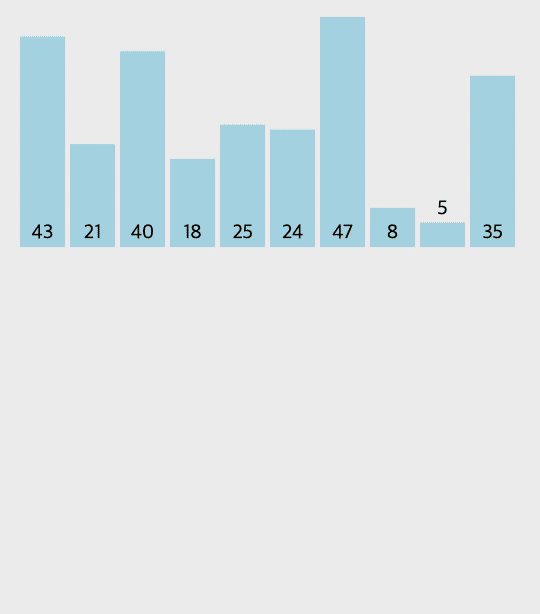

# 병합 정렬(Merge Sort)이란?

**병합 정렬(Merge Sort)**은 <u>분할 정복 기법(Divide and Conquer)</u>과 <u>재귀 용법</u>을 활용한 정렬 알고리즘이다.

병합 정렬은 정렬할 원소 목록을 원소가 하나 밖에 남지 않을 때까지 절반으로 잘라 비슷한 크기의 두 부분으로 계속 나눈다. 정렬할 때는 각 절반의 가장 작은 요소를 비교하여 수행된다. (각 목록의 첫 번째 요소가 가장 먼저 비교된다.) 더 작은 값으로 시작되는 것을 정렬된 목록에 추가한다.

## 병합 정렬 과정

#### 분할(Divide)

- 입력 리스트를 거의 동일한 크기의 두 부분 리스트로 나눈다.
- 이 과정은 각 부분 리스트의 길이가 1이 될 때까지 재귀적으로 계속된다.

#### 정복(Conquer)

- 재귀적으로 각 부분 리스트를 정렬한다.
- 부분 리스트의 길이가 1이면 이미 정렬된 상태로 간주한다.

#### 결합(Combine)

- 정렬된 부분 리스트들을 하나의 정렬된 리스트로 병합한다.
- 이 단계에서 실제 정렬이 이루어진다.

## GIF로 보는 병합 정렬



<br />

# 코드 구현

```js
const merge = (left, right) => {
  let merged = [];

  while (left.length && right.length) {
    if (left[0] < right[0]) {
      sorted.push(left.shift());
    } else {
      sorted.push(right.shift());
    }
  }

  return [...sorted, ...left, ...right];
};

const mergeSort = data => {
  if (data.length < 2) return data;

  let mid = Math.floor(data.length / 2);
  let left = mergeSort(data.slice(0, mid));
  let right = mergeSort(data.slice(mid));

  return merge(left, right);
};

const dataList = [43, 21, 40, 18, 25, 24, 47, 8, 5, 35];
console.log(selectionSort(dataList));
// [5, 8, 18, 21, 24, 25, 35, 40, 43, 47]
```

# 병합 정렬의 시간 복잡도

|    최악    |    평균    |    최선    |
| :--------: | :--------: | :--------: |
| $O(NlogN)$ | $O(NlogN)$ | $O(NlogN)$ |

# 병합정렬의 장단점

### 장점

- 항상 동일한 시간이 소요되므로 어떤 경우에도 좋은 성능을 낼 수 있다.
- 퀵 정렬과 달리 기준값(pivot)을 설정하는 과정이 없어 기준값에 따라 성능이 달라지는 경우가 없다.

### 단점

- `in place` 정렬 알고리즘이 아니기 때문에 데이터의 양이 많은 경우 이동횟수가 많아진다.
- 임시배열에 원본을 계속해서 옮기며 정렬을 하는 방식이기 때문에 추가적인 메모리가 필요하다.

<br />

# 참고

- https://www.fun-coding.org/
- http://dbmspoly.blogspot.com/p/advantage-disadvantages-of-sort.html
- https://visualgo.net/en/sorting
