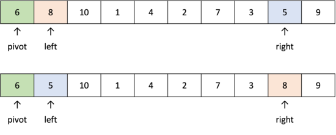
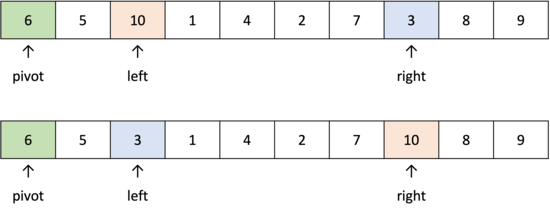
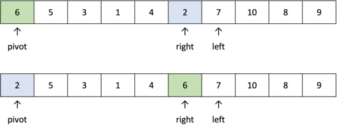
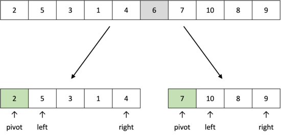

# 퀵 정렬이란?

퀵 정렬은 평균적으로 매우 빠른 수행 속도를 자랑하는 정렬 알고리즘이다. 퀵 정렬은 합병 정렬과 비슷하게 전체 데이터 리스트를 2개의 부분 리스트로 분할하고, 각각의 부분 리스트를 다시 퀵정렬하는 **분할 정복법(Divide-and-Conquer)**을 사용한다. 그러나 퀵 정렬은 합병 정렬과 다르게 데이터 리스트를 비균등하게 분할한다. 퀵 정렬과 합병 정렬은 대부분의 프로그래밍 언어에서 정렬 라이브러리의 근간이 되는 알고리즘이다.

### 퀵 정렬의 원리

퀵 정렬에서는 **피벗(pivot)**이 사용된다. 큰 숫자와 작은 숫자를 교환할 때, 피벗은 기준이 된다. 데이터 리스트에서 첫 번째 데이터를 피벗으로 정한다.

`left` 변수는 피벗보다 큰 수를 만나거나 피벗을 만나면 멈추고, `right` 변수는 피벗보다 작은 수를 만나거나 피벗을 만나면 멈춘다.

`left`와 `right`가 멈췄을 때, `left`가 `right`보다 왼쪽에 있다면 즉, `left`와 `right`가 엇갈리지 않았다면 `left`의 데이터와 `right`의 데이터를 서로 교체한다. 반대로 `left`가 `right`보다 오른쪽에 있다면 즉, `left`와 `right`가 엇갈렸다면 피벗의 데이터와 `right`의 데이터를 서로 교체한다.

그림을 통해서 각 단계별로 자세하게 알아보자.

1. 리스트의 첫 번째 데이터인 `6`을 피벗으로 설정한다.


<br />

2. `left`는 왼쪽부터 피벗 `6`보다 큰 데이터를 선택하므로 `8`을 선택하고, `right`는 오른쪽부터 피벗 `6`보다 작은 값을 찾으므로 `5`를 선택한다. `left`와 `right`는 엇갈리지 않았으므로 이 두 데이터의 위치를 서로 변경한다.



<br />

3. `left`는 피벗 `6`보다 큰 데이터를 선택하므로 `10`을 선택하고, `right`는 피벗 `6`보다 작은 값을 찾으므로 `3`을 선택한다. `left`와 `right`는 엇갈리지 않았으므로 이 두 데이터의 위치를 서로 변경한다.



<br />

4. `left`와 `right`가 엇갈리게 된다. 이렇게 엇갈리게 된 경우에는 작은 데이터와 피벗의 위치를 서로 변경한다. 즉, `right`와 `pivot`데이터의 위치를 서로 변경한다.



<br />

이와 같이 피벗이 이동한 상태에서 왼쪽과 오른쪽 리스트를 살펴보자. 왼쪽 리스트의 데이터는 모두 피벗보다 작은 값들이고, 오른쪽 리스트의 데이터는 피벗보다 모두 큰 값들이다. 이렇게 피벗의 왼쪽에는 피벗보다 작은 데이터들이 위치하도록 하고 피벗의 오른쪽에는 피벗보디 큰 데이터가 위치하도록 하는 작업을 **분할(divide)** 또는 **파티션(partition)**이라고 한다.



<br />

왼쪽 리스트와 오른쪽 리스트에서 각각 위에서 했던 방식과 동일하게 퀵 정렬을 수행하면 모든 리스트의 데이터가 정렬된다.

# 코드 구현

```jsx
function quickSort(dataList, start, end) {
  if (end <= start) return;

  const pivot = start;
  let left = start + 1;
  let right = end;

  while (left <= right) {
    console.log(dataList);
    while (left <= end && dataList[left] <= dataList[pivot]) left++;
    while (start < right && dataList[pivot] <= dataList[right]) right--;

    if (right < left) {
      [dataList[right], dataList[pivot]] = [dataList[pivot], dataList[right]];
    } else {
      [dataList[left], dataList[right]] = [dataList[right], dataList[left]];
    }
  }
  quickSort(dataList, start, right - 1);
  quickSort(dataList, right + 1, end);
}

const dataList = [6, 8, 10, 1, 4, 2, 7, 3, 5, 9];
quickSort(dataList, 0, dataList.length - 1);
console.log(dataList); // [1, 2, 3, 4, 5, 6, 7, 8, 9, 10]
```

아래 코드는 퀵 정렬을 짧게 작성한 코드이다. 피벗과 데이터를 비교하는 연산 횟수가 증가하므로 시간 면에서 비효율적이긴 하지만 코드가 직관적이고 기억하기 쉽다.

```jsx
const quickSort = dataList => {
  if (dataList.length <= 1) return dataList;

  const pivot = dataList[0];
  const leftSide = [];
  const rightSide = [];

  for (let i = 1; i < dataList.length; i++) {
    if (dataList[i] <= pivot) leftSide.push(dataList[i]);
    else rightSide.push(dataList[i]);
  }

  return [...quickSort(leftSide), pivot, ...quickSort(rightSide)];
};

const dataList = [6, 8, 10, 1, 4, 2, 7, 3, 5, 9];
console.log(quickSort(dataList)); // [1, 2, 3, 4, 5, 6, 7, 8, 9, 10]
```

# 퀵 정렬의 시간 복잡도

N이 2의 거듭제곱이라고 가정하고 만약에 퀵정렬에서의 리스트 분할이 항상 리스트의 가운데에 서 이루어진다고 가정하면 합병 정렬의 복잡도 분석과 마찬가지로 N개의 레코드를 가지는 리스트는 $N/2, N/4, N/8, ..., N/2^k$의 크기로 나누어질 것이다. 크기가 1이 될 때까지 나누어지므로 $N/2k = 1$일 때까지 나누어질 것이고 따라서 $k = logN$개의 패스가 필요하게 된다. 각각의 패스에서는 전체 리스트의 대부분의 레코드를 비교하기 때문에 평균 $N$번 정도의 비교가 이루어지므로 퀵 정렬은 비교 연산을 총 $NlogN$번 실행하게 되어 $O(NlogN)$의 시간 복잡도를 가지는 알고리즘이 된다.

<br />

| 최악     | 평균       | 최선       |
| -------- | ---------- | ---------- |
| $O(N^2)$ | $O(NlogN)$ | $O(NlogN)$ |

# 퀵 정렬의 장단점

### 장점

- 데이터가 무작위로 입력되는 경우 매우 빠르게 동작한다.
- 많은 데이터를 처리할 때 적합하다.
- in-place 정렬 알고리즘이므로 추가적인 메모리가 필요하지 않다.

### 단점

- 최악의 경우 $O(n^2)$의 시간 복잡도를 갖는다.
- 데이터가 이미 정렬되어 있다면 매우 느리게 동작한다.
- 정렬할 데이터가 정수라면 기수정렬이 더 효율적이다.

<br />

---

# 참고

- [https://www.fun-coding.org/](https://www.fun-coding.org/)
- [http://dbmspoly.blogspot.com/p/advantage-disadvantages-of-sort.html](http://dbmspoly.blogspot.com/p/advantage-disadvantages-of-sort.html)
- [이것이 취업을 위한 코딩테스트다](http://www.yes24.com/Product/Goods/91433923)
- [C언어로 쉽게 풀어쓴 자료구조](http://www.yes24.com/Product/Goods/69750539)
