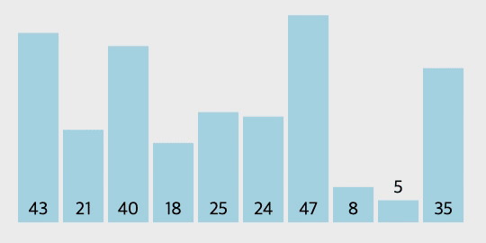

# 선택 정렬(Selection Sort)이란?

### 선택 정렬의 원리

정렬되지 않은 원소 중 가장 작은 원소를 찾아 정렬된 요소의 끝에 배치한다. 즉, 배열의 요소 중에서 최소값을 발견한 다음, 이 최소값을 배열의 첫번째 요소와 교환환다. 첫번째 요소를 제외한 나머지 요소들 중에서 가장 작은 값을 선택하고 이를 두번째 요소와 교환한다. 이 과정을 배열이 정렬될 때까지 반복한다. 선택 정렬은 가장 이해하기 쉬운 정렬 방법이고 매번 가장 작은 것을 선택한다는 의미에서 **선택 정렬(Selection Sort)**이라 한다.

<br />

> **In-place vs. Not In-place**
>
> 선택 정렬과 같이 다른 추가적인 메모리를 요구하지 않는 정렬 방법을 `In-place` 정렬 알고리즘이라 한다. 반대로 추가적인 메모리 공간이 필요로하는 알고리즘은 `Not In-place` 정렬 알고리즘이라 한다.
>
> <br />
> 대표적인 In-place 정렬 알고리즘으로는 선택 정렬(Selection Sort), 삽입 정렬(Insertion
> Sort), 버블 정렬(Bubble Sort), 쉘 정렬(Shell Sort), 힙 정렬(Heap Sort), 퀵 정렬(Quick
> Sort)(정의에 따라서 Not In-place 로 볼 수도 있으나 흔히 In-place로 본다.)이 있고,
> Not In-place 정렬 알고리즘으로는 병합 정렬(Merge Sort), 계수 정렬(Counting Sort),
> 기수 정렬(Radix Sort) 등이 있다.

### GIF로 보는 선택 정렬



<br />

# 코드 구현

### 자바스크립트 코드

```js
const selectionSort = dataList => {
  for (let i = 0; i < dataList.length; i++) {
    let minIdx = i;
    for (let j = i + 1; j < dataList.length; j++) {
      if (dataList[minIdx] > dataList[j]) minIdx = j;
    }
    [dataList[minIdx], dataList[i]] = [dataList[i], dataList[minIdx]];
  }
  return dataList;
};

const dataList = [43, 21, 40, 18, 25, 24, 47, 8, 5, 35];
console.log(selectionSort(dataList));
// [5, 8, 18, 21, 24, 25, 35, 40, 43, 47]
```

### 파이썬 코드

```python
def selection_sort(data):
    for i in range(len(data)):
        min_idx = i
        for j in range(i + 1, len(data)):
            if data[min_idx] > data[j]:
                min_idx = j
        data[min_idx], data[i] = data[i], data[min_idx]
    return data


data_list = [43, 21, 40, 18, 25, 24, 47, 8, 5, 35]
print(selection_sort(data_list))
# [5, 8, 18, 21, 24, 25, 35, 40, 43, 47]
```

# 선택 정렬의 시간 복잡도

선택 정렬은 소스코드 상으로 간단한 형태의 2중 반복문이 사용되었는데 $n-1$번 만큼 가장 작은 값을 찾아서 맨 앞으로 교체해야 한다. 그리고 가장 작은 값을 찾는 과정이 매번 내부 루프안에서 발생한다.
연산 횟수는 $(n - 1) + (n - 2) +  ... + 1$로 볼 수 있다. 이는 $n(n - 1) / 2$ 로 표현할 수 있고, 빅오 표기법으로 간단히 $O(n^2)$이라고 표현할 수 있다. 따라서 선택 정렬의 시간 복잡도는 **$O(N^2)$** 이다.

| 최악     | 평균     | 최선     |
| -------- | -------- | -------- |
| $O(N^2)$ | $O(N^2)$ | $O(N^2)$ |

# 선택 정렬의 장단점

### 장점

- 적은 개수의 원소를 정렬할 때 성능이 좋다.
- `in-place` 정렬 알고리즘이기 때문에 원소들의 개수보다 무시할만한 저장공간을 더 사용한다(추가적인 메모리 공간 사용이 적다).

### 단점

- 많은 개수의 데이터를 처리할 때 효율성(efficiency)이 떨어진다.
- 선택 정렬에는 $n$개의 요소를 정렬하기 위한 $n^2$ 단계가 필요하다.

<br />

---

# 참고

- https://www.fun-coding.org/
- http://dbmspoly.blogspot.com/p/advantage-disadvantages-of-sort.html
- https://visualgo.net/en/sorting
- [이것이 취업을 위한 코딩테스트다](http://www.yes24.com/Product/Goods/91433923)
- [C언어로 쉽게 풀어쓴 자료구조](http://www.yes24.com/Product/Goods/69750539)
