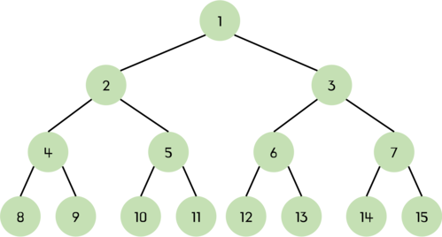
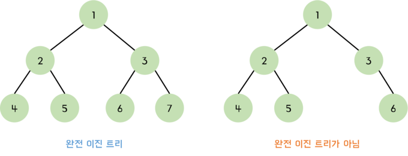
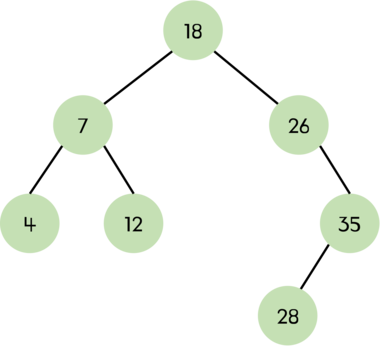
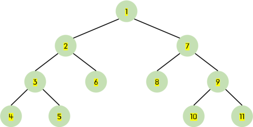
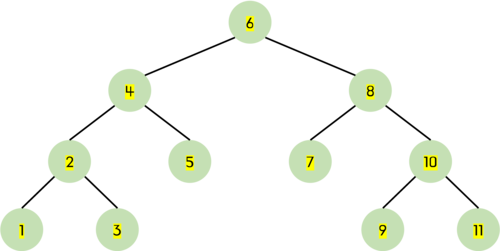
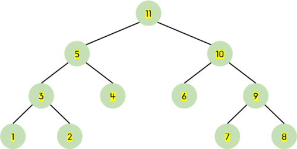

# 이진 트리(Binary Tree)란?

이진 트리는 트리 중에서 가장 널리 쓰이는 트리이다. 자식노드가 최대 두 개인 노드들로 구성된 트리를 **이진 트리(binary tree)**라고 한다.

## 트리와 이진 트리의 차이점

- 이진 트리의 모든 노드는 차수가 2이하이다. 즉, 자식 노드의 개수가 2 이하이다. 반면 일반 트리는 자식 노드의 개수에 제한이 없다.
- 이진 트리는 노드를 하나도 갖지 않을 수도 있다.
- 이진 트리는 서브 트리 간에 순서가 존재한다. 따라서 왼쪽 서브 트리와 오른쪽 서브 트리를 구분한다.

# 이진 트리의 종류

## 정 이진트리

**정 이진 트리(Full Binary Tree)**는 모든 내부 노드가 두 개의 자식 노드를 가지며, 모든 리프 노드(마지막 단계의 노드)가 같은 깊이에 있는 이진 트리이다. 따라서, 모든 노드의 차수가 2인 이진 트리라고도 할 수 있다.

## 포화 이진 트리

**포화 이진 트리(Perfect Binary Tree)**는 용어 그대로 트리의 각 레벨에 노드가 꽉 찬 이진 트리이다. 높이가 $k$인 포화 이진 트리는 정확하게 $2^k-1$개의 노드를 가진다.


## 완전 이진 트리

**완전 이진 트리(Complete Binary Tree)**는 높이가 $k$일 때 레벨 1부터 $k-1$까지는 노드가 모두 채워져 있고 $k$레벨에서는 왼쪽부터 오른쪽으로 노드가 순서대로 채워져 있는 이진 트리이다. 마지막 레벨에서는 노드가 꽉 차 있지 않아도 되지만 중간에 빈 노드가 있어서는 안 된다.

❗️ **포화 이진 트리는 항상 완전 이진 트리이지만 그 역은 항상 성립하지 않는다.**



<br />

# 이진 탐색 트리

<div style={{maxWidth: '400px'}}>



</div>

**이진 탐색 트리(binary search tree)**는 이진 트리 기반의 탐색을 위한 자료구조다.

이진 탐색 트리는 정렬된 트리로, 노드의 왼쪽 서브 트리에는 그 노드의 값보다 작은 값들을 지닌 노드들로 이뤄져 있고 오른쪽 서브 트리에는 노드의 값과 같거나 큰 값들을 지닌 노드들로 이루어져 있는 트리다. 따라서 찾고자 하는 값이 루트 노드의 값과 비교하여 루트 노드보다 작으면 찾고자 하는 값은 왼쪽 서브 트리에 있고 루트 노드보다 크면 오른쪽 서브 트리에 있음을 쉽게 알 수 있다.

즉, 이진 탐색 트리는 **왼쪽 자식 노드 < 부모 노드 < 오른쪽 자식 노드**가 성립되며 <u>중복되는 값을 허용하지 않는다.</u>

## 이진 탐색 트리 구현

```js
class Node {
  constructor(value) {
    this.value = value;
    this.left = null;
    this.right = null;
  }
}

class BinarySearchTree {
  constructor() {
    this.root = null;
  }

  insert(value) {
    const newNode = new Node(value);

    if (!this.root) this.root = newNode;
    else this.insertNode(this.root, newNode);
  }

  insertNode(node, newNode) {
    if (newNode.value < node.value) {
      if (!node.left) node.left = newNode;
      else this.insertNode(node.left, newNode);
    } else {
      if (!node.right) node.right = newNode;
      else this.insertNode(node.right, newNode);
    }
  }
}

const bst = new BinarySearchTree();
```

<br />

# 이진 트리의 순회

이진 트리를 순회하는 대표적인 방법에는 `전위`, `중위`, `후의`의 3가지 방법이 있다. 이는 루트와 왼쪽 서브 트리, 오른쪽 서브 트리 중에서 루트를 언제 방문하느냐에 따라 구분된다.

### 전위 순회

**전위 순회(preorder traversal)**는 <u>루트 → 왼쪽 서브 트리 → 오른쪽 서브 트리</u> 순서로 방문한다.


```js
traversePreOrder(node = this.root, result = []) {
    if (node) {
      result.push(node.value);
      this.traversePreOrder(node.left, result);
      this.traversePreOrder(node.right, result);
    }
    return result;
  }
```

### 중위 순회

**중위 순회(inorder traversal)**는 <u>왼쪽 서브 트리 → 루트 → 오른쪽 서브 트리</u> 순서로 방문한다.


```js
traverseInOrder(node = this.root, result = []) {
    if (node) {
      this.traversePostOrder(node.left, result);
      result.push(node.value);
      this.traversePostOrder(node.right, result);
    }
    return result;
  }
```

### 후위 순회

**후위 순회(postorder traversal)**는 <u>왼쪽 서브 트리 → 오른쪽 서브 트리 → 루트</u> 순서로 방문한다.



```js
traversePostOrder(node = this.root, result = []) {
    if (node) {
      this.traversePostOrder(node.left, result);
      this.traversePostOrder(node.right, result);
      result.push(node.value);
    }
    return result;
  }
```

<br />

# 참고

- [이것이 취업을 위한 코딩테스트다](http://www.yes24.com/Product/Goods/91433923)
- [파이썬 알고리즘 인터뷰](http://www.yes24.com/Product/Goods/91084402)
- https://www.geeksforgeeks.org/implementation-binary-search-tree-javascript/
- https://www.jiwon.me/binary-tree-traversal/
