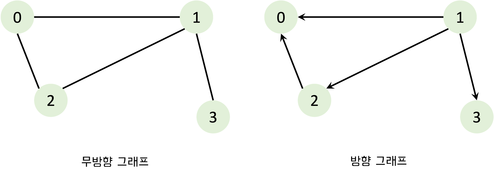
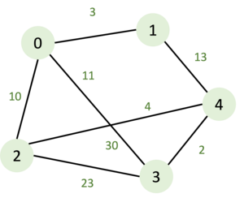
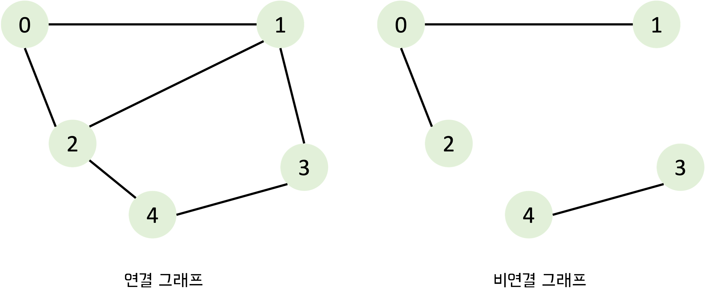
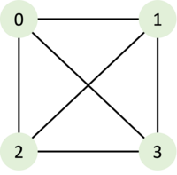
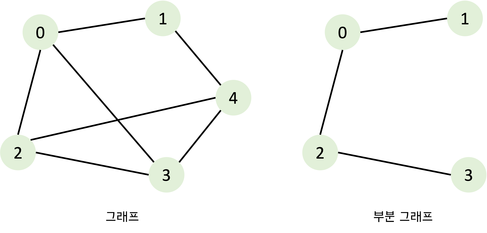
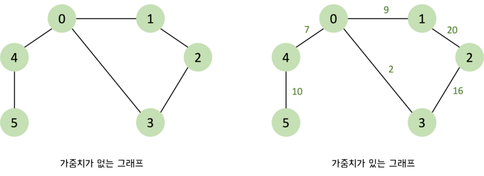

# 그래프(Graph)란?

그래프는 객체 사이의 연결 관계를 표현할 수 있는 자료 구조로 실제 세계의 현상이나 사물을 `정점(vertex)`과 `간선(edge)`으로 표현한 것이다.

전기 소자를 그래프로 표현하게 되면 전기 회로의 소자들이 어떻게 연결되어 있는지를 표현해야 회로가 제대로 동작하는지 분석할 수 있으며, 운영 체제에서는 프로세스와 자원들이 어떻게 연관되는지를 그래프로 분석하여 시스템의 효율이나 교착상태 유무 등을 알아낼 수 있다. 그래프 구조는 인접 행렬이나 인접 리스트로 메모리에 표현되고 처리될 수 있으므로 광범위한 분야의 다양한 문제들을 그래프로 표현하여 해결할 수 있다.

# 그래프의 용어

그래프는 정점(vertex)과 간선(edge)들의 유한집합이라 할 수 있다. 수학적으로는 $G = (V, E)$와 같이 표시한다.
**정점**은 여러 가지 특성을 가질 수 있는 객체를 의미하고, **간선**은 이러한 정점 간의 관계를 의미한다. 정점(vertex)은 노드(node)라고도 하며, 간선(edge)은 링크(link)라고도 한다.

| 용어            | 설명                                             |
| :-------------- | :----------------------------------------------- |
| **정점의 차수** | 무방향 그래프에서 하나의 정점에 인접한 정점의 수 |
| **진입 차수**   | 방향 그래프에서 외부에서 오는 간선의 수          |
| **진출 차수**   | 방향 그래프에서 외부로 향하는 간선의 수          |
| **경로길이**    | 경로를 구성하기 위해 사용된 간선의 수            |

# 그래프의 종류

## 무방향 그래프와 방향 그래프

간선의 종류에 따라 **무방향 그래프(undirected graph)**와 **방향 그래프(directed graph)**로 나눌 수 있다.

**무방향 그래프**는 간선에 방향이 없는 그래프로 간선을 통해 양방향의 정점으로 갈 수 있다. 정점 A와 정점 B를 잇는 간선을 `(A, B)`와 같이 표현할 수 있는데 무방향 그래프에서는 (A, B)와 (B, A)가 같은 간선이 된다.

**방향 그래프**는 간선에 방향이 존재하는 그래프로 간선을 통해 한쪽으로만 갈 수 있다. 정점 A와 정점 B를 잇는 간선을 `<A, B>`와 같이 표현할 수 있고 방향 그래프에서는 <A, B>와 <B, A>는 서로 다른 간선이다.



## 가중 그래프 또는 가중 네트워크

간선에 가중치를 할당하여 정점 간의 연결 유무뿐 아니라 연결 강도까지 나타낼 수 있으므로 보다 복잡한 관계를 표현할 수 있는 그래프이다.

이렇게 간선에 비용이나 가중치가 할당된 그래프를 **가중 그래프(weighted graph)** 또는 **가중 네트워크(weighted network)**라고 한다.

<div class='resize-wrapper'>



</div>

## 연결 그래프와 비연결 그래프

무방향 그래프에 있는 모든 정점에 대해 항상 경로가 존재한다면 이 그래프를 **연결 그래프(connected graph)**라 부른다. 그렇지 않은(특정 정점에 대한 경로가 없는) 그래프는 **비연결 그래프(disconnected graph)**라고 한다. _트리(Tree)는 그래프의 특수한 형태로 사이클을 가지지 않는 연결 그래프이다._



## 완전 그래프

그래프에 속해 있는 모든 정점이 서로 연결된 그래프를 **완전 그래프(complete graph)**라고 한다. 무방향 완전 그래프의 정점 수를 $n$이라고 한다면 간선의 수는 $n * (n - 1) / 2$이다.

<div class='resize-wrapper'>



</div>

## 부분 그래프

어떤 그래프의 정점 일부와 간선 일부로 이루어진 그래프를 **부분 그래프(sub graph)**라 한다. 그래프 G의 부분 그래프 S는 다음과 같은 수식을 만족한다.

- $V(S) \subseteq V(G)$
- $E(S) \subseteq E(G)$



<br/>

# 그래프의 표현 방법

프로그래밍에서 그래프는 크게 2가지 방식으로 표현할 수 있는데 `인접 행렬(adjacency matrix)`과 `인접 리스트(adjacency list)`이다.

**인접 행렬**은 2차원 배열로 각 노드의 연결 관계를 표현하는 방식이다. 연결이 되어 있지 않은 노드끼리는 무한(Infinity)의 비용이라고 작성한다. 노드에 대해 가중치가 있을 때는 아래와 같이 가중치를 입력해주고 가중치가 없는 경우에는 `1`과 `0`으로 표기한다. 인접 행렬 방식을 사용하면 노드의 연결 관계를 담은 배열이 중앙 대각선을 기준으로 대칭을 이루게 된다.



```js
// 가중치가 없는 인접 행렬 그래프
const graph = [
  [0, 1, 0, 1, 1, 0],
  [1, 0, 1, 0, 0, 0],
  [0, 1, 0, 1, 0, 0],
  [1, 0, 1, 0, 0, 0],
  [1, 0, 0, 0, 0, 1],
  [0, 0, 0, 0, 1, 0],
];

// 가중치가 있는 인접 행렬 그래프
const INF = Number.MAX_SAFE_INTEGER;

const weighted_graph = [
  [0, 9, INF, 2, 7, INF],
  [9, 0, 20, INF, INF, INF],
  [INF, 20, 0, 16, INF, INF],
  [2, INF, 16, 0, INF, INF],
  [7, INF, INF, INF, 0, 10],
  [INF, INF, INF, INF, 10, 0],
];
```

**인접 리스트**는 리스트로 그래프의 연결 관계를 표현하는 방식으로 모든 노드에 연결 정보를 차례대로 연결하여 저장한다. 노드에 대해 가중치가 있을 때는 아래와 같이 가중치를 입력해주고 가중치가 없는 경우에는 2차원 배열로 표기한다.

```js
// 가중치가 없는 인접 리스트 그래프
const graph = [[1, 3, 4], [0, 2], [1, 3], [0, 2], [0, 5], [4]];

// 가중치가 있는 인접 리스트 그래프
const weighted_graph = [
  [
    [1, 9],
    [3, 2],
    [4, 7],
  ],
  [
    [0, 9],
    [2, 20],
  ],
  [
    [1, 20],
    [3, 16],
  ],
  [
    [0, 2],
    [2, 16],
  ],
  [
    [0, 7],
    [5, 10],
  ],
  [[4, 10]],
];
```

## 인접 행렬 방식과 인접 리스트 방식의 차이점

이 두 방식에는 어떤 차이점이 있을까? 메모리 측면에서 보자면 **인접 행렬 방식**은 노드의 모든 관계를 저장하므로 메모리를 불필요하게 많이 사용하게 된다.

**인접 리스트 방식**은 연결된 정보만을 저장하기 때문에 메모리를 효율적으로 사용하게 된다. 하지만, 연결된 데이터를 하나씩 확인해야 하므로 인접 행렬 방식에 비해 특정한 두 노드의 연결에 대한 정보를 얻는 속도가 느리다.

# 그래프의 탐색

그래프 탐색은 하나의 노드로부터 시작하여 차례대로 모든 노드를 한 번씩 방문하는 것이다. 많은 문제가 단순히 그래프의 노드를 탐색하는 것으로 해결된다. 대표적으로 특정한 노드에서 다른 노드로 갈 수 있는지 없는지를 탐색을 통하여 알 수 있다.

<br/>

그래프의 각 노드를 탐색 방법에는 크게 `깊이 우선 탐색(depth first search)`과 `너비 우선 탐색(breadth first search)`의 두 가지 알고리즘이 있다.

**깊이 우선 탐색(DFS)**은 주로 스택으로 구현하거나 재귀로 구현하고, **너비 우선 탐색(BFS)**는 주로 큐로 구현하며 그래프의 최단 경로를 구하는 문제 등에 사용된다.

<blockquote variant="info">

DFS와 BFS에 대한 자세한 설명은 아래 게시글에서 다루고 있으니 참고하면 좋을 것 같다.

[[알고리즘] JavaScript로 구현하는 DFS](https://chamdom.blog/dfs-using-js/)

[[알고리즘] JavaScript로 구현하는 BFS](https://chamdom.blog/bfs-using-js/)

</blockquote>

<br />

# 참고

- https://www.fun-coding.org/Chapter17-graph-live.html
- [C언어로 쉽게 풀어쓴 자료구조](http://www.yes24.com/Product/Goods/69750539)
