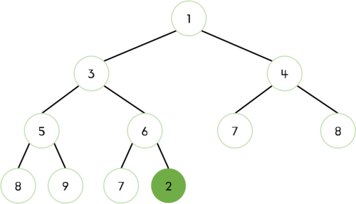
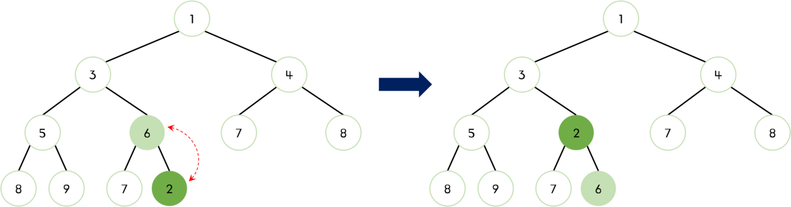
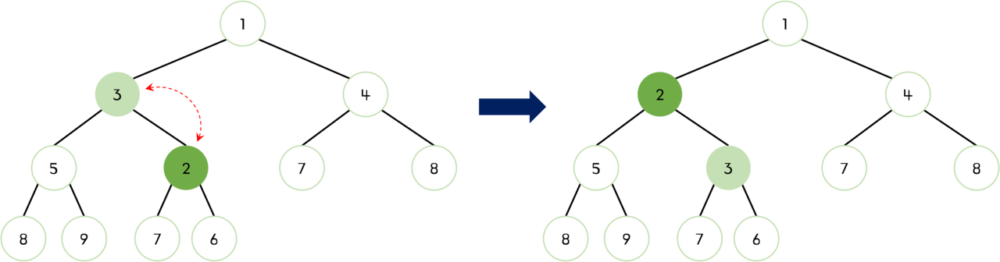
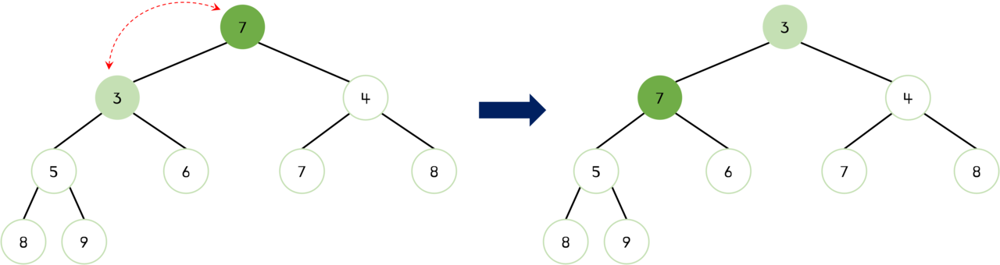

# 힙이란?

**힙(heap)**은 완전 이진 트리의 일종으로 `우선순위 큐`를 위하여 만들어진 자료구조이다. 힙은 완전히 정렬된 것은 아니지만 전혀 정렬 되지 않은 상태도 아닌 반정렬 상태(느슨한 정렬 상태)를 유지한다.

우선순위 큐를 구현할 때 내부적으로 최소 힙 또는 최대 힙을 이용한다. 최소 힙을 이용하는 경우 '값이 낮은 데이터가 먼저 삭제'되며, 최대 힙을 이용하는 경우 '값이 큰 데이터가 먼저 삭제'된다. 이때 힙은 _삽입과 삭제에 $O(NlogN)$의 시간 복잡도를 가진다._

> Java는 PriorityQueue 가 있으며, Python3의 경우에는 heapq 라던가 힙 구조화 시켜주는 heapify 함수 등이 있지만, 자바스크립트는 그런거 없다.🥲

자바스크립트로 코딩테스트 문제를 풀 때 힙을 직접 구현해서 풀어야'만' 해결할 수 있는 문제가 있는지는 모르겠다만 구현해놔서 손해보는 일은 없을거라고 생각한다! 따라서 이 글에서는 자바스크립트로 heap을 구현해볼 것이다.

## 힙의 종류

힙(Heap)은 대개 최대 힙(Max Heap)과 최소 힙(Min Heap) 두 가지 종류로 구분된다.

- **최대 힙(Max Heap):** 모든 노드가 자식 노드보다 작거나 같은 값을 가지는 힙이다. 루트 노드는 최소값을 가진다.
- **최소 힙(Min Heap):** 부모 노드의 값이 자식 노드의 값보다 작거나 같은 완전 이진 트리이다.

## 힙 구현

힙의 부모와 자식 간에 다음과 같은 관계가 성립한다.

- 왼쪽 자식의 index = `부모의 index * 2 + 1`
- 오른쪽 자식의 index = `(부모의 index * 2) + 2`
- 부모의 index = `Math.floor((자식의 index - 1) / 2)`

> Heap을 클래스로 구현하고 이를 상속 받아서 MinHeap으로 구현한 코드를 다른 블로그나 사이트에서 찾아볼 수 있지만, 코드가 길어지는 것을 막기 위해 메서드들을 최소화해서 MinHeap으로만 구현했다.

기본적으로 사용될 메서드 들은 아래와 같다.

```jsx
class MinHeap {
  constructor() {
    // 힙을 저장할 배열
    this.heap = [];
  }

  // 힙의 크기를 반환하는 메서드
  size() {
    return this.heap.length;
  }

  // 두 값을 바꿔주는 메서드
  swap(idx1, idx2) {
    [this.heap[idx1], this.heap[idx2]] = [this.heap[idx2], this.heap[idx1]];
  }
}
```

### 삽입 연산

Min Heap의 삽입 연산은 다음과 같은 단계로 이루어진다.

1. Heap의 마지막 위치에 요소를 추가한다.
2. 새로운 요소를 추가한 위치에서부터, 부모 노드와 새로 추가된 노드의 값을 비교한다. 만약 새로 추가된 노드의 값이 부모 노드의 값보다 작다면, 부모 노드와 새로 추가된 노드의 위치를 교환한다.
3. 이전 단계에서 교환된 새로 추가된 노드와 부모 노드의 값 비교를 반복한다. 이 단계를 반복하여 Min Heap의 규칙을 지키도록 한다.

> **✍🏻 bubbleUp**
>
> 힙에 값을 삽입할 때 부모와 비교해서 값이 크거나 작으면(최소 힙의 경우 부모가 자신보다 크면, 최대 힙의 경우 부모가 자신보다 작으면) 부모와 값을 교환해서 올바르게 정렬이 될 때 까지 올라가는 것을 `bubbleUp`이라 한다.

1. 먼저 힙의 마지막 노드로 새로운 요소 `2`를 삽입한다.



<br />

2. 부모 노드 `6`과 비교했을 때 `2`가 작으므로 교체한다.



<br />

3. 부모 노드 `3`과 비교했을 때 `2`가 작으므로 교체한다.



<br />

4. 부모 노드 `1`과 비교했을 때 `2`가 크므로 더 이상 교체하지 않는다.

코드로 구현한 것은 다음과 같다.

```jsx
// 새로운 노드를 추가하는 메서드
add(value) {
  this.heap.push(value); // 힙의 끝에 새로운 노드 추가
  this.bubbleUp(); // 새로운 값이 추가된 위치에서 bubbleUp() 수행
}

bubbleUp() {
  let index = this.heap.length - 1; // 새로운 노드가 추가된 위치
  let parentIdx = Math.floor((index - 1) / 2); // 부모 노드의 위치
  while (
    this.heap[parentIdx] && // 부모 노드가 존재하고
    this.heap[index][1] < this.heap[parentIdx][1] // 새로운 노드가 부모 노드보다 작은 경우
  ) {
    this.swap(index, parentIdx); // 두 노드의 값을 교체
    index = parentIdx; // 인덱스를 부모 노드의 인덱스로 변경
    parentIdx = Math.floor((index - 1) / 2); // 새로운 부모 노드의 인덱스 계산
  }
}
```

<br />

### 삭제 연산

Min Heap의 삭제 연산은 다음과 같은 단계로 이루어진다.

1. Heap에서 가장 작은 값을 가진 노드(루트 노드)를 제거한다. 이때, Min Heap에서 가장 작은 값은 루트 노드이다.
2. Heap의 맨 마지막에 있는 노드를 새로운 루트 노드로 이동시킨다.
3. 새로운 루트 노드와 자식 노드의 값을 비교하여, 자식 노드의 값이 작다면 루트 노드의 위치를 교환한다.
4. 이전 단계에서 교환된 새로운 루트 노드와 자식 노드의 값 비교를 반복한다. 이 단계를 반복하여 Min Heap의 규칙을 지키도록 한다.

> **✍🏻 bubbleDown**
>
> 루트 노드를 삭제하고 마지막 노드를 루트로 올리고 루트 노드와 아래 자식 노드들과 비교해서 값이 크거나 작으면(최소 힙의 경우 자식이 자신보다 값이 작으면, 최대 힙의 경우 자식이 자신보다 값이 크면) 자식과 값을 교환해서 올바르게 정렬이 될 때 까지 내려가는 것을 `bubbleDown`이라 한다..

1. 먼저 루트 노드가 삭제된다. 빈 루트 노드 자리에는 힙의 마지막 노드 `7`을 가져온다.


<br />

2. 새로운 루트 노드인 `7`과 자식 노드들을 비교했을 때 `7`이 더 크므로 교체되어야 한다. 이때 자식 노드 중 더 작은 값인 `3`과 `7`이 교체된다.



<br />

3. `7`이 아직 자식 노드들보다 더 크기 때문에 교체되어야 한다. 이때 자식 노드 중 더 작은 값인 `5`와 `7`이 교체된다.


<br />

4. `7`이 자식 노드들보다 작으므로 더 이상 교체하지 않는다.

코드로 구현한 것은 다음과 같다.

```jsx
poll() {
  if (this.heap.length === 1) {
    return this.heap.pop(); // 힙의 크기가 1인 경우, 힙에서 값을 삭제하고 return
  }

  const value = this.heap[0]; // 힙의 최소값(루트 노드의 값)을 저장
  this.heap[0] = this.heap.pop(); // 힙의 끝에 있는 값을 루트 노드로 이동
  this.bubbleDown(); // 루트 노드에서 bubbleDown을 수행
  return value; // 삭제한 최소값 return
}

bubbleDown() {
  let index = 0; // 루트 노드의 index
  let leftIdx = index * 2 + 1; // 왼쪽 자식 노드의 index
  let rightIdx = index * 2 + 2; // 오른쪽 자식 노드의 index

  while (
    // 왼쪽 자식 노드가 존재 하면서 값이 루트 노드보다 작거나
    (this.heap[leftIdx] && this.heap[leftIdx][1] < this.heap[index][1]) ||
    // 오른쪽 자식 노드가 존재 하면서 값이 루트 노드보다 작은 경우
    (this.heap[rightIdx] && this.heap[rightIdx][1] < this.heap[index][1])
  ) {
    let smallerIdx = leftIdx; // 왼쪽 자식 노드가 더 작다고 가정
    if (
      this.heap[rightIdx] &&
      this.heap[rightIdx][1] < this.heap[smallerIdx][1] // 오른쪽 자식 노드가 더 작다면
    ) {
      smallerIdx = rightIdx; // 오른쪽 자식 노드의 index로 변경
    }

    this.swap(index, smallerIdx); // 두 노드의 값을 교체
    index = smallerIdx; // index를 더 작은 값의 자식 노드의 index로 변경
    leftIdx = index * 2 + 1; // 왼쪽 자식 노드의 index 계산
    rightIdx = index * 2 + 2; // 오른쪽 자식 노드의 index 계산
  }
}
```

### 전체 코드

주석을 제거한 전체 코드는 다음과 같다.

```jsx
class MinHeap {
  constructor() {
    this.heap = [];
  }

  size() {
    return this.heap.length;
  }

  swap(idx1, idx2) {
    [this.heap[idx1], this.heap[idx2]] = [this.heap[idx2], this.heap[idx1]];
  }

  add(value) {
    this.heap.push(value);
    this.bubbleUp();
  }

  poll() {
    if (this.heap.length === 1) {
      return this.heap.pop();
    }

    const value = this.heap[0];
    this.heap[0] = this.heap.pop();
    this.bubbleDown();
    return value;
  }

  bubbleUp() {
    let index = this.heap.length - 1;
    let parentIdx = Math.floor((index - 1) / 2);
    while (
      this.heap[parentIdx] &&
      this.heap[index][1] < this.heap[parentIdx][1]
    ) {
      this.swap(index, parentIdx);
      index = parentIdx;
      parentIdx = Math.floor((index - 1) / 2);
    }
  }

  bubbleDown() {
    let index = 0;
    let leftIdx = index * 2 + 1;
    let rightIdx = index * 2 + 2;

    while (
      (this.heap[leftIdx] && this.heap[leftIdx][1] < this.heap[index][1]) ||
      (this.heap[rightIdx] && this.heap[rightIdx][1] < this.heap[index][1])
    ) {
      let smallerIdx = leftIdx;
      if (
        this.heap[rightIdx] &&
        this.heap[rightIdx][1] < this.heap[smallerIdx][1]
      ) {
        smallerIdx = rightIdx;
      }

      this.swap(index, smallerIdx);
      index = smallerIdx;
      leftIdx = index * 2 + 1;
      rightIdx = index * 2 + 2;
    }
  }
}
```

<br />

---

# 참고

- [[자바스크립트 자료구조] 힙(Heap) - (1) 최소힙, 최대힙 구현](https://nyang-in.tistory.com/153)
- [이것이 취업을 위한 코딩테스트다](http://www.yes24.com/Product/Goods/91433923)
- [C언어로 쉽게 풀어쓴 자료구조](http://www.yes24.com/Product/Goods/69750539)
