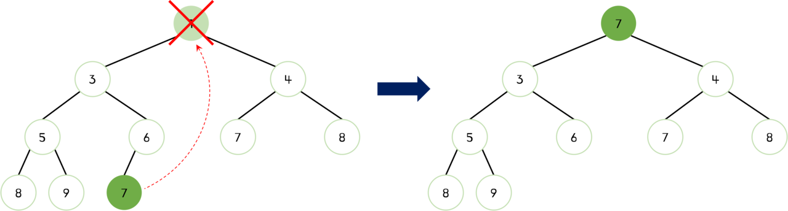
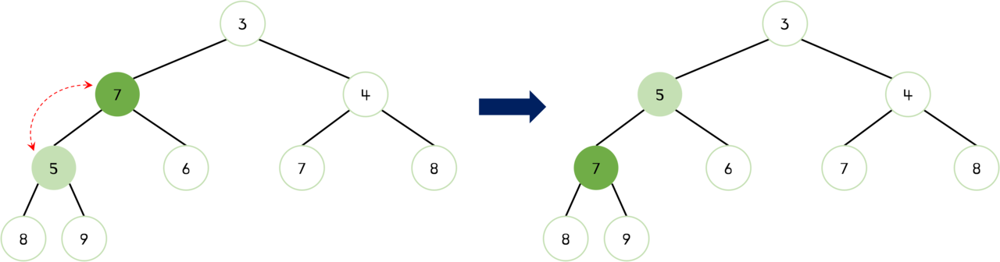

# 힙이란?

**힙(heap)**은 완전 이진 트리의 일종으로 `우선순위 큐`를 위하여 만들어진 자료구조이다. 힙은 완전히 정렬된 것은 아니지만 전혀 정렬 되지 않은 상태도 아닌 반정렬 상태(느슨한 정렬 상태)를 유지한다.

우선순위 큐를 구현할 때 내부적으로 최소 힙 또는 최대 힙을 이용한다. 최소 힙을 이용하는 경우 '값이 낮은 데이터가 먼저 삭제'되며, 최대 힙을 이용하는 경우 '값이 큰 데이터가 먼저 삭제'된다. 이때 힙은 _삽입과 삭제에 $O(NlogN)$의 시간 복잡도를 가진다._

> Java는 PriorityQueue 가 있으며, Python3의 경우에는 heapq 라던가 힙 구조화 시켜주는 heapify 함수 등이 있지만, 자바스크립트는 그런거 없다.🥲

자바스크립트로 코딩테스트 문제를 풀 때 힙을 직접 구현해서 풀어야'만' 해결할 수 있는 문제가 있는지는 모르겠다만 구현해놔서 손해보는 일은 없을거라고 생각한다! 따라서 이 글에서는 자바스크립트로 heap을 구현해볼 것이다.

## 힙의 종류

힙에는 **최대 힙(Max Heap)**, **최소 힙(Min Heap)**의 두 가지 종류가 있다.

**최대 힙(Max Heap)** <br />
부모 노드의 값이 자식 노드의 값보다 크거나 같은 완전 이진 트리이다.

<br />


<br />

**최소 힙(Min Heap)** <br />
부모 노드의 값이 자식 노드의 값보다 작거나 같은 완전 이진 트리이다.

<br />


<br />

## 힙 구현

이 글에서는 **최소 힙(Min Heap)**을 구현할 것이다. 코드를 통해 각 과정을 자세히 살펴보자.

> 최소 힙을 최대 힙처럼 사용하기 위해서는 값에 음수 부호(`-`)를 붙여서 힙에 삽입하고 힙에서 꺼낼때는 다시 음수 부호(`-`) 붙여서 원래의 값으로 돌리는 방식을 사용할 수 있다.

```jsx
class Heap {
  constructor() {
    this.heap = [null]; // 첫 번째 인덱스 사용 X
  }
}
```

힙은 완전 이진 트리이기 때문에 각각의 노드에 차례대로 번호룰 붙일 수 있다. 이 번호를 배열의 인덱스로 생각하여 배열로 구현해 보자. 구현을 쉽게 하기 위해서 배열의 첫번째 인덱스인 `0`은 사용하지 않기로 한다.

힙의 부모와 자식 간에 다음과 같은 관계가 성립한다.

- 왼쪽 자식의 index = `부모의 index * 2`
- 오른쪽 자식의 index = `(부모의 index * 2) + 1`
- 부모의 index = `Math.floor(자식의 index / 2)`

### 삽입 연산

힙에 새로운 요소를 삽입할 때, 먼저 힙의 마지막 노드로 새로운 요소를 삽입한다. 새로 삽입한 노드를 부모 노드와 비교하고 교체하면서 힙의 성질을 만족할 때까지 반복한다. 자세한 교체 과정은 그림을 통해 알아보자.

1. 먼저 힙의 마지막 노드로 새로운 요소 `2`를 삽입한다.


<br />

2. 부모 노드 `6`과 비교했을 때 `2`가 작으므로 교체한다.


<br />

3. 부모 노드 `3`과 비교했을 때 `2`가 작으므로 교체한다.


<br />

4. 부모 노드 `1`과 비교했을 때 `2`가 크므로 더 이상 교체하지 않는다.

<br />

```jsx

...

// 노드를 교체하는 기능을 하는 swap 메서드로 분리해서 구현하였다.
swap(a, b) {
  [this.heap[a], this.heap[b]] = [this.heap[b], this.heap[a]];
}

heappush(value) {
  this.heap.push(value);
  let curIdx = this.heap.length - 1;
  let parentIdx = Math.floor(curIdx / 2);

  // 최소힙이므로 부모 노드가 작아야 한다. 따라서 부모 노드가 현재 노드보다 큰 지 검사하며 반복한다.
  while (curIdx > 1 && this.heap[curIdx] < this.heap[parentIdx]) {
    this.swap(parentIdx, curIdx);
    curIdx = parentIdx;
    parentIdx = Math.floor(curIdx / 2);
  }
}
```

### 삭제 연산

삭제 연산은 최소 힙에서는 최소값을, 최대 힙에서는 최대값을 삭제하는 것이다. 최소 힙, 최대 힙 모두 삭제해야할 대상은 루트 노드이므로 **루트 노드가 삭제된다.** 루트 노드를 삭제하고 힙의 성질을 만족하기 위해 노드를 부모 노드와 비교하면서 교체하는 작업을 반복 수행한다. 삽입 연산에서 사용한 그림 예제를 그대로 사용하겠다.

1. 먼저 루트 노드가 삭제된다. 빈 루트 노드 자리에는 힙의 마지막 노드 `7`을 가져온다.



<br />

2. 새로운 루트 노드인 `7`과 자식 노드들을 비교했을 때 `7`이 더 크므로 교체되어야 한다. 이때 자식 노드 중 더 작은 값인 `3`과 `7`이 교체된다.


<br />

3. `7`이 아직 자식 노드들보다 더 크기 때문에 교체되어야 한다. 이때 자식 노드 중 더 작은 값인 `5`와 `7`이 교체된다.



<br />

4. `7`이 자식 노드들보다 작으므로 더 이상 교체하지 않는다.

<br />

```jsx

...

heappop() {
  const min = this.heap[1];
  if (this.heap.length <= 2) this.heap = [null];
  else this.heap[1] = this.heap.pop();

  let curIdx = 1;
  let leftIdx = curIdx * 2;
  let rightIdx = curIdx * 2 + 1;

  // 루트만 있을 때
  // 왼쪽 자식 노드가 없다면 오른쪽 노드도 없는 상태이다. 즉, 루트 노드만 존재하는 상황이다.
  if (!this.heap[leftIdx]) return min;

  // 왼쪽 자식 노드만 존재할 때
  if (!this.heap[rightIdx]) {
    if (this.heap[leftIdx] < this.heap[curIdx]) {
      this.swap(leftIdx, curIdx);
    }
    return min;
  }

  // 왼쪽 자식 노드, 오른쪽 자식 노드가 모두 있을 때
  // 최소힙이므로 부모 노드가 작아야 한다.
  // 따라서 현재 노드가 왼쪽 노드 또는 오른쪽 노드보다 큰 지 검사하며 반복한다.
  while (
    this.heap[leftIdx] < this.heap[curIdx] ||
    this.heap[rightIdx] < this.heap[curIdx]
  ) {
    const minIdx =
      this.heap[rightIdx] < this.heap[leftIdx] ? rightIdx : leftIdx;
    this.swap(minIdx, curIdx);
    curIdx = minIdx;
    leftIdx = curIdx * 2;
    rightIdx = curIdx * 2 + 1;
  }

  return min;
}

```

### 전체 코드

주석을 제거한 전체 코드는 다음과 같다.

```jsx
class MinHeap {
  constructor() {
    this.heap = [null];
  }

  swap(a, b) {
    [this.heap[a], this.heap[b]] = [this.heap[b], this.heap[a]];
  }

  heappush(value) {
    this.heap.push(value);
    let curIdx = this.heap.length - 1;
    let parentIdx = Math.floor(curIdx / 2);

    while (curIdx > 1 && this.heap[curIdx] < this.heap[parentIdx]) {
      this.swap(curIdx, parentIdx);
      curIdx = parentIdx;
      parentIdx = Math.floor(curIdx / 2);
    }
  }

  heappop() {
    const min = this.heap[1];
    if (this.heap.length <= 2) this.heap = [null];
    else this.heap[1] = this.heap.pop();

    let curIdx = 1;
    let leftIdx = curIdx * 2;
    let rightIdx = curIdx * 2 + 1;

    if (!this.heap[leftIdx]) return min;
    if (!this.heap[rightIdx]) {
      if (this.heap[leftIdx] < this.heap[curIdx]) {
        this.swap(leftIdx, curIdx);
      }
      return min;
    }

    while (
      this.heap[leftIdx] < this.heap[curIdx] ||
      this.heap[rightIdx] < this.heap[curIdx]
    ) {
      const minIdx =
        this.heap[rightIdx] < this.heap[leftIdx] ? rightIdx : leftIdx;
      this.swap(minIdx, curIdx);
      curIdx = minIdx;
      leftIdx = curIdx * 2;
      rightIdx = curIdx * 2 + 1;
    }

    return min;
  }
}
```

<br />

---

# 참고

- [JS로 구현하는 HEAP](https://velog.io/@longroadhome/%EC%9E%90%EB%A3%8C%EA%B5%AC%EC%A1%B0-Stack%EC%9D%84-%EC%9D%B4%EC%9A%A9%ED%95%9C-Iterative-DFS-%EA%B5%AC%ED%98%84#iterative-dfs-%EB%B0%A9%EB%AC%B8-%EA%B5%AC%ED%98%84)
- [이것이 취업을 위한 코딩테스트다](http://www.yes24.com/Product/Goods/91433923)
- [C언어로 쉽게 풀어쓴 자료구조](http://www.yes24.com/Product/Goods/69750539)
