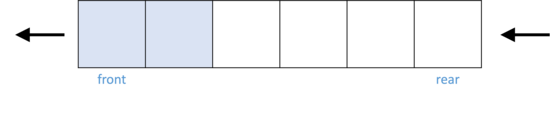

# 큐(Queue)란?

<br />



큐(Queue)는 선입선출(FIFO: First-In First-Out) 구조를 가지는 자료구조이다. 스택은 나중에 들어온 데이터가 먼저 나가는 구조이지만 큐는 먼저 들어온 데이터가 먼저 나가는 구조이다. 큐의 예로는 매표소나 드라이브 스루를 들 수 있다. 줄 서 있는 사람 중에서 가장 앞에 있는 사람(즉 가장 먼저 온 사람)이 먼저 표를 사거나 주문을 할 수 있을 것이다.

큐는 뒤(rear)에서 데이터가 삽입되고 앞(front)에서 데이터가 하나씩 제거되는 구조로 되어 있다. 구조상으로 스택과의 차이점은 스택은 데이터의 삽입과 삭제가 같은 쪽에서 일어나지만, 큐는 데이터의 삽입과 삭제가 다른 쪽에서 일어난다. 큐에서 데이터의 삽입이 일어나는 곳을 후단(rear), 데이터의 삭제가 일어나는 곳을 전단(front)라고 한다.

큐가 필요한 상황은 다음과 같다.

- 데이터를 순서대로 처리해야 할 필요가 있는 상황.
- 데이터를 한 곳에서 다른 한 곳으로 이동시키려고 할 때.

### 자바스크립트의 큐(Queue)

다른 언어에서는 내장 라이브러리로 큐를 제공하기도 한다. 대표적으로 `JAVA`는 `java.util.Queue`를 제공하고 `Python`은 `collections`의 `deque`를 제공한다. 하지만 자바스크립트는 내장 라이브러리로 큐를 제공하지 않는다. 따라서 큐를 사용하기 위해서는 따로 구현해야 할 필요가 있다.

이 글에서는 `ES6`의 `class`를 이용해서 구현하려고 한다. 여기서 **굳이 구현서 사용해야 하나?** 의문이 들 수 있다. 물론 자바스크립트의 `배열(Array)`을 이용해서 큐 구현을 흉내 낼 수 있다. 배열의 내장 메서드에는 `shift()`가 존재하는데, 이 메서드는 배열의 앞부분의 요소를 삭제하는 기능을 한다. `shift()`메서드를 활용해서 큐를 구현할 수 있지만, 여기에는 문제점이 있다. 바로 `shift()` 메서드를 사용한 뒤에 남아 있는 배열 요소들에 대해 재정렬이 일어나는 것이다. 재정렬이 일어나는 과정 때문에 실제 큐 자료구조의 시간 복잡도와 큰 차이를 보이게 된다.

보통 큐를 사용하는 알고리즘 문제에서 배열을 이용해도 통과할 수 있는 문제들이 있지만, 시간 복잡도를 고려해야 하는 문제에서는 위와 같은 이유로 배열을 사용할 수 없게 된다. 이런 상황에서는 큐를 직접 구현하여 문제를 푸는 것이 적합하다.

# 큐 구현

### 큐 초기화

앞서 말한 바와 같이 ES6의 class를 이용해서 큐를 구현해 보자. 먼저 클래스를 선언하고 constructor 메서드에 큐를 저장할 객체 `store`와 포인터로 사용할 front와 rear를 선언한다. 자바스크립트에서 객체는 `key-value` 형태로 이루어져 있다. key를 통해 value에 접근하는데 $O(1)$의 시간이 걸리므로 해시(Hash)로 활용할 수 있다. 그래서 store를 객체로 선언하였다. `front`와 ` rear` 변수는 일종의 포인터 역할을 해주는 변수이다. 큐의 시작 인덱스가 `0`이라고 가정하고 데이터가 없을 때는 둘 다 `0`을 가리키고 있게 한다.

```jsx
class Queue {
  constructor() {
    this.store = {}; // 데이터를 저장하는 객체
    this.front = 0; // 첫 번째 데이터를 가리키는 포인터
    this.rear = 0; // 마지막 데이터를 가리키는 포인터
  }
}
```

### 크기 구하기

다른 언어에서는 대부분 큐의 크기를 구하는 메서드를 제공한다. 따라서 우리도 큐의 크기를 구하는 메서드를 구현해보자.

큐의 데이터를 객체에 저장하기 때문에 `arr.length`와 같이 배열처럼 값을 구하기 어렵다. Object.keys/values/entries 메서드로 객체의 프로퍼티를 열거할 수 있지만, 배열로 변환되는 과정이 생겨 $O(n)$의 시간 복잡도가 발생하게 되므로 이 방법은 사용하지 않기로 한다.

큐의 크기를 구하는 경우는 **1. 데이터가 존재하지 않을 경우**, **2. 데이터가 존재 하는 경우**로 크게 두 가지 경우로 들 수 있다. 먼저 데이터가 존재하지 않을 경우를 보자. 데이터의 끝을 가리키는 `rear`의 값에 아무것도 저장되어 있지 않다면 큐에는 데이터가 없다고 판단할 수 있을 것이다. 데이터가 존재할 때는 큐의 인덱스가 0부터 시작하므로 `rear - front + 1`로 구할 수 있다.

```jsx
class Queue {
  size() {
    // rear가 가리키는 값이 없다면 큐에는 데이터가 없다는 것이다.
    if (this.store[this.rear] === undefined) {
      return 0;
    } else {
      // 그 외의 경우
      return this.rear - this.front + 1;
    }
  }
}
```

### 데이터 추가

큐에 데이터를 추가할 때도 크기를 구할 때와 마찬가지로 큐의 데이터가 존재하지 않을 경우와 데이터가 있을 경우로 나눌 수 있다. 큐에 만약 데이터가 없다면 store 객체의 첫 번째 요소로 데이터를 추가해준다. 그리고 큐에 데이터가 존재한다면 데이터의 마지막 요소를 가리키고 있을 `rear`의 값을 증가시키고 그 자리에 값을 넣어주는 방식으로 구현한다.

`this.store["0"] = value;` 코드를 보면 객체의 키값을 문자열로 해주었다. 이는 _자바스크립트의 객체의 키값으로는 **Symbol**과 **문자열**만 가능하기 때문이다._ 하지만 숫자로 해줘도 상관은 없다. 숫자로 키 값을 설정해도 암묵적으로 문자열로 변환하는 과정이 일어나 문자열로 키 값을 저장하기 때문이다. 바로 아래에 `this.rear += 1;` 이 코드를 보면 알 수 있는데 암묵적 형 변환으로 문자열 `0`을 숫자 `1`로 만들었지만, 결과적으로 객체에 키값으로 저장되는 것은 `숫자 1`이 아닌 `문자열 1`이다.

```jsx
push(value) {
  // 큐에 데이터가 존재하지 않을 경우
  if (this.size() === 0) {
    this.store['0'] = value;

    // 큐에 데이터가 존재할 경우
  } else {
    this.rear += 1;
    this.store[this.rear] = value;
  }
}
```

### 데이터 추출

다음으로 데이터를 추출하는 과정을 보자. 데이터를 추출하는 과정은 데이터의 삭제가 일어나므로 `temp` 변수를 선언해서 추출할 값을 저장하고 그 값을 삭제한 다음 `temp`를 return 해줘야 한다. 데이터를 추출할 때 `front` 값과 `rear` 값이 같은 경우(큐에 데이터 1개 있는 경우와 큐에 데이터가 존재하지 않는 경우)와 그 외의 경우로 나눌 수 있다.

먼저, `front` 값과 `rear` 값이 같은 경우 중 큐에 데이터가 1개만 존재할 때를 고려해 보자. `front`와 `rear`값이 같을 때 데이터를 삭제하게 되면 `front`와 `rear`를 0으로 초기화 하는 과정이 필요하다. 이 과정을 통해 우리는 데이터를 삽입하는 과정에서, 큐에 아무런 데이터가 없을 때는 무조건 0번 위치부터 데이터 삽입을 할 수 있도록 분기점을 통일시켜 줄 수 있기 때문이다.

데이터가 존재하지 않을 때도 데이터가 1개 존재할 때와 마찬가지로 `this.front === this.rear` 조건을 만족하게 되는데, 이때 존재하지 않는 값을 변수에 담고 삭제하더라도 자바스크립트는 존재하지 않는 값에 대해 `undefined`를 반환할 뿐 에러를 발생시키거나 중지하지 않기 때문에 이에 대한 예외 처리를 할 필요는 없을 것이다.

그 외의 경우에는 `temp` 변수에 삭제할 값을 담아주고 return한 다음에 `front`의 값을 하나 증가시켜 준다.

```jsx
popleft() {
  let temp;
  // 큐에 데이터가 1개 존재하거나 데이터가 없는 경우
  if (this.front === this.rear) {
    temp = this.store[this.front];
    delete this.store[this.front];
    this.front = 0;
    this.rear = 0;
    return temp;
    // 그 외의 경우
  } else {
    temp = this.store[this.front];
    delete this.store[this.front];
    this.front += 1;
    return temp;
  }
}
```

# 전체 코드

주석 없는 전체 코드는 다음과 같다.

```jsx
class Queue {
  constructor() {
    this.store = {};
    this.front = 0;
    this.rear = 0;
  }

  size() {
    if (this.store[this.rear] === undefined) {
      return 0;
    } else {
      return this.rear - this.front + 1;
    }
  }

  push(value) {
    if (this.size() === 0) {
      this.store['0'] = value;
    } else {
      this.rear += 1;
      this.store[this.rear] = value;
    }
  }

  popleft() {
    let temp;
    if (this.front === this.rear) {
      temp = this.store[this.front];
      delete this.store[this.front];
      this.front = 0;
      this.rear = 0;
      return temp;
    } else {
      temp = this.store[this.front];
      delete this.store[this.front];
      this.front += 1;
      return temp;
    }
  }
}
```

<br />

---

# 참고

- [이것이 취업을 위한 코딩테스트다](http://www.yes24.com/Product/Goods/91433923)
- [C언어로 쉽게 풀어쓴 자료구조](http://www.yes24.com/Product/Goods/69750539)
