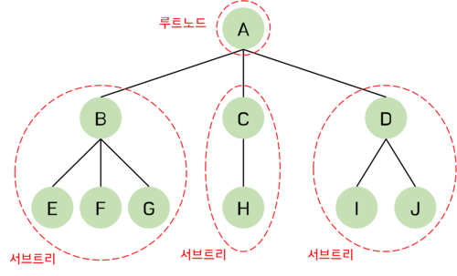

# 트리(Tree)란?

트리는 계층적인 구조를 표현하는 자료구조로, 여러 개의 노드(Node)로 구성되어 있다. 이 노드들은 부모(Parent)와 자식(Child) 관계를 가지며, 서로 다른 노드들을 연결하는 에지(Edge)로 이루어져 있다. 트리는 다양한 분야에서 사용되며, 특히 데이터베이스, 운영체제, 알고리즘 등에서 널리 사용된다. 예를 들어, 파일 시스템에서 폴더와 파일의 계층 구조를 표현하기 위해 트리를 사용한다.

### 트리와 그래프의 차이점

> 트리는 DAG(Directed Acyclic Graphs, 방향성이 있는 비순환 그래프)의 한 종류이다.

트리는 두 개의 노드 사이에 반드시 1개의 경로만 가지지만, 그래프는 단방향, 양방향을 모두 가리킬 수 있다. 또한 트리는 하나의 부모 노드를 가지며 루트 또한 하나여야 한다.

|               |         그래프         |           트리           |
| :------------ | :--------------------: | :----------------------: |
| **방향성**    |      방향, 무방향      |           방향           |
| **사이클**    | 순환, 비순환, 자기순환 |          비순환          |
| **루트 노드** |     루트 개념 없음     |     1개의 루트 존재      |
| **부모-자식** |  부모-자식 개념 없음   |     1개의 부모 노드      |
| **모델**      |     네트워크 모델      |        계층 모델         |
| **간선 수**   |          자유          | $N-1$개($N$은 노드 개수) |

# 트리의 종류

### 이진 트리

**이진 트리(Binary Tree)**는 자식 노드가 최대 두 개인 트리이다. 이진 트리는 데이터를 정렬된 상태로 유지하기 위해 사용되며, 자료구조 분야에서 가장 많이 사용되는 자료구조 중 하나이다.

### 이진 탐색 트리

**이진 탐색 트리(Binary Search Tree)**는 이진 트리 중에서도 왼쪽 서브 트리의 모든 노드가 오른쪽 서브 트리의 모든 노드보다 작은 경우를 말한다. 이진 탐색 트리는 데이터를 정렬된 상태로 유지하기 때문에, 탐색 시간이 $O(\log N)$으로 매우 빠르다.

### 이진 힙

**이진 힙(Binary Heap)**은 이진 트리 중에서도 특별한 형태의 이진 트리이다. 이진 힙은 이진 탐색 트리와는 달리, 특정한 정렬 순서를 가지지 않는다. 대신, 각 노드는 특정한 우선순위(priority)를 가지며, 부모 노드는 항상 자식 노드보다 더 높은 우선순위를 가진다.

### AVL 트리

**AVL 트리(발명자의 이름인 Adelson-Velsky and Landis에서 따온 이름)**는 이진 탐색 트리의 일종으로, 균형을 유지하는 트리이다. AVL 트리는 모든 노드의 왼쪽 서브 트리와 오른쪽 서브 트리의 높이 차이가 1 이하인 트리다. 따라서, 탐색 시간이 $O(\log N)$으로 매우 빠르다.

### B-트리

**B 트리(B-tree)**는 여러 개의 자식 노드를 가질 수 있는 이진 탐색 트리의 변형이다. B-트리는 대용량 데이터를 처리하기 위한 데이터베이스 등에서 사용된다.

### 트라이

**트라이(Trie)**는 문자열 검색에 특화된 트리이다. 문자열의 각 문자를 노드로 표현하며, 문자열을 찾을 때는 각 문자의 노드를 따라가면 된다.

# 트리의 용어들

트리의 구성 요소에 해당하는 A, B, C, D, E, F, G, H, I, J를 **노드(node)**라 한다.

트리는 한 개 이상의 노드로 이루어진 유한 집합이다. 트리의 최상단에 있는 노드를 **루트 노드(root node)**라고 하고 나머지 노드들은 **서브 트리(sub tree)**라고 한다. 전체 노드 집합 `{A, B, C, D, E, F, G, H, I}` 중에 서 루트 노드는 `A`이고 나머지 `{B, E, F, G}`, `{C, H}`, `{D, I, J}` 3개의 집합으로 나누어지는 이 노드들은 A의 서브 트리라고 한다. 다시 서브 트리인 `{B, E, F, G}`의 루트는 `B`가 되고 나머지 노드들은 다시 3개의 서브 트리, 즉 `{E}`, `{F}`, `{G}`로 나누어진다.

트리에서 루트와 서브 트리는 선으로 연결된다. 이 연결선을 **간선(edge)**라고 한다.

노드 간에는 부모 관계, 자식 관계, 형제 관계가 존재한다. `A`는 `B`의 **부모 노드(parent node)**가 된다. 반대로 `B`는 `A`의 **자식 노드(children node)**이 된다. `B`와 `C`와 `D`는 **형제 관계(sibling)**이다.

자식 노드가 없는 노드를 **단말 노드(terminal node, 또는 leaf node)**라고 한다.

**노드의 차수(degree)**는 어떤 노드가 가지고 있는 자식 노드의 개수를 의미한다. 위 그림에서 루트 노드의 경우, 자식 노드가 3개이기 때문에 차수도 3이 된다. 단말 노드는 차수가 0인 노드이다.

**트리의 차수(degree of tree)**는 트리가 가지고 있는 노드의 차수 중에서 가장 큰 값이다. 위 그림에서 `A`와 `B` 노드의 차수가 3으로 가장 크므로 전체 트리의 차수는 3이다.

**노드의 레벨(level)**은 트리의 각층에 번호를 매기는 것으로 루트의 레벨은 1이 되고 한 층씩 내려갈수록 1씩 증가한다. 위 그림에서 `A`의 레벨은 1이고, `B`의 레벨은 2이다.

**트리의 높이(height)**는 트리가 가지고 있는 최대 레벨을 말한다. 위 그림에서 트리의 높이는 3이다.

<blockquote variant="info">

이진 트리와 이진 탐색트리에 대한 내용은 [이진 트리(binary tree)와 이진 탐색 트리(binary search tree)](https://chamdom.blog/binary-tree/)에서 확인할 수 있다.

</blockquote>

 

---

# 참고

- [C언어로 쉽게 풀어쓴 자료구조](http://www.yes24.com/Product/Goods/69750539)
- https://bigsong.tistory.com/33
