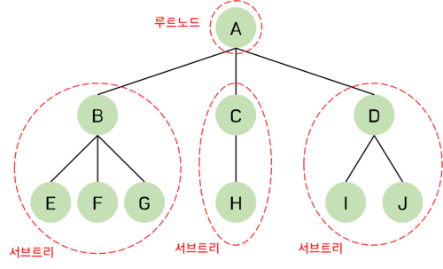
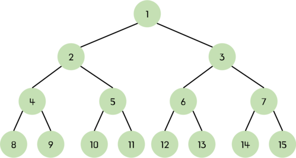
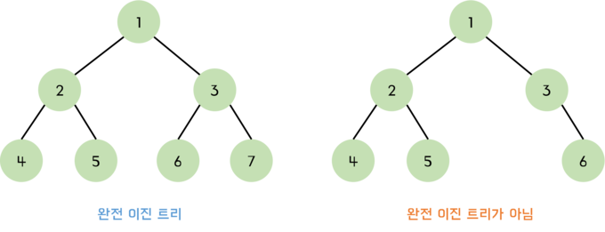
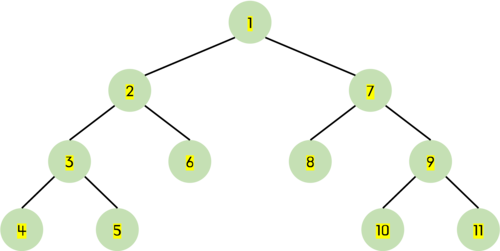
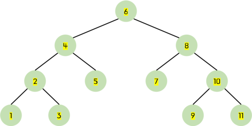
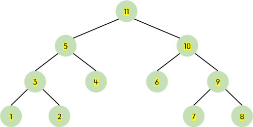
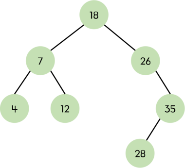

# 트리(Tree)란?

**트리(Tree)**는 그래프의 한 종류이다. 트리는 순환 구조를 갖지 않는(사이클이 존재하지 않는) 방향 그래프이다. 하나의 뿌리에서 위로 뻗어나가는 형상처럼 생겨서 트리(나무)라는 명칭이 붙었다. 트리는 계층적인 자료를 표현하는데 적합한 자료구조이다.

## 트리와 그래프의 차이점

_트리는 DAG(Directed Acyclic Graphs, 방향성이 있는 비순환 그래프)의 한 종류이다._

트리는 두 개의 노드 사이에 반드시 1개의 경로만 가지지만, 그래프는 단방향, 양방향을 모두 가리킬 수 있다. 또한 트리는 하나의 부모 노드를 가지며 루트 또한 하나여야 한다.

|               | 그래프                 | 트리                     |
| ------------- | ---------------------- | ------------------------ |
| **방향성**    | 방향, 무방향           | 방향                     |
| **사이클**    | 순환, 비순환, 자기순환 | 비순환                   |
| **루트 노드** | 루트 개념 없음         | 1개의 루트 존재          |
| **부모-자식** | 부모-자식 개념 없음    | 1개의 부모 노드          |
| **모델**      | 네트워크 모델          | 계층 모델                |
| **간선 수**   | 자유                   | $N-1$개($N$은 노드 개수) |

## 트리의 용어들



트리의 구성 요소에 해당하는 A, B, C, D, E, F, G, H, I, J를 **노드(node)**라 한다.

트리는 한 개 이상의 노드로 이루어진 유한 집합이다. 트리의 최상단에 있는 노드를 **루트 노드(root node)**라고 하고 나머지 노드들은 **서브 트리(sub tree)**라고 한다. 전체 노드 집합 `{A, B, C, D, E, F, G, H, I}` 중에 서 루트 노드는 `A`이고 나머지 `{B, E, F, G}`, `{C, H}`, `{D, I, J}` 3개의 집합으로 나누어지는 이 노드들은 A의 서브 트리라고 한다. 다시 서브 트리인 `{B, E, F, G}`의 루트는 `B`가 되고 나머지 노드들은 다시 3개의 서브 트리, 즉 `{E}`, `{F}`, `{G}`로 나누어진다.

트리에서 루트와 서브 트리는 선으로 연결된다. 이 연결선을 **간선(edge)**라고 한다.

노드 간에는 부모 관계, 자식 관계, 형제 관계가 존재한다. `A`는 `B`의 **부모 노드(parent node)**가 된다. 반대로 `B`는 `A`의 **자식 노드(children node)**이 된다. `B`와 `C`와 `D`는 **형제 관계(sibling)**이다.

자식 노드가 없는 노드를 **단말 노드(terminal node, 또는 leaf node)**라고 한다.

**노드의 차수(degree)**는 어떤 노드가 가지고 있는 자식 노드의 개수를 의미한다. 위 그림에서 루트 노드의 경우, 자식 노드가 3개이기 때문에 차수도 3이 된다. 단말 노드는 차수가 0인 노드이다.

**트리의 차수(degree of tree)**는 트리가 가지고 있는 노드의 차수 중에서 가장 큰 값이다. 위 그림에서 `A`와 `B` 노드의 차수가 3으로 가장 크므로 전체 트리의 차수는 3이다.

**노드의 레벨(level)**은 트리의 각층에 번호를 매기는 것으로 루트의 레벨은 1이 되고 한 층씩 내려갈수록 1씩 증가한다. 위 그림에서 `A`의 레벨은 1이고, `B`의 레벨은 2이다.

**트리의 높이(height)**는 트리가 가지고 있는 최대 레벨을 말한다. 위 그림에서 트리의 높이는 3이다.

<br />

---

<br />

# 이진 트리(Binary Tree)란?

이진 트리는 트리 중에서 가장 널리 쓰이는 트리이다. 자식노드가 최대 두 개인 노드들로 구성된 트리를 **이진 트리(binary tree)**라고 한다.

## 트리와 이진 트리의 차이점

- 이진 트리의 모든 노드는 차수가 2이하이다. 즉, 자식 노드의 개수가 2 이하이다. 반면 일반 트리는 자식 노드의 개수에 제한이 없다.
- 이진 트리는 노드를 하나도 갖지 않을 수도 있다.
- 이진 트리는 서브 트리 간에 순서가 존재한다. 따라서 왼쪽 서브 트리와 오른쪽 서브 트리를 구분한다.

## 이진 트리 종류

### 포화 이진 트리

**포화 이진 트리(full binary tree)**는 용어 그대로 트리의 각 레벨에 노드가 꽉 찬 이진 트리이다. 높이가 $k$인 포화 이진 트리는 정확하게 $2^k-1$개의 노드를 가진다.


<br />

### 완전 이진 트리

**완전 이진 트리(complete binary tree)**는 높이가 $k$일 때 레벨 1부터 $k-1$까지는 노드가 모두 채워져 있고 $k$레벨에서는 왼쪽부터 오른쪽으로 노드가 순서대로 채워져 있는 이진 트리이다. 마지막 레벨에서는 노드가 꽉 차 있지 않아도 되지만 중간에 빈 노드가 있어서는 안 된다.

_포화 이진 트리는 항상 완전 이진 트리이지만 그 역은 항상 성립하지 않는다._



<br />

## 이진 트리의 순회

이진 트리를 순회하는 대표적인 방법에는 `전위`, `중위`, `후의`의 3가지 방법이 있다. 이는 루트와 왼쪽 서브 트리, 오른쪽 서브 트리 중에서 루트를 언제 방문하느냐에 따라 구분된다.

### 전위 순회

**전위 순회(preorder traversal)**는 루트, 왼쪽 서브 트리, 오른쪽 서브 트리 순서로 방문한다.


<br />

### 중위 순회

**중위 순회(inorder traversal)**는 왼쪽 서브 트리, 루트, 오른쪽 서브 트리를 순서로 방문한다.


<br />

### 후위 순회

**후위 순회(postorder traversal)**는 왼쪽 서브 트리, 오른쪽 서브 트리, 루트를 순서로 방문한다.



<br />

---

# 이진 탐색 트리



**이진 탐색 트리(binary search tree)**는 이진 트리 기반의 탐색을 위한 자료구조이다. 이진 탐색 트리는 정렬된 트리로, 노드의 왼쪽 서브 트리에는 그 노드의 값보다 작은 값들을 지닌 노드들로 이뤄져 있고 오른쪽 서브 트리에는 노드의 값과 같거나 큰 값들을 지닌 노드들로 이루어져 있는 트리이다. 따라서 찾고자 하는 값이 루트 노드의 값과 비교하여 루트 노드보다 작으면 찾고자 하는 값은 왼쪽 서브 트리에 있고 루트 노드보다 크면 오른쪽 서브 트리에 있음을 쉽게 알 수 있다. 즉, 이진 탐색 트리는 **왼쪽 자식 노드 < 부모 노드 < 오른쪽 자식 노드**가 성립되며 중복되는 값을 허용하지 않는다.

## 이진 탐색 트리 구현

```jsx
class Node {
  constructor(value) {
    this.value = value;
    this.left = null;
    this.right = null;
  }
}

class BinarySearchTree {
  constructor() {
    this.root = null;
  }

  isEmpty() {
    return this.root === null;
  }

  insert(value) {
    const newNode = new Node(value);
    if (this.isEmpty()) {
      this.root = newNode;
    } else {
      this.insertNode(this.root, newNode);
    }
  }

  insertNode(root, newNode) {
    if (newNode.value < root.value) {
      if (root.left === null) root.left = newNode;
      else this.insertNode(root.left, newNode);
    } else {
      if (root.right === null) root.right = newNode;
      else this.insertNode(root.right, newNode);
    }
  }

  search(root, value) {
    if (!root) return null;
    else if (value < root.value) return this.search(root.left, value);
    else if (value > root.value) return this.search(root.right, value);
    else return value;
  }
}

const bst = new BinarySearchTree();
bst.insert(10);
bst.insert(5);
bst.insert(15);

console.log(bst.search(bst.root, 10)); // 10
```

<br />

---

<br />

# 참고

- [C언어로 쉽게 풀어쓴 자료구조](http://www.yes24.com/Product/Goods/69750539)
- [이것이 취업을 위한 코딩테스트다](http://www.yes24.com/Product/Goods/91433923)
- [파이썬 알고리즘 인터뷰](http://www.yes24.com/Product/Goods/91084402)
- [https://bigsong.tistory.com/33](https://bigsong.tistory.com/33)
- [https://www.geeksforgeeks.org/implementation-binary-search-tree-javascript/](https://www.geeksforgeeks.org/implementation-binary-search-tree-javascript/)
