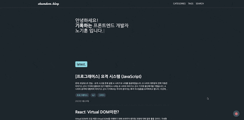
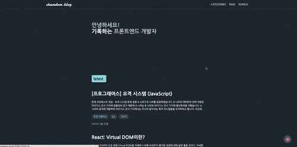

# 들어가며

이제는 당연하게 사용되는 다크 모드를 블로그에 적용하려고 한다. 솔직히 엄청 간단할 것이라고 생각했는데 블로그를 제작하면서 제일 많은 시간을 투자했다. 이번 포스팅에서 다크 모드를 적용하는 방법과 함께 내가 겪었던 문제점들을 공유하려고 한다.

먼저 기능 구현을 하고 회고를 하는 것이다 보니, 중간 과정 코드들은 예시정도로만 보고 넘어가자.😅

# 처음으로 구현한 다크 모드

먼저 필자가 제작한 Gatsby 블로그는 `Styled Components`를 사용하고 있다. 그래서 ThemeProvider를 사용해서 다크모드를 구현하려고 했다.

다음과 같이 색상 변수를 정의하고, 이 색상 변수를 사용해 theme 객체를 정의했다.

```js
const PRIMARY0 = 'hsl(210, 1%, 98%)';
const PRIMARY1 = 'hsl(210, 2%, 95%)';
const PRIMARY2 = 'hsl(210, 3%, 93%)';
const PRIMARY3 = 'hsl(210, 3%, 89%)';
const PRIMARY4 = 'hsl(210, 6%, 83%)';
const PRIMARY5 = 'hsl(210, 8%, 71%)';
const PRIMARY6 = 'hsl(210, 11%, 56%)';
const PRIMARY7 = 'hsl(210, 16%, 31%)';
const PRIMARY8 = 'hsl(210, 19%, 23%)';
const PRIMARY9 = 'hsl(210, 20%, 15%)';

export const lightTheme = {
  bgColor: PRIMARY0,
  textColor: PRIMARY9,
  ...
};

export const darkTheme = {
  bgColor: PRIMARY9,
  textColor: PRIMARY0,
  ...
};
```

그런데 위 방법으로 구현하고 문제가 생겼다! 화면이 깜빡이는 `FOUC(Flash of Unstyled Content)`가 발생한 것이다. 이 문제는 레더링 되기 전에 스타일이 적용되지 않고 렌더링 이후에 `ThemeProvider`에 의해 스타일이 적용되기 때문에 발생하는 문제다.

`FOUC`가 발생하면 찰나의 순간이긴 하지만 사용자 경험에 좋지 않기 때문에 다른 방법을 찾아보기로 했다.

# CSS Variables 사용하기

이를 해결하기 위한 한 가지 방법은 `CSS Variables`를 사용하기로 했다. html의 `data-theme` 속성을 변경하면서 다크 모드를 적용하기 위해서다. 이 방법을 사용하면 JavsScript가 로드되기 전(렌더링 되기전)에 CSS를 적용할 수 있기 때문에 `FOUC` 문제를 해결할 수 있다고 생각했다. 미약한 나의 지식으로는 이 방법밖에 떠오르지 않는다.🥲

<br/>

컴포넌트 기반의 디자인 시스템을 일관되게 유지하기 위해 Styled Components의 `createGlobalStyle`를 사용했다.

<blockquote title="Tip">

`createGlobalStyle`를 사용할 때 prettier가 적용되지 않는 오류가 발생할 수 있는데 코드를 다음과 같이 수정하면 해결할 수 있다.

```js
import { createGlobalStyle, css } from 'styled-components';

export default createGlobalStyle`${css`
  // style code
`}`;
```

</blockquote>

아래 코드처럼 CSS 변수를 정의하고, `data-theme='dark'` 속성을 가진 요소에 다크 모드에서 사용할 CSS 값을 설정한다. <u>꼭 lightTheme의 CSS 변수와 darkTheme의 CSS 변수 이름이 1:1 매핑되도록 작성해주어야 한다.</u> 이 부분이 가장 노가다가 심한 부분이었다.

```js
import { createGlobalStyle, css } from 'styled-components';

export default createGlobalStyle`${css`
  :root {
    --bgColor: ${({ theme }) => theme.colors.primary0};
    --textColor: ${({ theme }) => theme.colors.primary9};
    ...
  }

  [data-theme='dark'] {
    --bgColor: ${({ theme }) => theme.colors.primary9};
    --textColor: ${({ theme }) => theme.colors.primary0};
    ...
  }
`}`;
```

필자는 `gatsby-browser.js`와 `gatsby-ssr.js`에 `ThemeProvider`로 위 `GlobalStyle`을 감싸주는 방식으로 작성했다.

```js
import { ThemeProvider } from 'styled-components';

import GlobalStyle from './src/style/globalStyle';
import theme from './src/style/variables';

export const wrapPageElement = ({ element }) => (
  <ThemeProvider theme={theme}>
    <GlobalStyle />
    {element}
  </ThemeProvider>
);
```

이제 다음 코드와 같이 CSS 변수를 사용할 수 있다. 이렇게 하면 색상을 한 번만 선언하면 된다. 이것 때문에 1:1 매핑해서 선언하라고 한거다! 😁

```js
const Container = styled.div`
  background-color: var(--bgColor);
  color: var(--textColor);
  ...
`;
```

<br />

# 다크 모드 기능 구현하기

이제 색상 설정은 끝났으니 본격적으로 다크 모드 기능을 구현해보자. 우선, 다크 모드를 적용하는 방법을 다시 한 번 정리해보면 다음과 같다.

1.  색상을 createGlobalStyle를 이용해 `CSS Variables` 형태로 구현한다**(완료)**.
2.  컬러 모드를 변경하는 방법은 `data-theme` 속성을 변경하는 것으로 구현한다**(지금부터)**.

## getCurrentTheme 함수 생성

다크 모드 기능을 구현하면서 **사용자 환경 설정 테마 값**에 따라서도 다크모드가 적용될 수 있으면 좋을 것 같다. 이를 고려해서 다음과 같은 우선순위를 정했다.

1. 이전에 방문했던 적이 있어서 `localStorage`에 저장된 값이 있다면 그 값을 사용한다.
2. 사용자의 시스템 테마가 다크 모드라면 다크 모드를 사용한다.
3. 그 외의 경우에는 라이트 모드를 사용한다.

<br/>

위와 같은 우선순위를 정한 이유는 사용자의 개인 설정과 시스템 기본 설정 사이에 적절한 균형을 찾기 위해서다. 만약 사용자가 이전에 블로그를 방문했고 테마를 변경했다면, 그 변경 사항을 `localStorage`에 저장하고 이 값을 우선적으로 사용한다. 이렇게 하면 사용자의 개인화된 설정이 유지된다. 그러나 사용자가 블로그를 처음 방문한 경우, 시스템 설정을 따르도록 하는 것이다.

<br/>

여기서 사용자의 사용자 환경 설정 테마 값을 파악할 수 있을까? 이는 `prefers-color-scheme` 미디어 쿼리를 사용하면 알 수 있었다! 이 미디워 쿼리는 사용자의 시스템 테마가 다크 모드인지 라이트 모드인지 `boolean` 값을 반환한다.

<br/>

위 우선순위를 고려해서 만든 함수는 다음과 같다.

```ts
export function getCurrentTheme(): ThemeMode {
  const localTheme = getValue('themeMode');
  if (localTheme) return localTheme;

  if (typeof window !== 'undefined') {
    const colorSchemeQuery = window.matchMedia('(prefers-color-scheme: dark)');
    const systemTheme = colorSchemeQuery.matches ? 'dark' : 'light';
    return systemTheme;
  }
}
```

## Redux Slice 생성

다크 모드 테마를 저장하기 위해 전역 상태 관리 라이브러리인 **Redux**를 사용했다. 그리고 initialState의 `themeMode`를 `getCurrentTheme` 함수로 설정했다. 이제 브라우저가 새로고침되더라도 이전에 설정한 테마를 유지할 수 있다.

```ts
import { createSlice } from '@reduxjs/toolkit';
import { getCurrentTheme } from '@utils/getCurrentTheme';

const initialState: DarkModeState = {
  themeMode: getCurrentTheme(),
};

const darkModeSlice = createSlice({
  name: 'darkMode',
  initialState,
  reducers: {
    setTheme(state, action) {
      state.themeMode = action.payload.themeMode;
    },
  },
});

export const { setTheme } = darkModeSlice.actions;
export default darkModeSlice.reducer;
```

추가적으로 설명하자면, `getCurrentTheme` 함수를 initialState로 선언하더라도 FOUC 문제는 해결되지 않는다. 위 코드는 렌더링 이후에 실행되는 것이고 FOUC 문제를 해결하려면 레더링 이전에 추가적인 작업이 필요하다. 이 부분은 아래서 설명하겠다.

## useSysThemeEffect 커스텀 훅 만들기

이 커스텀 훅은 <u>시스템 테마가 변경되었을 때, 테마를 변경하는 역할</u>을 한다.

```ts
import { setTheme } from '@store/modules/darkMode';
import { getValue } from '@utils/storage';

export const useSysThemeEffect = () => {
  const dispatch = useAppDispatch();

  const checkSystemTheme = useCallback((e: MediaQueryListEvent) => {
    const newPrefersColorScheme = e.matches ? 'dark' : 'light';
    const newTheme = getValue('themeMode') || newPrefersColorScheme;
    dispatch(setTheme({ themeMode: newTheme, saveToLocalStorage: false }));
  }, []);

  useEffect(() => {
    const colorSchemeQuery = window.matchMedia('(prefers-color-scheme: dark)');
    colorSchemeQuery.addEventListener('change', checkSystemTheme);

    return () =>
      colorSchemeQuery.removeEventListener('change', checkSystemTheme);
  }, [checkSystemTheme, dispatch]);
};
```

이제 코드를 자세히 살펴보자. 코드에서 `setTheme`을 `dispatch`하는 부분을 보면 `saveToLocalStorage`를 전달하고 있다. 이는 `localStorage` 저장 여부를 결정하는 값이다.

이렇게 구분한 이유는 위에서 언급한 우선 순위를 따르기 위해서다. 시스템 테마를 `localStorage`에 저장하게 되면 이는 사용자의 개인 설정이 되기 때문에 시스템 테마가 변경되어도 `localStorage`에 저장된 테마가 우선적으로 적용되버리기 때문이다.

<br/>

정리하자면 이후에 만들 토글 버튼을 클릭해서 테마를 변경했을 때만 `localStorage`에 저장하고, 시스템 테마가 변경되었을 때는 `localStorage`에 저장하지 않는 것이다.

### Redux Middleware

`setTheme`을 `dispatch`할 때, `saveToLocalStorage`를 전달하지만 redux 코드에서는 이를 처리하는 부분이 없다. 사실 처음에는 이를 처리하는 부분을 리듀서에 구현했었다.

```ts
const darkModeSlice = createSlice({
  name: 'darkMode',
  initialState,
  reducers: {
    setTheme(state, action) {
      const { themeMode, saveToLocalStorage } = action.payload;
      if (saveToLocalStorage) {
        setValue('themeMode', themeMode);
      }
      document.documentElement.dataset.theme = themeMode;
      state.themeMode = themeMode;
    },
  },
});
```

하지만, 이는 [Redux의 설계 원칙](https://redux.js.org/understanding/thinking-in-redux/three-principles)에 어긋나는 방법이기 때문에 이를 처리하는 부분을 `middleware`로 분리했다.

`createAsyncThunk`를 사용하거나 middleware에 `redux-logger`를 추가해서 사용해본적은 있지만 이런 **side effect**를 처리하기 위해 사용해본 적은 이번이 처음이다. ~~따라서 매우 구린 코드일 수 있으니 참고만 하기 바란다..😅~~

<br/>

코드는 다음과 같다.

```ts
// themeMiddleware.ts

import { Middleware } from '@reduxjs/toolkit';
import { setValue } from '@utils/storage';

export const themeMiddleware: Middleware = () => next => action => {
  if (action.type === 'darkMode/setTheme') {
    const { themeMode, saveToLocalStorage } = action.payload;
    if (saveToLocalStorage) {
      setValue('themeMode', themeMode);
    }
    if (typeof document !== 'undefined') {
      document.documentElement.dataset.theme = themeMode;
    }
  }
  next(action);
};
```

```ts
// store.ts

import { configureStore, combineReducers } from '@reduxjs/toolkit';

import darkModeSlice from './modules/darkMode';
import { themeMiddleware } from './modules/themeMiddleware';

const rootReducer = combineReducers({ darkMode: darkModeSlice });

const store = configureStore({
  reducer: rootReducer,
  middleware: getDefaultMiddleware =>
    getDefaultMiddleware().prepend(themeMiddleware),
});

export default store;

export type RootState = ReturnType<typeof store.getState>;
export type AppDispatch = typeof store.dispatch;
```

## ThemeToggle 컴포넌트 만들기

이제 다크 모드를 토글할 수 있는 버튼을 만들 차례이다. 먼저 코드는 다음과 같다.

```tsx
import React from 'react';
import { AnimatePresence, motion } from 'framer-motion';

import { useAppDispatch, useAppSelector } from '@hooks/reduxHooks';
import { setTheme } from '@store/modules/darkMode';

// CSS
import * as S from './style';
import { FaSun, FaMoon } from 'react-icons/fa';

const ThemeIcon = {
  dark: <FaSun />,
  light: <FaMoon />,
};

const ThemeToggleButton = () => {
  const { themeMode } = useAppSelector(state => state.darkMode);
  const dispatch = useAppDispatch();

  const themeToggleHandler = () => {
    const nextTheme = themeMode === 'dark' ? 'light' : 'dark';
    dispatch(setTheme({ themeMode: nextTheme, saveToLocalStorage: true }));
  };

  return (
    <S.ToggleWrapper onClick={themeToggleHandler}>
      <AnimatePresence exitBeforeEnter initial={false}>
        <motion.div
          key={themeMode}
          initial={{ rotate: -180, opacity: 1 }}
          animate={{ rotate: 0, opacity: 1 }}
          exit={{ rotate: 180, opacity: 0 }}
          transition={{ duration: 0.3 }}
        >
          {ThemeIcon[themeMode]}
        </motion.div>
      </AnimatePresence>
    </S.ToggleWrapper>
  );
};

export default ThemeToggleButton;
```

여기서는 `setTheme`을 `dispatch`할 때, `saveToLocalStorage`를 `true`로 전달했다. 이는 사용자가 의도적으로 테마를 변경했다는 의미이다. `localStorage`가 우선순위에서 더 높게 적용되기 때문에 버튼을 클릭한 다음 시스템 테마가 변경되어도 `localStorage`에 저장된 테마가 적용된다.

# FOUC 문제 해결하기

<p align="center">



</p>

여기서 문제가 발생했다 😱 다크 모드를 적용하고 브라우저를 새로고침 하면 위와 같이 화면이 깜빡이는 문제가 생겼다.

<br/>

찾아보니 이러한 현상을 **FOUC(Flash of unstyled content)**라고 부른다. 스타일시트가 완전히 로드되기 전에 HTML 콘텐츠가 먼저 렌더링되면 스타일이 적용되지 않은 상태로 페이지가 표시되거나 기본 값(라이트 모드)로 표시되었다가 클라이언트 측에서 저장된 설정을 불러와 다크모드를 적용하는 과정에서 발생하는 것이다.

따라서 클라이언트 사이드에서는 처리할 수 없고, 서버 사이드에서 처리해야 한다. 이를 해결하기 위해 `gatsby-ssr.js`에 다음과 같은 코드를 추가했다.

```js
// gatsby-ssr.js

const darkModeScript = `
(function() {
  const value = window.localStorage.getItem('themeMode');
  const localTheme = JSON.parse(value);
  if (localTheme) {
    document.documentElement.dataset.theme = localTheme;
    return;
  }

  const systemTheme = window.matchMedia('(prefers-color-scheme: dark)');
  if(systemTheme.matches) {
    document.documentElement.dataset.theme = 'dark';
  } else {
    document.documentElement.dataset.theme = 'light';
  }
})();
`;

export const onRenderBody = ({ setPreBodyComponents }) => {
  setPreBodyComponents([
    createElement('script', {
      key: 'darkModeScript',
      dangerouslySetInnerHTML: {
        __html: darkModeScript,
      },
    }),
  ]);
};
```

이 코드는 브라우저에 렌더링되기 전에 실행되는 코드이다. `localStorage`에 저장된 테마가 있다면 그 값을 가져오고, 그렇지 않다면 시스템 테마를 가져와 `data-theme`을 업데이트 시켜준다.

<br/>

이렇게 하면 브라우저가 렌더링되기 전에 테마가 적용되기 때문에 `FOUC`가 발생하지 않는다.



굿- 😎

# 마치며

블로그에 다크 모드를 적용하면서 이전에는 고려해보지 않았던 사용자 경험도 개선해보았다. 색상을 선정하고 적용하는 것도 시간이 오래 걸리는 작업이었다. 컴포넌트가 많지 않아서 다행이었지만, 컴포넌트가 많다면 이를 관리하는 것도 쉽지 않을 것 같다.

아직은 코드가 깔끔하지 않다고 생각되지만, 블로그를 만들면서 꼭 적용하고 싶던 기능을 적용해서 뿌듯하다. 😆

<br/>

평소에 당연하다고 느끼던 기능들이 얼마나 많은 고민과 시간이 필요한지 알게 되었다. 사용자 경험이 매우 중요하다고 느꼈고 이를 고려해서 개발하면서 서버 사이드에 대한 공부도 하게 되고 정말 좋은 경험이었다. 지금은 서버 사이드에 대한 이해도가 충분하지 않기 때문에 꼭 이 부분을 공부해야겠다.

<blockquote variant='info'>

위 과정에 대한 전체 코드는 [깃허브](https://github.com/CH4MD0M/gatsby-starter-dom)에서 확인할 수 있다.

</blockquote>

<br />

# 참고

- [CSS변수를 활용하여 다크 모드 구현하기](https://jthcast.dev/posts/how-to-make-dark-mode-with-css-variables/)
- [벨로그에 다크 모드 적용하기](https://velog.io/@velopert/velog-dark-mode#styled-components%EC%97%90%EC%84%9C-css-variable-%EC%93%B0%EA%B8%B0)
- [Gatsby Blog 다크 모드 적용기](https://www.sungikchoi.com/blog/gatsby-dark-mode/)
- [kaicataldo/gatsby-ssr.js](https://gist.github.com/kaicataldo/f28b6adf941d1575afa78e647624a327#file-gatsby-ssr-js-L8)
- [Gatsby, Lumen and Dark Mode](https://jmartins.dev/posts/gatsby-lumen-and-dark-mode)
