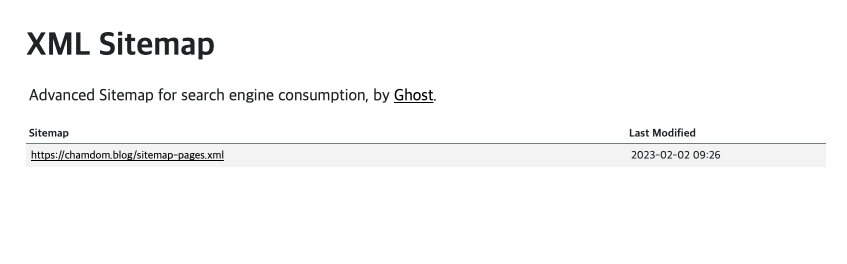

> SEO에 대한 포스팅은 [여기](https://chamdom.blog/what-is-seo)에서 확인할 수 있다.

블로그를 운영하면서 웹사이트가 상단에 노출시키고 싶다는 욕심이 생겼다. 그래서 SEO를 설정해보기로 했다.

<br/>

검색 엔진은 웹사이트의 콘텐츠를 수집하고, 색인화하고, 검색 결과로 제공한다. 이때, 검색 엔진이 웹사이트를 수집하고 색인화하는 과정을 크롤링이라고 한다. 이 크롤링 과정에서 크롤러(봇)에게 우리의 웹사이트를 잘 알려주어야 하는데 그 역할을 하는 것이 바로 `robots.txt`와 `sitemap.xml`이다.

# sitemap.xml 생성

먼저 sitemap.xml을 생성해보자. sitemap.xml은 웹사이트의 구조를 검색 엔진에게 알려주는 역할을 한다. 킹갓 gatsby 플러그인을 설치하면 sitemap을 자동으로 생성해준다.

`gatsby-plugin-advanced-sitemap`을 사용하면 좀 더 읽기 좋은 화면처럼 구성해준다.

```bash
npm install gatsby-plugin-advanced-sitemap
# 또는
yarn add gatsby-plugin-advanced-sitemap

```

플러그인을 설치하고 `gatsby-config.js`에 아래와 같이 플러그인을 추가해주면 끝이다.

```js
// gatsby-config.js
module.exports = {
  ...

  plugins: [`gatsby-plugin-advanced-sitemap`],
};
```

사이트맵이 잘 생성되었는지 확인해보자. `gatsby build`후 public `url/sitemap.xml`에 접속하면 사이트맵이 생성된 것을 확인할 수 있다.



# robots.txt 생성

`robots.txt` 파일은 검색 엔진 크롤러가 웹사이트를 방문할 때, 어떤 페이지를 수집할 수 있는지 알려주는 역할을 한다. `robots.txt` 파일은 루트 디렉토리에 위치해야 하고 `robots.txt` 파일이 없으면 모든 페이지를 수집한다.

`gatsby-plugin-robots-txt` 플러그인을 설치하면 된다. 이 플러그인 또한 알아서 자동으로 생성해준다.

```bash
npm install gatsby-plugin-robots-txt
# 또는
yarn add gatsby-plugin-robots-txt
```

플러그인을 설치하고 `gatsby-config.js`에 아래와 같이 플러그인을 추가하고 설정을 해준다. 필자는 모든 페이지를 크롤링 하도록 설정했다.

```js
// gatsby-config.js
module.exports = {
  ...

  plugins: [
    {
      resolve: 'gatsby-plugin-robots-txt',
      options: {
        host: 'https://chamdom.blog',
        sitemap: 'https://chamdom.blog/sitemap.xml',
        policy: [{ userAgent: '*', allow: '/' }],
      },
    },
  ],
};
```

빌드 후 `public/robots.txt`에 접속하면 아래와 같이 생성된 것을 확인할 수 있다.

```txt
User-agent: *
Allow: /
Sitemap: https://chamdom.blog/sitemap.xml
Host: https://chamdom.blog
```

<br />

> Gatsby react helmet 설정하는 방법은 [해당 게시글](https://chamdom.blog/gatsby-blog-seo-2)에서 확인할 수 있다.
> Gatsby 블로그를 google search console 등록하는 방법은 [해당 게시글](https://chamdom.blog/gatsby-blog-seo-3)에서 확인할 수 있다.
