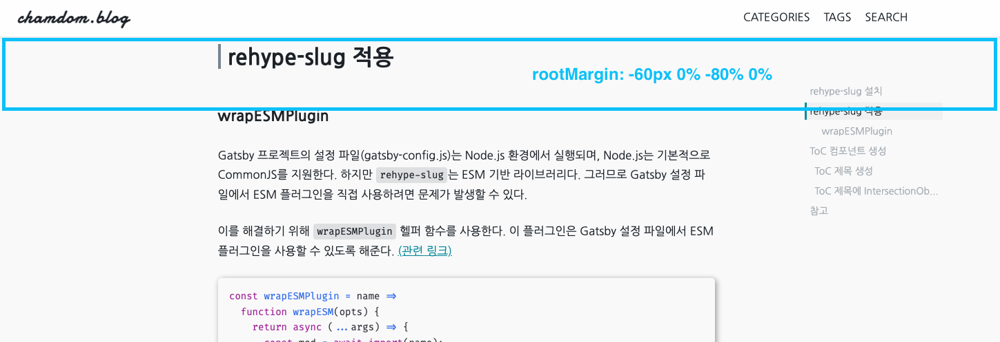

여러 개발 블로그를 보면 글의 목차를 보여주는 Toc 기능이 있는 것을 볼 수 있다. 보기에 편한 기능도 있지만 개인적으로 멋있어보였다!ㅎㅎ

<br/>

gatsby 블로그에서 Toc기능 구현하는 방법을 찾아보던 중 `gatsby-remark-autolink-headers`라는 플러그인을 찾았다. 이 플러그인은 마크다운 파일의 `headder`를 찾아서 링크를 걸어주는 역할을 한다.

<br/>

Toc에서 헤더를 클릭하면 주소창에 **#(해시)**가 추가되어 해당 위치로 이동하게 된다. 문제는 이 상태에서 '뒤로 가기'를 하면 이전 페이지로 이동하는 것이 아니라, 해시 클릭 전의 섹션으로 돌아가게 된다는 점이다. 따라서 사용자가 완전히 이전 페이지로 돌아가고 싶을 때 여러 번 '뒤로 가기' 버튼을 눌러야 하는 불편함이 생길 수 있다. (항상 편한 방법에는 나사가 하나씩 빠져있는듯🥲)

<br/>

그리고 gatsby 블로그를 만들면서 최대한 기능 구현은 직접 하고 싶다는 생각을 했기 때문에 자동으로 생성해주는 플러그인, 라이브러리들은 최대한 사용하지 않으려고 했다.

<br/>

서론이 길었다. 바로 Toc 기능을 구현하는 방법을 알아보자.

# rehype-slug 설치

ToC를 생성하려면 각 제목 요소에 고유한 식별자가 필요하다. 이를 통해 링크를 생성하거나 active 상태를 체크하기 위해서다

`rehype-slug`는 이 식별자를 자동으로 생성해주는 라이브러리다. 제목 요소를 찾아서 텍스트를 기반으로 한 고유한 식별자를 만들어주고, 이를 제목 요소에 'id' 속성으로 추가해준다.

<br/>

설치는 아래와 같이 하면 된다.

```bash
npm install --save rehype-slug
# or
yarn add rehype-slug
```

# rehype-slug 적용

## wrapESMPlugin

Gatsby 프로젝트의 설정 파일(gatsby-config.js)는 Node.js 환경에서 실행되며, Node.js는 기본적으로 CommonJS를 지원한다. 하지만 `rehype-slug`는 ESM 기반 라이브러리다. 그러므로 Gatsby 설정 파일에서 ESM 플러그인을 직접 사용하려면 문제가 발생할 수 있다.

<br/>

이를 해결하기 위해 `wrapESMPlugin` 헬퍼 함수를 사용한다. 이 플러그인은 Gatsby 설정 파일에서 ESM 플러그인을 사용할 수 있도록 해준다. [(관련 링크)](https://www.gatsbyjs.com/plugins/gatsby-plugin-mdx/)

```js
const wrapESMPlugin = name =>
  function wrapESM(opts) {
    return async (...args) => {
      const mod = await import(name);
      const plugin = mod.default(opts);
      return plugin(...args);
    };
  };
```

이제 `gatsby-config.js` 파일에 아래와 같이 추가해주자.

```js
{
  resolve: 'gatsby-plugin-mdx',
  options: {
    rehypePlugins: [wrapESMPlugin('rehype-slug')],
  }
}
```

# useHeadObserver Hooks 생성

먼저 필자는 ToC를 구현하는데 `IntersectionObserver`를 사용했다. 그리고 이 기능을 Hooks로 분리했다. 자세한 코드는 [깃허브]()에서 확인할 수 있다! 주석을 제거한 Hooks 코드는 게시글 끝에 작성했다.

## Toc 제목 가져오기

먼저 제목 부분을 모두 가져온다.

여기서 `newHeadings`을 생성해서 객체 배열로 저장한 이유는 Intersection Observer에서 각 헤딩을 쉽게 관찰하고, 해당 id를 바로 가져와 코드 가독성을 높이기 위함이다.

```tsx
// 페이지의 모든 제목을 담을 상태 배열
const [headings, setHeadings] = useState<HTMLElement[]>([]);
// 현재 활성화된 제목의 ID
const [activeHeadingId, setActiveHeadingId] = useState<string>('');

useEffect(() => {
  // 페이지의 모든 제목 요소를 찾아 배열로 변환
  const headingElements = Array.from(
    document.querySelectorAll<HTMLElement>('#post-contents > :is(h1, h2, h3)'),
  );

  // 선택된 요소들을 Heading 객체 배열로 변환
  const newHeadings = headingElements.map(element => ({
    id: element.id,
    element: element,
  }));

  setHeadings(newHeadings);
}, []);
```

## IntersectionObserver 적용

> `intersectionObserver`에 관한 내용은 [HEROPY님 블로그](https://heropy.blog/2019/10/27/intersection-observer/)가 많은 도움이 되었다.

```tsx
useEffect(() => {
  // ...

  const handleObserver = (entries: IntersectionObserverEntry[]) => {
    entries.forEach(entry => {
      const id = entry.target.id;

      // 제목 요소가 화면에 보이면, 해당 제목의 ID를 활성 상태로 설정
      if (entry.isIntersecting) {
        setActiveHeadingId(id);
      }
    });
  };

  // IntersectionObserver 인스턴스 생성
  const observer = new IntersectionObserver(handleObserver, {
    rootMargin: `-60px 0px -80% 0px`,
  });

  // 모든 헤딩 요소에 대해 관찰을 시작
  newHeadings.forEach(heading => observer.observe(heading.element));

  // 컴포넌트가 언마운트될 때 Observer를 정리
  return () => observer.disconnect();
}, []);

return { headings, activeHeadingId };
```



필자의 블로그는 Navigation이 스크롤시에 내려오기 때문에 상당의 값을 -60px을 주었다. 이 부분은 각자의 블로그에 맞게 조절하면 된다.

<br/>

그리고 첫 렌더링 시점에 제일 첫 번째 Toc 제목을 활성화 시키기 위해서 다음 코드를 추가해 주었다.

```tsx
useEffect(() => {
  // ...

  // 헤딩이 하나 이상 있다면, 첫 번째 헤딩을 활성 헤딩으로 설정
  if (newHeadings.length > 0) setActiveHeadingId(newHeadings[0].id);

  // const handleObserver = (entries: IntersectionObserverEntry[]) => {
  // ...
}, []);
```

# Toc 컴포넌트 생성

이제 Toc 컴포넌트에 적용해보자.

위에서 작성했던 custom Hooks를 import 해서 `headings`와 `activeHeadingId`를 가져온다.

```tsx
import { useHeadObserver } from '@hooks/useHeadObserver';

const Toc = () => {
  const { headings, activeHeadingId } = useHeadObserver();

  // TOC-Item Click Handler
  const handleClickHeading = useCallback((itemId: string) => {
    const node = document.getElementById(itemId);
    animateScroll.scrollTo(getElementOffsetY(node) - 60);
  }, []);

  return (
    <S.TocWrapper>
      {headings.map(({ element, id }) => (
        <TocItem
          key={id}
          id={id}
          tagName={element?.tagName}
          isActive={id === activeHeadingId}
          onClick={handleClickHeading}
        >
          {element?.innerText}
        </TocItem>
      ))}
    </S.TocWrapper>
  );
};
```

`react-scroll` 라이브러리를 사용해서 제목 클릭시 해당 제목으로 스크롤이 이동하도록 구현했다. 여기서도 60px을 빼주는 이유는 Navigation이 내려오기 때문이다.

### TocItem 컴포넌트

```tsx
interface TocItemProps {
  id: string;
  tagName: string;
  isActive: boolean;
  onClick: (id: string) => void;
  children: React.ReactNode;
}

const TocItem = React.memo(
  ({ id, tagName, isActive, onClick, children }: TocItemProps) => {
    // tagName에 따라서 margin 값을 처리.
    const margin = useMemo(() => {
      switch (tagName) {
        case 'H1':
          return '0.5rem';
        case 'H2':
          return '1.2rem';
        case 'H3':
          return '2.2rem';
        default:
          return '0.5rem';
      }
    }, [tagName]);

    return (
      <S.TocItem active={isActive} ml={margin} onClick={() => onClick(id)}>
        {children}
      </S.TocItem>
    );
  },
);
export default TocItem;
```

# 개선점 발견

위 코드만으로도 Toc 생성과 제목 위치로 스크롤 시 해당 제목이 Toc 컴포넌트에서 활성화되는 기능은 잘 작동한다. 하지만, 추가로 구현하고 싶었던 기능이 있었다.

<br/>

제목을 기준으로 헤더가 활성화되던 방식을 콘텐츠 단위로 활성화되도록 하고 싶었다.

예를 들어, 사용자가 2번 제목 아래의 콘텐츠를 읽고 있다가 스크롤을 올려 1번 제목 아래의 콘텐츠가 보이면, 1번 제목이 활성화되도록 하는 것이다. 즉, 제목뿐만 아니라 그에 속한 전체 콘텐츠 영역이 기준이 되어 활성화 상태가 결정되게 하는 방식을 구현하고 싶었다.

<br/>

이를 위해서 스크롤의 방향을 판별할 수 있어야 했다. 위에서 작성했던 Hooks에 코드를 추가해 보자. 설명은 주석으로 작성했다.

```tsx
useEffect(() => {
  const handleObserver = (entries: IntersectionObserverEntry[]) => {
    entries.forEach(entry => {
      const id = entry.target.id;

      if (entry.isIntersecting) {
        // 제목 요소가 화면에 보이면, 해당 제목의 ID를 활성 상태로 설정하고 스크롤 위치를 저장
        setActiveHeadingId(id);
        scrollPositionRef.current = window.scrollY;
      } else {
        // 제목 요소가 화면에서 사라지면,
        // 마지막 스크롤 위치와 현재 스크롤 위치를 비교하여 스크롤 방향을 판단
        const diff = scrollPositionRef.current - window.scrollY;
        const isScrollingUp = diff > 0;

        // 현재 제목의 위치를 찾아 이전 제목을 얻음
        const currentIndex = newHeadings.findIndex(h => h.id === id);
        const prevEntry = newHeadings[currentIndex - 1];

        // 스크롤이 위로 움직이고 이전 제목이 존재하면, 이전 제목을 활성 상태로 설정
        if (isScrollingUp && prevEntry) setActiveHeadingId(prevEntry.id);
      }
    });
  };
}, []);
```

위 코드를 추가하면서 스크롤 방향을 판별해서 스크롤업 할 때, 이전 제목을 활성화할 수 있었다.

# 마치며

블로그를 만들면서 제일 구현하고 싶었던 기능 중에 하나였다. 생각보다 시간이 오래 걸렸지만 얻은 지식도 많아서 뿌듯했다. 그리고 다른 블로그 글을 보면서 스크롤 최적화에 대한 부분을 잠깐 보긴 했는데 이 부분도 공부해야할 것 같다!

<br />

# 참고

- [How to Track Scroll Direction Inside IntersectionObserver in React](https://reacthustle.com/blog/how-to-track-scroll-direction-inside-intersection-observer-in-react)
- [Gatsby 블로그 TOC 만들기](https://ha-young.github.io/2021/gatsby/2021-01-06-Gatsby-%EB%B8%94%EB%A1%9C%EA%B7%B8-TOC%EB%A7%8C%EB%93%A4%EA%B8%B0/)
