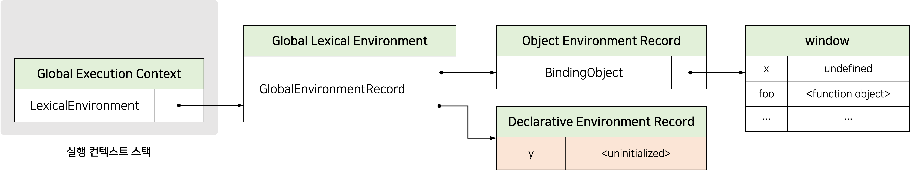
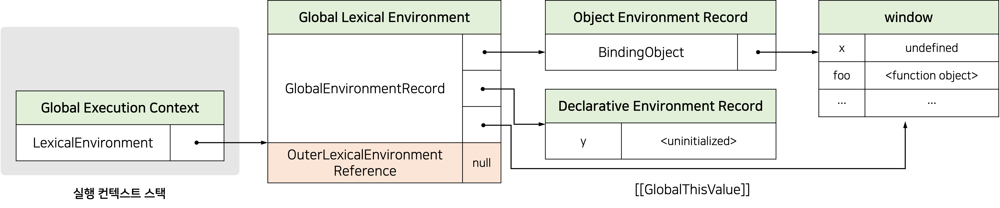
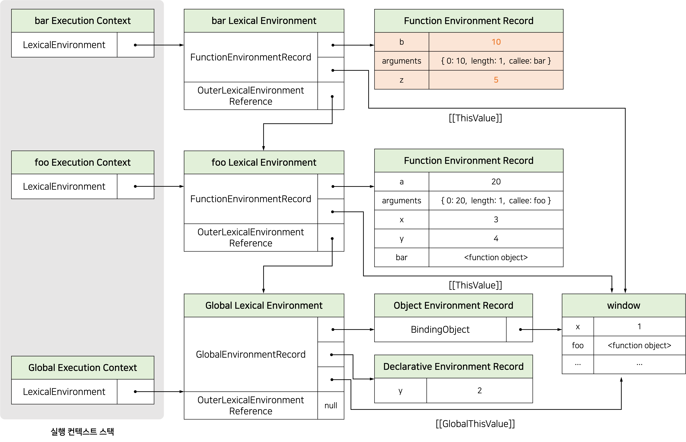
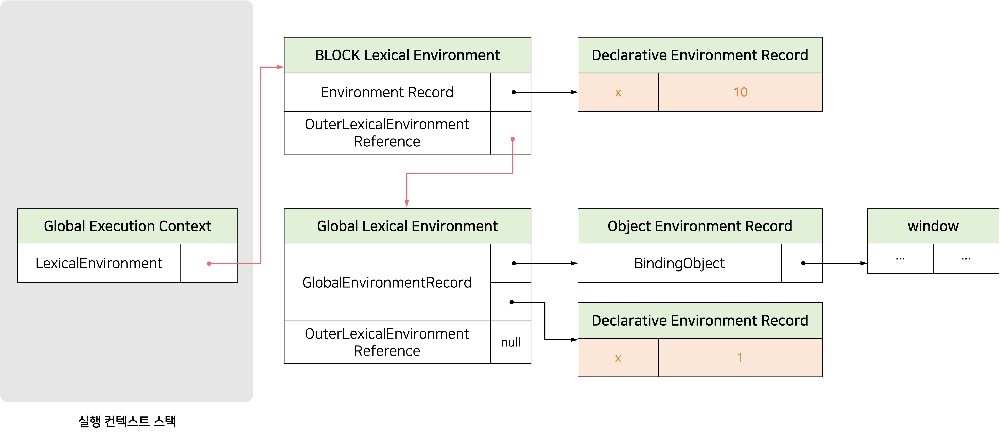

**실행 컨텍스트(execution context)**는 `scope`, `hoisting`, `function`, `this`, `closure` 등의 동작 원리를 담고 있는 자바스크립트의 핵심 원리이다.

ECMAScript 사양은 소스코드를 4가지 타입으로 구분한다.

- 전역 코드(global code)
- 함수 코드(function code)
- eval 코드(eval code)
- 모듈 코드(module code)

소스코드를 4가지 타입으로 구분하는 이유는 소스코드 타입에 따라 실행 컨텍스트를 생성하는 과정과 관리 내용이 다르기 때문이다.

# 소스코드의 평가와 실행


<br />

자바스크립트 엔진은 소스코드를 `소스코드의 평가`와 `소스코드의 실행 과정`으로 나누어 처리한다.

**소스코드 평가 과정**에서는 실행 컨텍스트를 생성하고 변수, 함수 등의 선언문만 먼저 실행하여 생성된 변수나 함수 식별자를 키로 실행 컨텍스트가 관리하는 스코프(렉시컬 환경의 환경 레코드)에 등록한다.

**소스코드 실행 과정**에서는 변수나 함수의 참조를 실행 컨텍스트가 관리하는 스코프에서 검색해서 취득한다. 그리고 변수 값의 변경 등 소스코드의 실행 결과는 다시 실행 컨텍스트가 관리하는 스코프에 등록된다.

<br />

```jsx
var x;
x = 1;
```

자바스크립트 엔진은 위 코드를 2개의 과정으로 나누어 처리한다.

먼저 소스코드 **평가 과정**에서 `var x;`를 실행한다. 이때 생성된 변수 식별자 `x`를 실행 컨텍스트가 관리하는 스코프에 등록되고 `undefined`로 초기화된다.
소스코드의 평가과정이 끝나면 소스코드 실행과정이 시작된다.

소스코드 **실행 과정** 에서는 `x = 1;`만 실행된다. 이때 변수 `x`에 값을 할당하려면 먼저 `x`가 선언된 변수인지 확인해야한다(실행컨텍스트가 관리하는 스코프에 x 변수가 등록되어 있는지 확인한다). 변수 `x`가 선언된 변수라면 값을 할당하고 할당 결과를 실행 컨텍스트에 등록하여 관리한다.

# 실행 컨텍스트의 역할

아래 코드는 전역 코드와 함수 코드로 구성되어 있다. 자바스크립트 엔진이 아래 코드를 어떻게 평가하고 실행하는지 알아보자.

```jsx
// 전역 변수 선언
const x = 1;
const y = 2;

// 함수 정의
function foo(a) {
  const x = 10;
  const y = 20;

  console.log(a + x + y); // 130
}

// 함수 호출
foo(100);

// 메서드 호출
console.log(x + y); //3
```

**1. 전역 코드 평가** <br />
전역 코드의 변수 선언문과 함수 선언문이 먼저 실행되고, 그결과 생성된 전역 변수와 전역 함수가 실행 컨텍스트가 관리하는 스코프에 등록된다. 이때 `var` 키워드로 선언된 전역 변수와 함수 선언문으로 정의된 전역 함수는 전역 객체의 프로퍼티와 메서드가 된다.

**2. 전역 코드 실행** <br />
런타임이 시작되어 전역 코드가 순차적으로 실행된다. 이때 전역 변수에 값이 할당되고 함수가 호출된다. 함수가 호출되면 전역 코드의 실행을 일시 중단하고 함수 내부로 이동한다.

**3. 함수 코드 평가** <br />
매개변수와 지역 변수 선언문이 먼저 실행되어 매개변수와 지역 변수가 실행 컨텍스트가 관리하는 지역 스코프에 등록된다. `arguments` 객체가 생성되어 지역 스코프에 등록되고 `this 바인딩`도 결정된다.

**4. 함수 코드 실행** <br />
런타임이 시작되어 함수 코드가 순차적으로 실행되기 시작한다. 이때 매개변수와 지역 변수에 값이 할당되고 console.log 메서드가 호출된다. console.log 메서드를 호출하기 위해 먼저 console을 스코프 체인을 통해 검색한다. 그 다음 log 프로퍼티를 console 객체의 프로토타입 체인을 통해 검색한다. 그후 console.log 메서드로 전달된 표현식 a+x+y가 평가된다.

**이처럼 코드가 실행되려면 스코프, 식별자, 코드 실행 순서 등의 관리가 필요하다.** 이 모든 것을 관리하느 것이 실행 컨텍스트다. **실행 컨텍스트는 소스코드를 실행하는 데 필요한 환경을 제공하고 코드의 실행 결과를 실제로 관리하는 영역이다.**

_실행 컨텍스트는 식별자(변수, 함수, 클래스 등의 이름)을 등록하고 관리하는 스코프와 코드 실행 순서 관리를 구현한 내부 메커니즘으로, 모든 코드는 실행 컨텍스트를 통해 실행되고 관리된다._

식별자와 스코프는 실행 컨텍스트의 **렉시컬 환경**으로 관리하고 코드 실행 순서는 **실행 컨텍스트 스택**으로 관리한다.

# 실행 컨텍스트 스택(Execution Context Stack)

```jsx
const x = 1;

function outer() {
  const y = 2;

  function inner() {
    const z = 3;
    console.log(x + y + z);
  }
  inner();
}

outer(); // 6
```


<br />

자바스크립트 엔진은 코드를 평가하여 실행 컨텍스트를 생성한다. 그리고 함수가 호출되면 함수 코드를 평가하여 함수 실행 컨텍스트를 생성한다. 이때 생성된 실행 컨텍스트는 **스택(stack)** 자료구조로 관리된다. 이를 **실행 컨텍스트 스택(Execution Context Stack)**이라 한다.

실행 컨텍스트 스택의 최상위에 존재하는 실행 컨텍스트는 언제나 현재 실행 중인 코드의 실행 컨텍스트이다. 따라서 실행 컨텍스트의 최상위에 존재하는 실행 컨텍스트를 **실행 중인 실행 컨텍스트(running execution context)**라고 부른다.

# 렉시컬 환경(Lexical Environment)

**렉시컬 환경(Lexical Environment)**은 식별자와 식별자에 바인딩된 값, 그리고 상위 스코프에 대한 참조를 기록하는 자료구조로 실행 컨텍스트를 구성하는 컴포넌트다. _렉시컬 환경은 스코프를 구분하여 식별자를 등록하고 관리하는 저장소 역할을 하는 렉시컬 스코프의 실체다._ 렉시컬 환경은 식별자(변수 이름)를 키로 등록하고 식별자에 바인딩된 값을 관리한다.

실행 컨텍스트는 `Lexical Environment 컴포넌트`와 `Variable Environment 컴포넌트`로 구성된다.


<br />

Lexical Environment(렉시컬 환경)은 `Environment Record`와 `Outer Lexical Environment Reference`로 구성된다.


### 환경 레코드(Environment Record)

- 스코프에 포함된 **식별자**를 등록하고 식별자에 바인딩된 값을 관리하는 저장소다.
- 환경 레코드는 소스코드의 타입에 따라 관리하는 내용에 차이가 있다.

### 외부 렉시컬 환경에 대한 참조(Outer Lexical Environment Reference)

- **상위 스코프**를 가리킨다. 여기서 상위 스코프란 상위 코드의 해당 실행 컨텍스트를 생성한 소스코드를 포함하는 렉시컬 환경을 말한다.
- 외부 렉시컬 환경에 대한 참조를 통해 **스코프 체인(scope chain)**을 구현한다.

<br />

---

<br />

# 실행 컨텍스트의 생성과 식별자 검색 과정

아래 코드를 기준으로 어떻게 실행 컨텍스트가 생성되고 코드가 관리되는지 알아보자.

```jsx
var x = 1;
const y = 2;

function foo(a) {
  var x = 3;
  const y = 4;

  function bar(b) {
    const z = 5;
    console.log(a + b + x + y + z);
  }
  bar(10);
}

foo(20); // 42
```

## 전역 객체 생성

전역 객체는 전역 코드가 평가되기 이전에 생성된다. 이때 전역 객체에는 빌트인 전역 프로퍼티와 빌트인 전역 함수, 그리고 표준빌트인 객체가 추가되며 동작환경(클라이언트 사이드 또는 서버 사이드)에 따라 클라이언트 사이드 Web API 또는 특정 환경을 위한 호스트 객체를 포함한다. 전역 객체도 `Object.prototype`을 상속받는다. 즉, 전역 객체도 프로토타입 체인의 일원이다.

## 전역 코드 평가

### 1. 전역 실행 컨텍스트 생성 <br />

먼저 _비어 있는 전역 실행 컨텍스트를 실행 컨텍스트 스택에 푸시한다._ 이때 전역 실행 컨텍스트는 실행 중인 실행 컨텍스트(running execution context)가 된다.


### 2. 전역 렉시컬 환경 생성

**전역 렉시컬 환경(Global Lexical Environment)**을 생성하고 전역 실행 컨텍스트에 바인딩한다.


<br />

위에서 살펴보았듯이 렉시컬 환경은 **환경 레코드(Environment Record)**와 **외부 렉시컬 환경에 대한 참조(Outer Lexical Environment Reference)**로 구성된다.

### 2-1. 전역 환경 레코드 생성

**전역 환경 레코드(Global Environment Record)**는 전역 변수를 관리하는 전역 스코프, 전역 객체의 빌트인 프로퍼티와 빌트인 전역함수, 표준 빌트인 객체를 제공한다.

기존의 `var` 키워드로 선언한 전역 변수와 `let`, `const` 키워드로 선언한 전역 변수를 구분하여 관리하기 위해 _전역 환경 레코드는 객체 환경 레코드(Object Environment Record)와 선언적 환경 레코드(Declarative Environment Record)로 구성되어 있다._

객체 환경 레코드는 기존의 전역 객체가 관리하던 `var` 키워드로 선언한 전역 변수와 함수 선언문으로 정의한 전역 함수 등을 관리하고 선언적 환경 레코드는 `let`, `const` 키워드로 선언한 전역 변수를 관리한다.

### 2-1-1. 객체 환경 레코드 생성


<br />

객체 환경 레코드는 **BindingObject 객체**와 연결된다. BindingObject 객체는 전역 객체 생성시 생성된 **전역 객체**다.

전역 코드 평가 과정에서 `var` 키워드로 선언한 전역 변수와 함수 선언문으로 정의된 전역 함수는 전역 환경 레코드의 객체 환경 레코드에 연결된 `BindingObject`를 통해 전역 객체의 프로퍼티와 메서드가 된다. 이것이 `var` 키워드로 선언한 전역 변수나 전역 함수가 전역 객체의 프로퍼티와 메서드가 되고, 식별자(window) 없이 전역 객체의 프로퍼티를 참조할 수 있는 메커니즘이다.

`var` 키워드로 선언한 변수 `x`는 전역 코드 평가 시점에 객체 환경 레코드에 바인딩된 BindingObject를 통해 전역 객체에 변수 식별자를 등록하고 암묵적으로 `undefined`를 바인딩한다. 따라서 `var` 키워드로 선언한 변수는 코드 실행 단계에서 변수 선언문 이전에 참조할 수 있다. _이것이 변수 호이스팅이 발생하는 원인이다._

함수 선언문으로 정의한 함수 `foo`가 평가되면 함수 이름과 동일한 이름의 식별자를 객체 환경 레코드에 바인딩된 BindingObject를 통해 전역 객체에 등록하고 생성된 함수 객체를 즉시 할당한다. 이것이 변수 호이스팅과 함수 호이스팅의 차이다.

> **✍🏻 변수 호이스팅과 함수 호이스팅의 차이점**
>
> var 키워드를 사용한 변수 선언문과 함수 선언문은 런타임 이전에 자바스크립트 엔진에 의해 먼저 실행되어 식별자를 생성하다는 점은 동일하다. 하지만, var 키워드로 선언된 변수는 undefined로 초기화 되지만, 함수 선언문을 통해 암묵적으로 생성된 식별자는 함수 객체로 초기화된다.

### 2-1-2. 선언적 환경 레코드 생성



<br />

_let, const 키워드로 선언한 전역 변수는 선언적 환경 레코드에 등록되고 관리된다._ 위 코드의 변수 `y`는 전역 객체의 프로퍼티가 되지 않기 때문에 `window.y`와 같이 전역 객체의 프로퍼티로서 참조할 수 없다.

위 그림에서 변수 `y`에 바인딩되어 있는 `<uninitialized>`는 초기화 단계가 진행되지 않아 변수에 접근할 수 없음을 나타내기 위해 사용한 표현이다.

### 2-2. this 바인딩

_전역 환경 레코드의 [[GlobalThisValue]] 내부 슬롯에 this가 바인딩된다._ 일반적으로 전역 코드에서 this는 전역 객체를 가리키므로 전역 환경 레코드의 `[[GlobalThisValue]]` 내부 슬롯에는 전역 객체가 바인딩된다.


### 2-3. 외부 렉시컬 환경에 대한 참조 결정

_외부 렉시컬 환경에 대한 참조(Outer Lexical Environment Reference)는 상위 스코프(현재 평가 중인 소스코드를 포함하는 외부 소스코드의 렉시컬 환경)를 가리킨다._ 이를 통해 **스코프 체인**을 구현한다.

현재 평가 중인 소스코드는 전역 코드다. 전역 코드를 포함하는 소스코드는 없으므로 전역 렉시컬 환경의 외부 렉시컬 환경에 대한 참조에 `null`이 할당된다. 이는 전역 렉시컬 환경이 스코프 체인의 종점에 존재함을 의미한다.



## 전역 코드 실행

전역 코드가 순차적으로 실행되기 시작한다. 변수 할당문이 실행되어 전역 변수 `x`, `y`에 값이 할당된다. 그리고 `foo` 함수가 호출된다.

식별자 결정을 위해 식별자를 검색할 때는 **실행 중인 실행 컨텍스트에서 식별자 검색을 시작한다.** 선언된 식별자는 실행 컨텍스트의 렉시컬 환경의 환경 레코드에 등록되어 있다. 만약 실행 중인 실행 컨텍스트의 렉시컬 환경에서 식별자를 검색할 수 없다면 외부 렉시컬 환경에 대한 참조가 가리키는 렉시컬 환경(상위 스코프)로 이동하여 식별자를 검색한다.

> ✍🏻 **식별자 결정(identifier resolution)**
>
> 변수 할당문 또는 함수 호출문을 실행하려면 먼저 변수 또는 함수 이름이 선언된 식별자인지 확인해야 한다.
>
> 변수 또는 함수의 이름이 선언된 식별자인지 확인하고, 같은 이름의 식별자가 다른 스코프에 여러 개 존재할 수 있기 때문에 어느 스코프의 식별자를 참조해야 하는지 결정하는 것을 말한다.

_위 과정이 스코프 체인의 동작 원리다._ 전역 렉시컬 환경은 스코프 체인의 종점이므로 전역 렉시컬 환경에서 검색할 수 없는 식별자는 `Reference Error`를 발생시킨다.

## foo 함수 코드 평가

`foo` 함수가 호출되면 전역 코드의 실행을 일시 중단하고 `foo` 함수의 내부로 코드의 제어권이 이동한다. 그리고 함수 코드를 평가하기 시작한다.

### 1. 함수 실행 컨텍스트 생성

foo 함수 실행 컨텍스트를 생성한다. _생성된 함수 실행 컨텍스트는 함수 렉시컬 환경이 완성된 다음 실행 컨텍스트 스택에 푸시된다._

### 2. 함수 렉시컬 환경 생성


foo 함수 렉시컬 환경(Function Lexical Environment)을 생성하고 foo 함수 실행 컨텍스트에 바인딩한다.

### 2-1. 함수 환경 레코드 생성


**함수 환경 레코드(Function Environment Record)**는 매개변수, arguments 객체, 함수 내부에서 선언한 지역 변수와 중첩 함수를 등록하고 관리한다.

### 2-2. this 바인딩


함수 환경 레코드의 `[[ThisValue]]` 내부 슬롯에 this가 바인딩되는데, **이는 함수 호출 방식에 따라 결정된다.** `foo` 함수는 일반 함수로 호출되었으므로 this는 전역 객체를 가리킨다. 따라서 함수 환경 레코드의 `[[ThisValue]]` 내부 슬롯에는 전역 객체가 바인딩된다.

_함수 내부에서 this를 호출하면 함수 환경 레코드의 [[ThisValue]] 내부 슬롯에 바인딩되어 있는 객체가 반환된다._

### 2-3. 외부 렉시컬 환경에 대한 참조 결정


함수의 외부 렉시컬 환경에 대한 참조에는 함수가 정의된 실행 컨텍스트의 렉시컬 환경의 참조가 할당된다. foo 함수는 전역 스코프에 정의된 함수이다. 따라서 foo 함수의 외부 렉시컬 환경에 대한 참조에는 전역 렉시컬 환경의 참조가 할당된다.

자바스크립트 엔진은 함수 정의를 평가하여 함수 객체를 생성할 때 함수의 상위 스코프를 함수 객체의 내부 슬롯 `[[Environment]]`에 저장한다.

함수 렉시컬 환경의 외부 렉시컬 환경에 대한 참조에 할당되는 것은 함수의 상위 스코프를 가리키는 함수 객체의 내부 슬롯 `[[Environment]]`에 저장된 렉시컬 환경의 참조다. _함수 객체의 내부 슬롯 [[Environment]]가 렉시컬 스코프를 구현하는 메커니즘이다._

## foo 함수 코드 실행


매개변수에 인수가 할당되고, 변수 할당문이 실행되어 지역변수 `x`, `y`에 값이 할당된다. 그리고 함수 `bar`가 호출된다. 그리고 식별자 결정을 위해 실행 중인 실행 컨텍스트의 렉시컬 환경에서 식별자를 검색하기 시작한다.

## bar 함수 코드 평가


`bar` 함수의 실행 컨텍스트와 렉시컬 환경의 생성 과정은 `foo` 함수와 동일하다.

## bar 함수 코드 실행



매개변수에 인수가 할당되고, 변수 할당문이 실행되어 지역 변수 `z`에 값이 할당된다.

## bar 함수 코드 실행 종료

`console.log` 메서드가 호출되고 종료하면 더는 실행할 코드가 없으므로 `bar` 함수 코드의 실행이 종료된다. 실행 컨텍스트 스택에서 bar 함수 실행 컨텍스트가 팝되어 제거되고 foo 함수 실행 컨텍스트가 실행 중인 실행 컨텍스트가 된다.

**실행 컨텍스트 스택에서 bar 함수 실행 컨텍스트가 제거되었다고 해서 bar 함수 렉시컬 환경까지 즉시 소멸하는 것은 아니다.** bar 함수 실행 컨텍스트가 소멸되었다 하더라도 bar 렉시컬 환경을 누군가 참조하고 있다면 bar 함수 렉시컬 환경은 소멸하지 않는다.

## foo 함수 코드 실행 종료

bar 함수가 종료하면 더 이상 실행할 코드가 없으므로 foo 함수 코드의 실행이 종료된다. 실행 컨텍스트 스택에서 foo 함수 실행 컨텍스트가 팝되어 제거되고 전역 실행 컨텍스트가 실행 중인 실행 컨텍스트가 된다.

## 전역 코드 실행 종료

foo 함수가 종료하면 더 이상 실행할 코드가 없으므로 전역 코드의 실행이 종료된다. 전역 실행 컨텍스트도 실행 컨텍스트 스택에서 팝되어 실행 컨텍스트 스택에는 아무것도 남아있지 않게 된다.

<br />

---

<br />

# 실행 컨텍스트와 블록 레벨 스코프

다음 코드를 통해 블록 레벨 스코프에서 실행 컨텍스트가 어떻게 생성되는지 알아보자.

```jsx
let x = 1;

if (true) {
  let x = 10;
  console.log(x); // 10
}

console.log(x); // 1
```

if 문의 코드 블록이 실행되면 if 문의 코드 블록을 위한 블록 레벨 스코프를 생성해야 한다. 이를 위해 _선언적 환경 레코드를 갖는 렉시컬 환경을 새롭게 생성하여 전역 렉시컬 환경을 교체한다._ 이 렉시컬 환경의 외부 렉시컬 환경에 대한 참조는 if 문이 실행되기 이전의 전역 렉시컬 환경을 가리킨다.



<br />

if 문 코드 블록의 실행이 종료되면 if 문의 코드 블록이 실행되기 이전의 렉시컬 환경으로 되돌린다. 이는 if 문뿐 아니라 블록 레벨 스코프를 생성하는 모든 블록문에 적용된다.


# 참고

- https://poiemaweb.com/
- 모던 자바스크립트 Deep Dive
