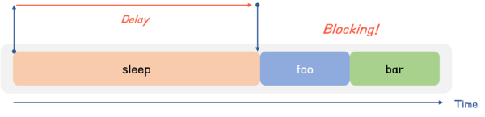
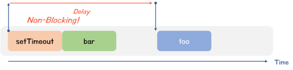
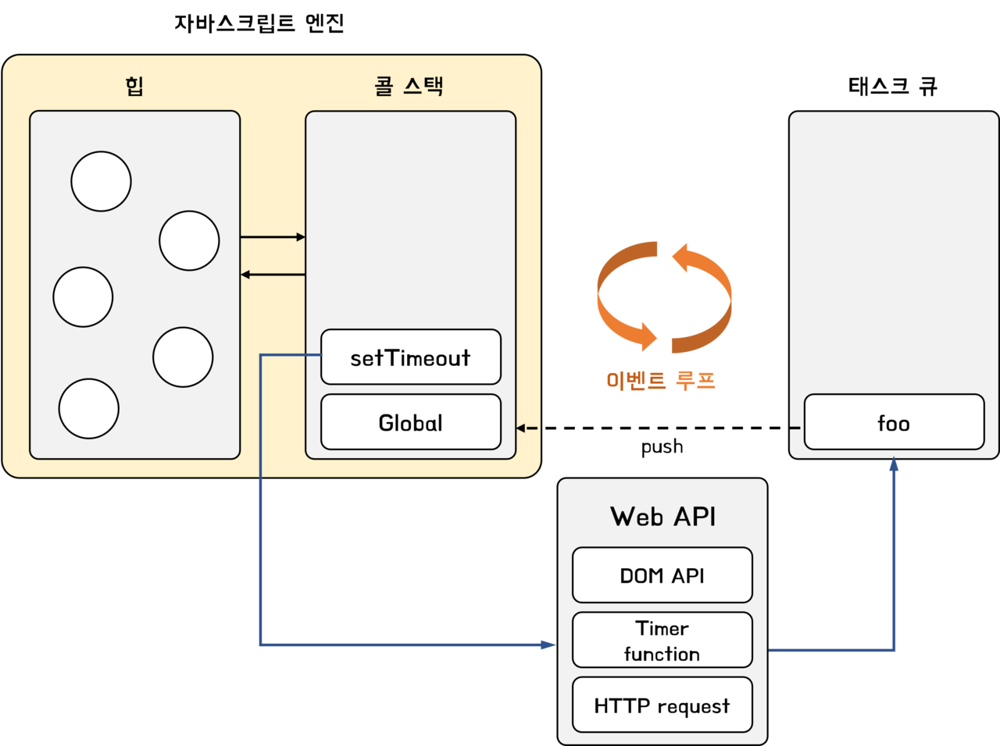

# 동기 처리와 비동기 처리

## 동기 처리

함수를 실행하면 함수 코드가 평가되어 함수 실행 컨텍스트가 생성된다. 이때 생성된 함수 실행 컨텍스트는 **실행 컨텍스트 스택(콜 스택; call stack)**에 푸시되고 함수 코드가 실행된다. 콜 스택에 함수 실행 컨텍스트가 푸시되는 것은 함수 실행의 시작을 말한다. 함수가 호출된 순서대로 순차적으로 실행되는 이유는 함수가 호출된 순서대로 콜 스택에 푸시되기 때문이다.

<br/>

자바스크립트 엔진은 <u>단 하나의 실행 컨텍스트 스택을 갖는다.</u> 이는 동시에 2개 이상의 함수를 실행할 수 없다는 것을 의미한다. 실행 컨텍스트 스택의 최상위 요소인 "실행 중인 실행 컨텍스트"를 제외한 모든 실행 컨텍스트는 모두 실행 대기 중인 태스크(task)들이다. 대기 중인 태스크들은 현재 실행 중인 실행 컨텍스트가 팝되어 실행 컨텍스트 스택에서 제거되면 비로소 실행되기 시작한다.

<br/>

자바스크립트 엔진은 <u>한 번에 하나의 테스크만 실행할 수 있는 싱글 스레드(single thread) 방식으로 동작한다.</u> 싱글 스레드 방식은 한 번에 하나의 테스크만 실행할 수 있기 때문에 처리에 시간이 걸리는 테스크를 실행하는 경우 **블로킹(작업 중단; blocking)**이 발생한다.

```js
function sleep(func, delay) {
  const delayUntil = Date.now() + delay;

  // 현재 시간(Date.now())에 delay를 더한 delayUntil이 현재 시간보다 작으면 계속 반복한다.
  while (Date.now() < delayUntil);
  // 일정 시간(delay)이 경과한 이후에 콜백 함수(func)를 호출한다.
  func();
}

function foo() {
  console.log('foo');
}

function bar() {
  console.log('bar');
}

sleep(foo, 3 * 1000);
// bar 함수는 sleep 함수의 실행이 종료된 이후에 호출되므로 3초 이상 블로킹된다.
bar();
```

위 코드의 `sleep` 함수는 3초 후에 `foo` 함수를 호출한다. `bar` 함수는 `sleep` 함수가 종료된 이후에 호출되므로 3초 이상 호출되지 못하고 블로킹이 발생한다.



현재 실행 중인 태스크가 종료할 때까지 다른 태스크가 대기하는 방식을 **동기(synchronous) 처리**라고 한다. 동기 처리 방식은 태스크의 실행 순서가 보장된다는 장점이 있지만, 현재 실행중인 태스크가 종료할 때까지 이후 태스크들은 블로킹이 발생하는 단점이 있다.

## 비동기 처리

위 코드를 `setTimeout`을 사용하여 수정해 보자.

```js
function foo() {
  console.log('foo');
}

function bar() {
  console.log('bar');
}

// 타이머 함수 setTimeout은 bar 함수를 블로킹하지 않는다.
setTimeout(foo, 3 * 1000);
bar();
```

`setTimeout` 함수는 앞서 살펴본 sleep 함수와 유사하게 일정 시간이 경과한 이후에 콜백함수를 실행하지만, 블로킹을 발생시키지 않는다. 이처럼 현재 실행 중인 태스크가 종료되지 않은 상태라 해도 다음 태스크를 곧바로 실행하는 방식을 **비동기(asynchronous) 처리**라고 한다.

> `setTimeout`, `setInterval`, `HTTP 요청`, `이벤트 핸들러` 등이 비동기 처리 방식으로 동작한다.



비동기 처리 방식은 블로킹이 발생하지 않는다는 장점이 있지만, 태스크의 실행 순서가 보장되지 않는다는 단점이 있다.

비동기 처리를 수행하는 비동기 함수는 전통적으로 콜백 패턴을 사용한다. 이에 대한 자세한 설명과 문제점에 대해서는 [JavaScript: 프로미스(Promise)란?](https://chamdom.blog/promise/)에서 자세히 다룬다.

# 이벤트 루프와 태스크 큐

## 이벤트 루프(event loop)

자바스크립트는 싱글 스레드로 동작한다. 위에서 설명한 것처럼 싱글 스레드 방식은 한 번에 하나의 태스크만 처리할 수 있다. 하지만 브라우저가 동작하는 것을 보면 태스크가 동시에 처리되는 것처럼 느껴진다. 이를 가능하게 하는 것이 바로 **이벤트 루프(event loop)**다.

<br/>

**이벤트 루프**는 콜 스택에 현재 실행 중인 실행 컨텍스트가 있는지, 태스크 큐에 대기 중인 함수가 있는 지 반복해서 확인한다. 만약 콜 스택이 비어 있고 태스크 큐에 대기 중인 함수가 있다면 이벤트 루프는 **순차적(FIFO, First In First Out)**으로 태스크 큐에 대기 중인 함수를 콜 스택으로 이동시킨다.



자바스크립트 엔진은 크게 2개의 영역으로 구분할 수 있다.

### 콜 스택(call stack)

소스코드 평가 과정에서 생성된 실행 컨텍스트가 추가되고 제거되는 실행 컨텍스트 스택이 바로 콜 스택이다.

함수를 호출하면 함수 실행 컨텍스트가 콜 스택에 푸시되어 순차적으로 실행된다. 자바스크립트 엔진은 단 하나의 콜 스택을 사용하기 때문에 최상위 실행 컨텍스트가 종료되어 콜 스택에서 제거되기 전까지는 다른 태스크는 실행되지 않는다.

### 힙(heap)

힙은 객체가 저장되는 메모리 공간이다. 실행 컨텍스트는 힙에 저장된 객체를 참조한다.

메모리에 값을 저장하려면 먼저 값을 저장할 메모리 공간의 크기를 결정해야 한다. 하지만 객체는 원시 값과 다르게 크기가 정해져 있지 않으므로 할당해여 할 메모리 공간의 크기를 런타임에 결정(동적 할당)해야 한다. 따라서 <u>객체가 저장되는 메모리 공간인 힙은 구조화되어 있지 않다는 특징이 있다.</u>

<br/>

자바스크립트 엔진은 단순히 태스크가 요청되면 콜 스택을 통해 요청된 작업을 순차적으로 실행할 뿐이다. 비동기 처리에서 소스코드의 평가와 실행을 제외한 모든 처리는 자바스크립트 엔진을 구동하는 환경인 브라우저 또는 Node.js가 담당한다. 이를 위해 브라우저 환경은 **태스크 큐**와 **이벤트 루프**를 제공한다.

## 태스크 큐(task queue)

태스크 큐는 구체적으로 **매크로 태스크 큐(macrotask queue/evnet queue)**와 **마이크로 태스크 큐(microtask queue/job queue)**로 나누어진다. 아래 코드를 살펴보자.

```js
setTimeout(() => console.log(1), 0);

Promise.resolve()
  .then(() => console.log(2))
  .then(() => console.log(3));
```

위 코드의 결과는 `2 -> 3 -> 1` 순으로 출력된다. 그 이유는 프로미스의 후속 처리 메서드의 콜백 힘수는 매크로태스크 큐가 아니라 마이크로태스크 큐에 저장되기 때문이다.

마이크로태스크 큐에는 프로미스의 후속 처리 메서드의 콜백 함수가 일시 저장된다. 그 외의 비동기 함수의 콜백 함수 또는 이벤트 핸들러는 **매크로태스크 큐**에 일시적으로 저장된다.

<br/>

<u>마이크로태스크 큐는 매크로 태스크 큐보다 우선순위가 높다.</u> 즉, 이벤트 루프는 콜 스택이 비면 우선 마이크로태스크 큐에서 대기하고 있는 함수를 가져와 실행한다. 이후 마이크로태스크 큐가 비면 매크로태스크 큐에서 대기하고 있는 함수를 가져와 실행한다.

# 정리

자바스크립트는 싱글 스레드 방식으로 동작한다. 이때 싱글 스레드 방식으로 동작하는 것은 브라우저가 아니라 브라우저에 내장된 자바스크립트 엔진이다. 만약 모든 자바스크립트 코드가 자바스크립트 엔진에서 싱글 스레드 방식으로 동작한다면 자바스크립트는 비동기로 동작할 수 없다. 즉, 자바스크립트 엔진은 싱글 스레드로 동작하지만 브라우저는 멀티 스레드로 동작한다.

<br />

브라우저는 자바스크립트 엔진 외에도 렌더링 엔진과 Web API를 제공한다. Web API는 브라우저에서 제공하는 API이며, DOM API와 타이머 함수, HTTP 요청과 같은 비동기 처리를 포한한다.

<br />

# 참고

- https://poiemaweb.com/
- https://ko.javascript.info/event-loop
- 모던 자바스크립트 Deep Dive
