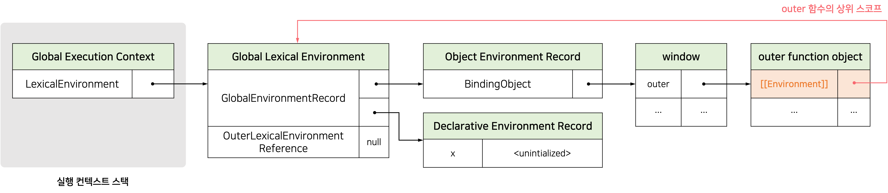
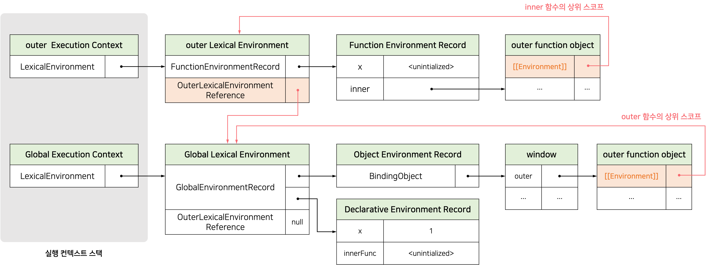
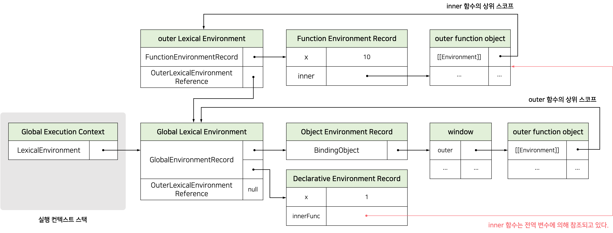
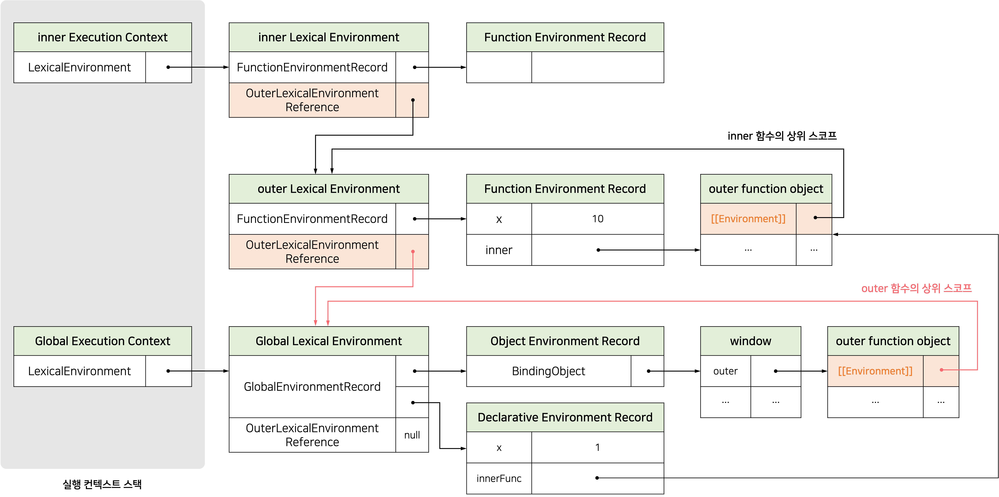

<blockquote variant="info">

클로저에 대해 이해하기 위해 실행 컨텍스트, 스코프에 대한 사전 지식이 있으면 이해하기 쉽다.

자세한 내용은 [JavaScript: 실행 컨텍스트(Execution Context)란?](https://chamdom.blog/execution-context/), [JavaScript: 스코프(Scope)란?](https://chamdom.blog/js-scope/)에서 확인할 수 있다.

</blockquote>

# 클로저

**클로저**는 자바스크립트 고유의 개념이 아니므로 ECMAScript사양에 등장하지 않는다. MDN에서는 클로저에 대해 다음과 같이 정의하고 있다.

> A closure is the combination of a function and the lexical environment within which that function was declared.
>
> 클로저는 함수와 그 함수가 선언된 렉시컬 환경의 조합이다.

다음 코드를 통해 클로저에 대해 자세히 알아보자.

```js
const x = 1;

// ①
function outer() {
  const x = 10;

  // ②
  const inner = function () {
    console.log(x);
  };
  return inner;
}

// outer 함수를 호출하면 중첩 함수 inner를 반환한다.
// 그리고 outer 함수의 실행 컨텍스트는 실행 컨텍스트 스택에서 팝되어 제거된다.
const innerFunc = outer(); // ③
innerFunc(); // ④ 10
```

outer 함수를 호출하면 inner 함수를 반환하고 실행 컨텍스트 스택에서 제거된다. 따라서 outer 함수의 지역 변수인 `x`에 접근할 수 있는 방법이 없어 보인다.
하지만 `x`의 값인 10이 출력되는 것을 볼 수 있다.

이처럼 _외부 함수보다 중첩 함수가 더 오래 유지되는 경우 중첩 함수는 이미 생명 주기가 종료한 외부 함수의 변수를 참조할 수 있다._ 이러한 중첩 함수를 **클로저(closure)**라고 한다.

#### 1. 전역 함수 객체의 상위 스코프 결정

outer 함수가 평가되어 함수 객체를 생성할때(①) 현재 실행 중인 실행 컨텍스트의 렉시컬 환경, 즉 전역 렉시컬 환경을 outer 함수 객체의 `[[Environment]]` 내부 슬롯에 상위 스코프로 저장한다.



#### 2. 중첩 함수(inner 함수)의 상위 스코프 결정

outer 함수를 호출하면 outer 함수의 렉시컬 환경이 생성되고 `OuterLexicalEnvironmentReference`에 outer 함수 객체의 `[[Environment]]` 내부 슬롯에 저장된 전역 렉시컬 환경을 할당한다.

그리고 중첩 함수 inner가 평가된다(② inner 함수는 함수 표현식으로 정의했기 때문에 런타임에 평가된다).
중첩 함수 inner는 자신의 `[[Environment]]` 내부 슬롯에 현재 실행 중인 실행 컨텍스트의 렉시컬 환경, 즉 outer 함수의 렉시컬 환경을 상위 스코프로 저장한다.



#### 3. 전역 함수(outer 함수) 실행 종료

outer 함수의 실행이 종료하면 inner 함수를 반환하면서 outer 함수의 생명 주기가 종료된다(③). 이때 _outer 함수의 실행 컨텍스트는 실행 컨텍스트 스택에서 제거되지만, outer 함수의 렉시컬 환경까지 제거되는 것은 아니다._
왜냐하면 outer 함수의 렉시컬 환경은 inner 함수의 `[[Environment]]` 내부 슬롯에서 참조하고 있고 inner 함수는 전역 변수 `innerFunc`에서 참조하고 있기 때문이다. 가비지 컬렉터는 누군가가 참조하고 있는 메모리 공간을 함부로 해제하지 않는다.



#### 4. 중첩 함수(inner 함수) 호출

inner 함수를 호출(④)하면 inner 함수의 실행 컨텍스트가 생성되고 실행 컨텍스트 스택에 푸시된다. 그리고 `OuterLexicalEnvironmentReference`에 inner 함수 객체의 내부 슬롯 `[[Environment]]`에 저장되어 있는 참조값을 할당한다.



중첩 함수 inner는 외부 함수 outer보다 더 오래 생존했다. 외부 함수보다 오래 생존한 중첩 함수는 외부 함수의 생존 여부와 상관없이 자신의 상위 스코프를 기억한다.

# 클로저의 활용

## 상태 유지

클로저는 <u>상태(state)를 안전하게 변경하고 유지하기 위해 사용</u>한다. 다시 말해, <u>상태를 안전하게 은닉(information hiding)하고 특정 함수에게만 상태 변경을 허용하기 위해 사용</u>한다.

```js
const counter = (function () {
  let num = 0;

  return {
    increase() {
      return ++num;
    },

    decrease() {
      return num > 0 ? --num : 0;
    },
  };
})();

console.log(counter.increase()); // 1
console.log(counter.increase()); // 2

console.log(counter.decrease()); // 1
console.log(counter.decrease()); // 0
```

위 코드를 생성자 함수로 표현하면 다음과 같다.

```js
const Counter = (function () {
  let num = 0;

  function Counter() {
    // this.num = 0;
    // 프로퍼티는 public하므로 은닉되지 않는다.
  }

  Counter.prototype.increase = function () {
    return ++num;
  };

  Counter.prototype.decrease = function () {
    return --num;
  };

  return Counter;
})();

const counter = new Counter();

console.log(counter.increase()); // 1
console.log(counter.increase()); // 2

console.log(counter.decrease()); // 1
console.log(counter.decrease()); // 0
```

즉시 실행 함수는 메서드를 반환하고 즉시 소멸한다. 즉시 실행 함수가 반환한 increase, decrease 메서드는 평가되는 시점에 실행 중인 실행컨텍스트인 즉시 실행 힘수 실행 컨텍스트의 렉시컬 환경을 기억하는 클로저다. 따라서 언제 어디서 호출되든 상관없이 increase, decrease 메서드는 즉시 실행 함수 스코프에 속한 식별자를 참조할 수 있다.

## 부수 효과 억제

외부 상태 변경이나 가변(mutable) 데이터를 피하고 불변성(mmutability)을 지향하는 함수형 프로그래밍에서 부수 효괴를 최대한 억제하여 오류를 피하고 프로그램의 안정성을 높이기 위해 클로저를 적극적으로 사용한다. 다음은 함수형 프로그래밍에서 클로저를 활용하는 간단한 예제다.

```js
// 함수를 반환하는 고차 함수
const counter = (function () {
  // 카운터 상태를 유지하기 위한 자유 변수
  let counter = 0;

  // 함수를 인수로 전달받고 클로저를 반환
  return function (predicate) {
    // 인수로 전달받은 보조 함수에 상태 변경을 위임한다.
    counter = predicate(counter);
    return counter;
  };
})();

// 보조 함수
function increase(n) {
  return ++n;
}

// 보조 함수
function decrease(n) {
  return --n;
}

console.log(counter(increase)); // 1
console.log(counter(increase)); // 2

console.log(counter(decrease)); // 1
console.log(counter(decrease)); // 0
```

위 코드의 즉시 실행 함수는 함수를 반환하는 고차 함수다. 즉시 실행 힘수가 반환하는 함수는 자신이 생성됐을 때의 렉시컬 환경인 즉시 실행 함수의 스코프에 속한 counter 변수를 기억하는 클로저다.

<br />

# 참고

- https://poiemaweb.com/
- 모던 자바스크립트 Deep Dive
