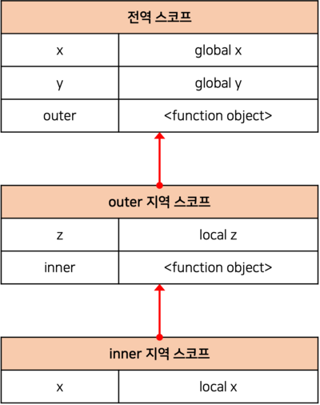

# 스코프란?

**스코프(scope)**는 자바스크립트를 포함한 모든 프로그래밍 언어의 기본적이며 중요한 개념이다. 자바스크립트의 스코프는 다른 언어의 스코프와 구별되는 특징이 있으므로 주의가 필요하다. 스코프는 변수, 함수와 관련이 있다.

모든 식별자(변수 이름, 함수 이름, 클래스 이름 등)는 자신이 선언된 위치에 의해 다른 코드가 식별자 자신을 참조할 수 있는 유효 범위가 결정된다. 이를 스코프라고 한다. 즉, _스코프는 식별자가 유효한 범위를 말한다._

```js
var x = 'global';

function foo() {
  var x = 'local';
  consol.log(x); // local
}
foo();

consol.log(x); // global
```

위 코드에서 두 개의 `x` 변수가 선언되었는데 하나는 함수 내부에, 다른 하나는 코드의 가장 바깥 영역에 선언되었다. `x`를 참조하려고 할 때(위 코드에서는 `console.log()`), 자바스크립트 엔진은 어떤 변수를 참조해야 할 것인지를 결정해야 한다. 이를 **식별자 결정(identifier resolution)**이라고 한다. 따라서 *스코프를 자바스크립트 엔진이 식별자를 검색할 때 사용하는 규칙*이라고도 할 수 있다.

자바스크립트 엔진은 코드를 실행할 때 코드의 문맥을 고려한다. 코드가 어디서 실행되며 코드 주변에 어떤 코드가 있는지에 따라 실행 결과가 달라진다.

> ✍🏻 ** 코드의 문맥과 환경**
>
> "코드가 어디서 실행되며 주변에 어떤 코드가 있는지"를 **렉시컬 환경(lexical environment)**이라고 부른다. 즉, 코드의 문맥은 렉시컬 환경으로 이뤄진다. 이를 구현한 것이 실행 컨텍스트이며, 모든 코드는 실행 컨텍스트에서 평가되고 실행된다.

위 코드를 살펴보자. 코드의 가장 바깥 영역에 선언된 `x`는 어디서든 참조할 수 있다. 하지만, foo 함수 내부에 있는 `x`는 함수 내부에서만 참조할 수 있고 foo 함수 외부에서는 참조할 수 없다. 두 개의 `x` 변수는 이름은 같지만 **스코프(자신이 유효한 범위)**가 다른 별개의 변수다.

스코프 내에서 식별자는 유일해야 하지만 다른 스코프에는 같은 이름의 식별자를 시용할 수 있다. 프로그래밍 언어에서는 스코프를 통해 변수 이름의 충돌을 방지하며 같은 이름의 변수를 사용할 수 있게 한다.

> ✍🏻 **var 키워드로 선언한 변수의 중복 선언**
>
> `var` 키워드로 선언된 변수는 같은 스코프 내에서 중복 선언이 허용된다. 이는 의도치 않게 변수값이 재할당되는 부작용이 있다. 하지만 `let`이나 `const` 키워드로 선언된 변수는 같은 스코프 내에서 중복 선언을 허용하지 않는다. 이 내용에 대해서는 [let, const 키워드](https://chamdom.blog/let-and-const-keyword)에서 자세히 다루고 있다.

# 스코프의 종류

코드는 **전역**과 **지역**으로 구분할 수 있다.

|     구분     |       설명       |   스코프    |   변수    |
| :----------: | :--------------: | :---------: | :-------: |
| 전역(Global) | 코드의 가장 바깥 | 전역 스코프 | 전역 변수 |
| 지역(Local)  |  함수 몸체 내부  | 지역 스코프 | 지역 변수 |

_변수는 자신이 선언된 위치에 의해 자신이 유효한 범위인 스코프가 결정된다._ 전역에서 선언된 변수는 전역 스코프를 갖는 전역 변수이고, 지역에서 선언된 변수는 지역 스코프를 갖는 지역 변수다.

**전역**이란 코드의 가장 바깥 영역을 말한다. 전역에 변수를 선언하면 **전역 스코프**를 갖는 전역 변수가 된다. 전역 변수는 어디서든지 참조할 수 있다.

**지역**이란 함수 몸체 내부를 말한다. 지역에 변수를 선언하면 **지역 스코프**를 갖는 지역 변수가 된다. 지역 변수는 자신의 지역 스코프와 하위 지역 스코프에서 유효하다.

# 스코프 체인

```js
var x = 'global x';
var y = 'global y';

function outer() {
  var z = 'local z';

  function inner() {
    var x = 'local x';
  }
  inner();
}
outer();
```



모든 스코프는 하나의 계층적 구조로 연결된 것을 **스코프 체인(Scope chain)**이라 한다. 모든 지역 스코프의 최상위 스코프는 전역 스코프다. 스코프 체인은 실행 컨텍스트의 렉시컬 환경을 **단방향**으로 연결한 것이다.

변수를 참조할 때 자바스크립트 엔진은 스코프 체인을 통해 변수를 참조하는 코드의 스코프에서 시작해서 _상위 스코프 방향으로 이동하며 선언된 변수를 검색한다._ 이를 통해 하위 스코프에서 상위 스코프의 변수를 참조할 수 있다.

스코프 체인은 물리적인 실체로 존재한다. 자바스크립트 엔진은 코드를 실행하기에 앞서 위 그림과 유사한 자료구조인 렉시컬 환경을 실제로 생성한다.

> ✍🏻 **렉시컬 환경(Lexical Environment)**
>
> 스코프 체인은 실행 컨텍스트의 렉시컬 환경을 단방향으로 연결한 것이다. **전역 렉시컬 환경**은 코드가 로드되면 곧바로 생성되고 **함수의 렉시컬 환경**은 함수가 호출되면 생성된다. 실행 컨텍스트에 대해서는 [실행 컨텍스트(Execution Context)란?](https://chamdom.blog/execution-context)에서 자세히 다루고 있다.

### 스코프 체인에 의한 변수 검색

자바스크립트 엔진은 스코프 체인을 따라 변수를 참조하는 코드의 스코프에서 시작해서 상위 스코프 방향으로 이동하며 선언된 변수를 검색한다고 했다. 절대 하위 스코프로 내려가면서 식별자를 검색하는 일은 없다. 이는 *상위 스코프에서 유효한 변수는 하위 스코프에서 자유롭게 참조할 수 있지만, 하위 스코프에서 유효한 변수를 상위 스코프에서 참조할 수 없다*는 것을 의미한다.

### 스코프 체인에 의한 함수 검색

```js
// 전역 함수
function foo() {
  console.log('global function foo');
}

function bar() {
  // 중첩 함수
  function foo() {
    console.log('local function foo');
  }
  foo(); // local function foo
}
bar();
```

위 코드에서 코드 가장 바깥 영역과 bar 함수 내부에 같은 이름의 foo 함수가 선언되어 있다. 함수 bar에서 foo 함수를 호출하면 자바스크립트 엔진은 함수를 호출하기 위해 함수를 가리키는 식별자 foo를 검색한다. 위에서 설명한 것처럼 자바스크립트 엔진은 스코프 체인을 따라 변수(식별자)를 참조하는 코드의 스코프에서 시작해서 상위 스코프 방향으로 검색하기 때문에 `local function foo`가 출력된다.

함수 선언문으로 함수를 정의하면 런타임 이전에 함수 객체가 먼저 생성된다. 그리고 자바스크립트 엔진은 함수 이름과 같은 이름의 식별자를 암묵적으로 선언하고 생성된 함수를 객체를 할당한다. 함수도 식별자에 할당되기 때문에 스코프를 갖는다. _함수는 식별자에 함수 객체가 할당된 것 외에는 일반 변수와 다를 바 없다._

# 함수 레벨 스코프

지역은 함수 몸체 내부를 말하고 지역은 지역 스코프를 만든다. 이는 코드 블록이 아닌 함수에 의해서만 지역 스코프가 생성된다는 것이다.

대부분의 프로그래밍 언어는 함수 몸체만이 아니라 모든 코드 블록 (if, for, while, try/catch 등)이 지역 스코프를 만든다. 이러한 특성을 **블록 레벨 스코프(Block Level Scope)**라 한다.

자바스크립트에서 `var` 키워드로 선언된 변수는 오로지 함수의 코드 블록(함수 몸체)만을 지역 스코프로 인정한다. 이러한 특성을 **함수 레벨 스코프(Function Level Scope)**라 한다. `var` 키워드로 선언된 변수는 함수 레벨 스코프만을 인정하기 때문에 함수 몸체 밖에서 `var` 키워드로 선언한 변수는 코드 블록 내부에 있더라도 전역 변수로 취급된다.

<br />

```js
var x = 1;

if (true) {
  var x = 10;
}

console.log(x); // 10
```

전역 변수 `x`가 선언되었고 if 문 코드 블록 내에도 변수 `x`가 선언되었다. 이때 if 문 코드 블록 내에 선언된 변수 `x`는 전역 변수이다. `var` 키워드로 선언된 변수는 함수의 코드 블록만을 스코프로 인정하기 때문에 if문의 코드 블록은 스코프로 인정하지 않는다. 따라서 변수 `x`의 값이 재할당되어 `10`이라는 결과 출력된다.

<br />

```js
var i = 10;

for (var i = 0; i < 5; i++) {
  console.log(i); // 0 1 2 3 4
}

console.log(i); // 5
```

`var` 키워드로 선언된 변수는 함수의 코드 블록만을 지역 스코프로 인정하지만(**함수 레벨 스코프**를 지원하지만), ES6에서 도입된 `let`, `const` 키워드는 **블록 레벨 스코프**를 지원한다.

> `let`, `const` 키워드에 대해서는 [let과 const 키워드](https://chamdom.blog/let-and-const-keyword)에서 자세하게 알아보자.

# 렉시컬 스코프

**동적 스코프(Dynamic scope)**는 _함수를 어디서 호출했는지에 따라 함수의 상위 스코프를 결정한다._ 즉, 함수를 정의하는 시점에 함수가 어디서 호출되는지 알 수 없다. 따라서 함수가 호출되는 시점에 동적으로 상위 스코프를 결정한다.

**정적 스코프(Static scope)** 또는 **렉시컬 스코프(Lexical scope)**는 _함수를 어디서 정의했는지에 따라 함수의 상위 스코프를 결정한다._ 즉, 함수 정의가 평가되는 시점에 상위 스코프가 정적으로 결정된다. 자바스크립트를 포함한 대부분의 프로그래밍 언어는 렉시컬 스코프를 따른다.

자바스크립트는 렉시컬 스코프를 따르므로 함수를 어디서 호출했는지가 아니라 함수를 어디에 정의했는지에 따라 상위 스코프를 결정한다. 따라서 함수가 호출된 위치는 상위 스코프 결정에 어떠한 영향도 주지 못한다. 즉, 함수의 상위 스코프는 언제나 자신이 정의된 스코프다.

이처럼 함수의 상위 스코프는 함수 정의가 실행될 때 정적으로 결정된다. 함수 정의가 실행되어 생성된 함수 객체는 자신의 상위 스코프를 기억한다. 함수가 호출될 때마다 함수의 상위 스코프를 참조할 필요가 있기 때문이다. 정리해보면 _자바스크립트는 렉시컬 스코프를 따르며 함수 레벨 스코프와 블록 레벨 스코프를 지원한다._

<br />

```js
var x = 1;

function foo() {
  var x = 10;
  bar();
}

function bar() {
  console.log(x);
}
foo(); // 1
bar(); // 1
```

위 코드를 보면 bar 함수는 전역에 정의된 함수이다. 함수 선언문으로 정의된 함수 bar는 전역 코드가 실행되기 전에 평가되어 함수 객체를 생성한다. 이때 생성된 bar 함수 객체는 자신의 스코프, 즉 전역 스코프를 기억한다. 그리고 bar 함수가 호출되면 어디에서 호출되었는지와 상관없이 자신이 기억하고 있는 전역 스코프를 상위 스코프로 사용한다. 따라서 `1`이 두 번 출력되는 것이다.

<br />
<br />

---

# 전역 변수의 문제점

## 변수의 생명 주기

변수는 생성되고 소멸하는 **생명 주기(Life cycle)**가 있다. 변수의 생명 주기는 메모리 공간이 확보된 시점부터 메모리 공간이 해제되어 가용 메모리 풀에 반환되는 시점까지이다.

### 지역 변수의 생명 주기

변수는 자신이 선언된 위치에서 생성되고 소멸한다. 전역 변수의 생명 주기는 애플리케이션의 생명 주기와 같다. 하지만 함수 내부에서 선언된 지역 변수는 함수가 호출되면 생성되고 함수가 종료하면 소멸한다.

지역 변수 `x`는 foo 함수가 호출되기 이전까지는 생성되지 않는다. foo 함수를 호출하지 않으면 함수 내부의 변수 선언문이 실행되지 않기 때문이다. 함수 내부에서 선언한 변수는 함수가 호출된 직후에 함수 몸체의 코드가 한 줄씩 차례대로 실행되기 이전에 자바스크립트 엔진에 의해 먼저 실행된다. 그리고 함수가 종료하면 변수 `x`도 소멸하여 생명 주기가 종료된다. 변수 `x`는 함수 foo가 호출되어 실행되는 동안에만 유효하다는 것이다. 즉, _지역 변수의 생명 주기는 함수의 생명 주기와 일치한다._

<br />

```js
var x = 'global';

function foo() {
  console.log(x); // ①
  var x = 'local';
}

foo();
console.log(x); // global
```

위 코드를 보면 foo 함수 내부에서 선언된 지역 변수 `x`는 ①시점에 이미 선언되었고 `undefined`로 초기화되어 있다. 따라서 전역 변수 `x`를 참조하는 것이 아니라 지역 변수 `x`를 참조해 값을 출력한다.

이처럼 _호이스팅은 스코프를 단위로 동작한다._ 즉, 호이스팅은 변수 선언이 **스코프의 선두**로 끌어올려진 것처럼 동작하는 것이다.

### 전역 변수의 생명 주기

전역 코드는 함수 호출과 같이 전역 코드를 실행하는 특별한 진입점이 없고 코드가 로드되자마자 곧바로 해석되고 실행되고 더 이상 실행할 문이 없을 때 종료된다.

`var` 키워드로 선언한 전역 변수는 전역 객체의 프로퍼티가 된다. 이는 *var 키워드로 선언한 전역 변수의 생명 주기가 전역 객체의 생명 주기와 일치한다*는 것을 의미한다.

> ✍🏻 **전역 객체(Global Object)**
>
> 전역 객체는 코드가 실행되기 이전 단계에 자바스크립트 엔진에 의해 어떤 객체보다도 먼저 생성되는 특수한 객체다.
> Client-Side 환경(브라우저)에서는 `window`, Server-Side 환경(Node.js)에서는 `global` 객체를 의미한다.

## 전역 변수의 문제점

**암묵적 결합** <br />
전역 변수의 선언은 모든 코드가 전역 변수를 참조하고 변경할 수 있는 **암묵적 결합(implicit coupling)**을 허용하는 것이다. 즉, 코드 어디서든 참조하고 할당할 수 있도록 허용하는 것이다. 변수의 유효 범위가 넓으면 코드의 가독성은 나빠지고 의도치 않게 상태가 변경될 수 있다.

**긴 생명 주기** <br />
긴 생명 주기 때문에 메모리 리소스도 오래 소비하고, 전역 변수의 상태를 변경할 수 있는 시간도 길고 기회도 많다.

**스코프 체인 상에서 종점에 존재** <br />
전역 변수의 검색 속도가 가장 느리다. 전역 변수는 스코프 체인 상에서 종점에 존재한다. 이는 변수를 검색할 때 전역 변수가 가장 마지막에 검색된다는 것이다.

**네임스페이스 오염** <br />
자바스크립트의 가장 큰 문제점 중 하나는 파일이 분리되어 있다고 해도 하나의 전역 스코프를 공유한다는 것이다. 다른 파일 내에서 같은 이름의 전역 변수나 전역 함수가 존재한다면 예상치 못한 결과를 가져올 수 있다.

<br />

---

# 참고

- https://poiemaweb.com/
- 모던 자바스크립트 Deep Dive
