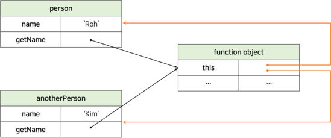
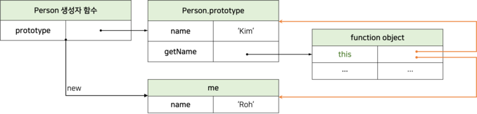

# this 키워드

`this`는 자신이 속한 객체 또는 자신이 생성할 인스턴스를 가리키는 자기 참조 변수다. this를 통해 자신이 속한 객체 또는 자신이 생성할 인스턴스의 프로퍼티나 메서드를 참조할 수 있다.

this는 자바스크립트 엔진에 의해 암묵적으로 생성되며, 코드 어디서든 참조할 수 있다. 함수를 호출하면 `arguments` 객체와 `this`가 암묵적으로 함수 내부에 전달된다. 함수 내부에서 `arguments` 객체와 같이 `this`도 지역변수처럼 사용할 수 있다. 단, _this 바인딩은 함수가 호출되는 방식에 따라 동적으로 결정된다._

> **✍🏻 this 바인딩**
>
> **바인딩**이란 식별자와 값을 연결하는 과정을 의미한다. 예를 들어 변수 선언은 변수 이름과 확보된 메모리 공간의 주소를 바인딩하는 것이다. this 바인딩은 this와 this가 가리킬 객체를 바인딩하는 것이다.

# 함수 호출 방식과 this 바인딩

_this 바인딩은 함수가 어떻게 호출되었는지에 따라 동적으로 결정된다._

> **✍🏻 렉시컬 스코프와 this 바인딩은 결정 시기가 다르다.**
>
> 렉시컬 스코프는 함수 정의가 평가되어 함수 객체가 생성되는 시점에 상위 스코프를 결정하지만, this 바인딩은 함수 호출 시점에 결정된다.

함수는 다양한 방식으로 호출할 수 있다. 함수 호출 방식에 따라 this 바인딩이 어떻게 결정되는지 알아보자.

## 일반 함수로 호출

기본적으로 `this`에는 **전역 객체(global object)**가 바인딩된다.

```js
var value = 1;

const obj = {
  value: 100,
  foo() {
    console.log('foo의 this: ', this); // window

    setTimeout(function () {
      console.log('callback 함수의 this: ', this); // window
      console.log('callback 함수의 this.value: ', this.value); // 1
    }, 100);
  },
};
```

일반 함수로 호출된 모든 함수(중첩 함수, 콜백 함수 포함) 내부의 this에는 전역 객체가 바인딩된다. 즉, _어떠한 함수라도 일반 함수로 호출되면 this에 전역 객체가 바인딩된다._ 하지만, this는 객체의 프로퍼티나 메서드를 참조하기 위한 자기 참조 변수이므로 **객체를 생성하지 않는 일반 함수에서 this는 의미가 없다.** 따라서 strict mode가 적용된 일반 함수 내부의 this에는 `undefined`가 바인딩된다.

### this의 명시적 바인딩

중첩 함수 또 는 콜백 함수는 외부 함수를 돕는 헬퍼 함수의 역할을 하므로 외부 함수의 일부 로직을 대신하는 경우가 대부분이다. 하지만 외부 함수인 메서드와 중첩 함수, 콜백 함수의 this가 일치하지 않는다는 것은 중첩 함수, 콜백 함수를 헬퍼 함수로 동작하기 어렵게 만든다. 따라서 메서드 내부의 중첩함수, 콜백함수의 this 바인딩을 메서드의 this 바인딩과 일치시키는 방법은 다음과 같다.

**that을 사용한 명시적 바인딩**

```js
var value = 1;

const obj = {
  value: 100,
  foo() {
    // this 바인딩을 변수 that에 할당한다.
    const that = this;

    // 콜백 함수 내부에서 this 대신 that을 참조한다.
    setTimeout(function () {
      console.log(that.value); // 100
    }, 100);
  },
};

obj.foo();
```

**apply/call/bind 메서드를 사용한 명시적 바인딩**

```js
var value = 1;

const obj = {
  value: 100,
  foo() {
    // 콜백 함수에 명시적으로 this를 바인딩한다.
    setTimeout(
      function () {
        console.log(this.value); // 100
      }.bind(this),
      100,
    );
  },
};
obj.foo();
```

**화살표 함수를 사용한 명시적 바인딩**

```js
var value = 1;

const obj = {
  value: 100,
  // 화살표 함수 내부의 this는 상위 스코프의 this를 가리킨다.
  foo() {
    setTimeout(() => console.log(this.value), 100); // 100
  },
};

obj.foo();
```

## 메서드로 호출

메서드 내부의 this에는 메서드를 호출한 객체(메서드를 호출할 때 메서드 이름 앞의 마침표(.) 연산자 앞에 기술한 객체)가 바인딩된다. 즉, _메서드 내부의 this는 메서드를 소유한 객체가 아닌 메서드를 호출한 객체에 바인딩 된다._

```js
const person = {
  name: 'Roh',
  getName() {
    // 메서드 내부에서의 this는 메서드를 호출한 객체에 바인딩된다.
    return this.name;
  },
};

// 메서드 getName을 호출한 객체는 person이다.
console.log(person.getName()); // Roh
```

**메서드는 프로퍼티에 바인딩된 함수다.** 위 코드에서 getName 메서드는 person 객체에 포함된 것이 아니라 독립적으로 존재한다. 단지 getName 프로퍼티가 함수 객체를 가리키고 있을 뿐이다. 따라서 getName 메서드는 다른 객체의 프로퍼티에 할당하는 것으로 다른 객체의 메서드가 될 수도 있고 변수에 할당하여 일반 함수로 호출될 수도 있다.

```js
const anotherPerson = {
  name: 'Kim',
};

//getName 메서드를 anotherPerson 객체의 메서드로 할당
anotherPerson.getName = person.getName;
console.log(anotherPerson.getName()); // Kim

// getName 메서드를 변수에 할당
const getName = person.getName;

// getName 메서드를 일반 함수로 호출
console.log(getName()); // ''
```



<br />

프로토타입 메서드 내부에서 사용된 this도 일반 메서드와 마찬가지로 **해당 메서드를 호출한 객체**에 바인딩된다.

```js
function Person(name) {
  this.name = name;
}

Person.prototype.getName = function () {
  return this.name;
};

const me = new Person('Roh');

// getName 메서드를 호출한 객체는 me다.
console.log(me.getName()); // ① Roh

Person.prototype.name = 'Kim';

// getName 메서드를 호출한 객체는 Person.prototype이다.
console.log(Person.prototype.getName()); // ② Kim
```

위 코드에서 ①의 경우 getName 메서드를 호출한 객체는 `me`다. 따라서 getName 메서드 내부의 this는 me를 가리키고 this.name은 `Roh`이다. <br />
②의 경우 getName 메서드를 호출한 객체는 `Person.prototype`이다. 따라서 getName 메서드 내부의 this는 Person.prototype을 가리키고 this.name은 `Kim`이다.



<br />

## 생성자 함수로 호출

_생성자 함수 내부의 this에는 생성자 함수가 생성할 인스턴스가 바인딩된다._

```js
function Circle(radius) {
  // 생성자 함수 내부의 this는 생성자 함수가 생성할 인스턴스를 가리킨다.
  this.radius = radius;
  this.getDiameter = function () {
    return 2 * this.radius;
  };
}

const circle1 = new Circle(5);
const circle2 = new Circle(10);

console.log(circle1.getDiameter()); // 10
console.log(circle2.getDiameter()); // 20
```

일반 함수와 동일한 방법으로 생성자 함수를 정의하고 new 연산자와 함께 호출하면 해당 함수는 생성자 함수로 동작한다. 만약 new 연산자와 함께 생성자 힘수를 호출하지 않으면 생성자 함수가 아니라 일반 함수로 동작
한다.

```js
const circle3 = Circle(20);

// 알번 함수로 호출된 Circle에는 return문이 없으므로 암묵적으로 undefined를 return한다.
console.log(circle3); // undefined

// 일반 함수로 호출된 Circle 내부의 this는 전역 객체를 가리킨다.
console.log(radius); // 20
```

## Function.prototype.apply/call/bind 메서드에 의한 호출

`apply`, `call`, `bind` 메서드는 `Function.prototype`의 메서드다. 따라서, 이 메서드들은 모든 함수가 상속받아 사용할 수 있다.

### Function.prototype.apply/call

`Function.prototype.apply`, `Function.prototype.call`메서드는 this로 사용할 객체와 인수리스트를 인수로 전달받아 함수를 호출한다.

```js
/**
* @param thisArg -> this로 사용할 객체
* @param argsArray -> 함수에게 전달할 인수 리스트 배열(또는 유사배열객체)
* @returns 호출된 함수의 반환값
*/
Function.prototype.apply(thisArg[, argsArray])
```

```js
/**
* @parma thisArg -> this로 사용할 객체
* @param arg1, arg2, ... -> 함수에게 전달할 인수 리스트
* @returns 호출된 함수의 반환값
*/
Function.prototype.call(thisArg[, arg1[, arg2[, ...]]])
```

`apply`, `call` 메서드의 본질적인 기능은 함수를 호출하는 것이다. `apply`, `call` 메서드는 함수를 호출하면서 **첫 번째 인수로 this로 사용할 객체를 전달해 호출한 함수의 this에 바인딩한다.**

`apply`, `call` 메서드는 호출할 함수에 인수를 전달하는 방식만 다를 뿐 this로 사용할 객체를 전달하면서 함수를 호출히는 것은 동일하다.

- apply 메서드는 호출할 함수의 인수를 **배열**로 전달한다.
- call 메서드는 호출할 함수의 인수를 **쉼표로 구분한 리스트 형식**으로 전달한다.

```js
function getThisBinding() {
  console.log(arguments);
  console.log(this);
}

// this로 사용할 객체
const thisArg = { a: 1 };

getThisBinding.apply(thisArg, [1, 2, 3]);
// Arguments(3) [1, 2, 3, callee: ƒ, Symbol(Symbol.iterator): ƒ]
// {a: 1}

getThisBinding.call(thisArg, 1, 2, 3);
// Arguments(3) [1, 2, 3, callee: ƒ, Symbol(Symbol.iterator): ƒ]
// {a: 1}
```

### Function.prototype.bind

`bind` 메서드는 apply와 call 메서드와 달리 함수를 호출하지 않고 this로 사용할 객체만 전달한다.

```js
function getThisBinding() {
  return this;
}

// this로 사용할 객체
const thisArg = { a: 1 };

console.log(getThisBinding.bind(thisArg)); // getThisBinding
// bind 메서드는 함수를 호출하지 않으므로 명시적으로 호출해야 한다.
console.log(getThisBinding.bind(thisArg)()); // { a: 1 }
```

`bind` 메서드는 메서드의 this와 메서드 내부의 중첩 함수, 콜백 함수의 this가 불일치하는 문제를 해결하기 위해 유용하게 사용된다.

```js
const person = {
  name: 'Roh',
  foo(callback) {
    // bind 메서드로 callback 함수 내부의 this 바인딩을 전달
    setTimeout(callback.bind(this), 100);
  },
};

person.foo(function () {
  console.log(`Hi! My name is ${this.name}`); // Hi! My name is Roh
});
```

# 정리

| 함수 호출 방식                                             | this 바인딩                                                            |
| ---------------------------------------------------------- | ---------------------------------------------------------------------- |
| 일반 함수 호출                                             | 전역 객체                                                              |
| 메서드 호출                                                | 메서드를 호출한 객체                                                   |
| 생성자 함수 호출                                           | 생성자 함수가 생성할 인스턴스                                          |
| Function.prototype.apply/call/bind 메서드에 의한 간접 호출 | Function.prototype.apply/call/bind 메서드에 첫 번째 인수로 전달한 객체 |

<br />

---

# 참고

- https://poiemaweb.com/
- 모던 자바스크립트 Deep Dive
