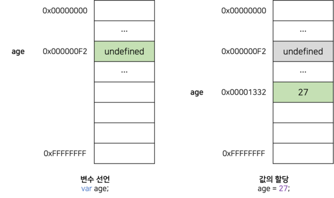
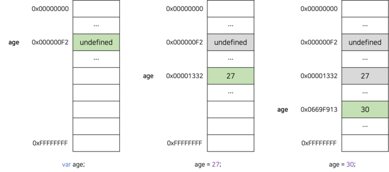

# 변수란 무엇인가?

변수는 프로그래밍 언어에서 데이터를 관리하기 위한 핵심 개념이다. 변 수란 무엇인지 그리고 왜 필요한지 알아보자.

<br/>

자바스크립트는 개발자의 직접적인 메모리 제어를 허용하지 않는다. 메모리 주소를 통해 값에 직접 접근하는 것은 치명적이 오류를 발생시킬 수 있기 때문이다. 따라서 변수를 통해 메모리에 안전하게 접근해야 한다. 변수의 정의를 내려보면 다음과 같다.

<br/>

_"변수는 하나의 값을 저장하기 위해 확보한 메모리 공간 자체 또는 그 메모리 공간을 식별하기 위해 붙인 이름을 말한다."_

<br/>

즉, 변수는 프로그래밍 언어에서 값을 저장하고 참조하는 메커니즘으로, **값의 위치를 가리키는 상징적인 이름**이다.

<br/>

변수는 프로그래밍 언어의 컴파일러 또는 인터프리터에 의해 값이 저장된 메모리 공간의 주소로 치환되어 실행된다. 따라서 개발자가 직접 메모리 주소를 통해 값을 저장하고 참조할 필요 없이 변수를 통해 값에 접근할 수 있다.

메모리 공간에 저장된 값을 식별할 수 있는 고유한 이름을 **변수명** 또는 **변수 이름** 이라 한다. 그리고 변수에 저장된 값을 **변수 값**이라고 한다.

변수에 값을 저장하는 것을 **할당(assignment)**이라 하고, 변수에 저장된 값을 일어오는 것을 **참조(reference)**라 한다.

# 식별자

변수 이름(변수명)을 **식별자(identifier)**라고도 한다. 식별자는 어떤 값을 구별해서 식별할 수 있는 고유한 이름을 말한다.

<br/>

사람의 이름으로 구별해서 식별하는 것처럼 값도 식별자로 구별해서 식별할 수 있다. 값은 메모리에 저장되어 있다. 따라서 <u>식별자는 값이 아니라 메모리 주소를 기억</u>하고 있다.

식별자로 값을 구별해서 식별할 수 있다는 것은 식별자가 기억하고 있는 메모리 주소를 통해 메모리 공간에 저장되어 있는 값에 접근할 수 있다는 것이다. 즉, _식별자는 메모리 주소에 붙인 이름이라고 할 수 있다._

<br/>

식별자라는 용어는 변수 이름에만 국한해서 사용하지 않는다. 변수, 함수, 클래스 등의 이름은 모두 식별자다. 즉, 메모리 상에 존재하는 어떤 값을 식별할 수 있는 이름은 모두 식별자라고 부른다. 이제 변수를 선언하는 방법을 알아보자.

<blockquote variant="word" title="변수 이름은 어디에 저장될까?">

변수 이름을 비롯한 모든 식별자는 실행 컨텍스트에 등록된다. 자바스크립트 엔진은 실행 컨텍스트를 통해 식별자와 스코프를 관리한다.

</blockquote>

<blockquote variant="info">

**실행 컨텍스트**에 대해서는 [[자바스크립트] 실행 컨텍스트(Execution Context)란?](https://chamdom.blog/execution-context) 에서 자세히 다루고 있다.

</blockquote>

<blockquote variant="info">

**스코프**에 대해서는 [[자바스크립트] 스코프(Scope)란?](https://chamdom.blog/scope) 에서 자세히 다루고 있다.

</blockquote>

# 변수 선언

변수 선언(variable declaration)이란 변수를 생성하는 것을 말한다. 자세히 말하자면 값을 저장하기 위한 메모리 공간을 확보(allocate)하고 변수 이름과 확보된 메모리 공간의 주소를 연결(binding)해서 값을 저장할 수 있게 준비하는 것이다. 변수 선언에 확보된 메모리 공간은 해제(release)되기 전까지 누구도 사용할 수 없도록 보호되므로 안전하게 사용할 수 있다.

변수를 사용하려면 반드시 선언이 필요하다. 변수를 선언할 때는 `var`, `let`, `const` 키워드를 사용한다. 자바스크립트는 ES6에서 let, const 키워드가 추가되기 전까지 var 키워드로만 변수를 선언할 수 있었다. 여기서는 `var` 키워드로 변수를 선언하는 것에 대해 알아보자.

<blockquote variant="word" title="var, let, const 키워드">

`var` 키워드는 여러 단점이 있다. 그 중에 대표적인 것은 함수 레벨 스코프를 지원한다는 것인다. 이로 인해 의도와 다르게 전역 변수가 선언되어 부작용을 발생시킬 수 있다.

</blockquote>

<blockquote variant="info">

`var` 키워드의 문제점과 `let`, `const` 키워드에 대해서는 [자바스크립트 let, const 키워드](https://chamdom.blog/let-and-const-keyword) 에서 자세히 다루고 있으니 참고하면 좋을 것이다.

</blockquote>

다음 코드를 살펴보자.

```js
var name;
```

변수를 선언한 다음, 값은 아직 할당하지 않았다. 따라서 변수 선언에 의해 확보된 메모리 공간이 비어 있을 것 같지만, `undefined`라는 값이 암묵적으로 할당되어 있다.

<br/>

자바스크립트 엔진은 변수 선언을 2단계에 거쳐 수행한다.

- **선언 단계:** 이름을 등록해서 자바스크립트 엔진에 변수의 존재를 알린다.
- **초기화 단계:** 값을 저장하기 위한 메모리 공간을 확보하고 암묵적으로 `undefined`를 할당해 초기화한다.

<br/>

`var` 키워드를 사용한 변수 선언은 <u>선언 단계와 초기화 단계가 동시에 진행</u>된다.

`var name;`은 선언 단계를 통해 변수명 `name`을 실행 컨텍스트에 등록하고, 초기화 단계를 통해 `undefined`를 할당한다.

`var` 키워드로 선언한 변수는 값을 할당하지 않아도(초기화하지 않아도) `undefined` 값을 갖는다.

# 변수 호이스팅

다음 코드를 살펴보자.

```js
console.log(name); // undefined

var name; // 변수 선언문
```

변수를 참조하는 코드가 변수 선언문보다 앞에 있다. 위 코드는 `ReferenceError`가 발생할 것처럼 보이지만 에러가 발생하지 않고 `undefined`가 출력된다. 그 이유는 <u>변수 선언은 런타임(소스코드가 한 줄씩 순차적으로 실행되는 시점)이 아니라 그 이전 단계에서 먼저 실행되기 때문</u>이다.

<br/>

자바스크립트 엔진은 런타임 이전에 소스코드의 **평가 과정**을 거치면서 소스코드를 실행하기 위한 준비를 한다.

평가 과정에서 자바스크립트 엔진은 모든 선언문을 소스코드에서 찾아내 먼저 실행한다. 그리고 소스코드의 평가 과정이 끝나면 모든 선언문을 제외하고 소스코드를 한 줄씩 순차적으로 실행한다. 즉, <u>자바스크립트 엔진은 변수 선언이 소스코드의 어디에 있든 상관없이 다른 코드보다 먼저 실행</u>한다.

<br/>

이처럼 변수 선언문이 코드의 선두로 끌어 올려진 것처럼 동작하는 자바스크립트 고유의 특징을 **변수 호이스팅(variable hoisting)**이라 한다.

# 값의 할당

```js
var age;
age = 27;
```

```js
var age = 27;
```

자바스크립트 엔진은 변수 선언과 값의 할당을 하나의 문으로 단축 표현해도 **변수 선언**과 **값의 할당**을 2개의 문으로 나누어 실행한다. 이때 주의할 점은 <u>변수 선언과 값 할당의 실행 시점은 다르다는 것</u>이다.

위에 설명했던 것처럼 **변수 선언**은 런타임 이전에 먼저 실행되지만, **값의 할당**은 소스 코드가 순차적으로 실행되는 시점인 런타임에 실행된다.

<br/>

값이 메모리에 어떻게 할당되는지 다음 코드를 통해 살펴보자.

```js
console.log(age); // undefined

var age = 27; // 변수 선언과 값의 할당

console.log(age); // 27
```



위에서 설명한 것처럼 변수 선언을 하나의 문으로 축약해서 표현해도 변수 선언과 값의 할당 2개의 문으로 나누어 각각 실행한다. 그림과 같이 변수에 값을 할당할 때는 `undefined`가 저장된 메모리 공간을 지우고 그 메모리 공간에 `80`을 저장하는 것이 아니라 새로운 메모리 공간을 확보하고 `80`을 저장한다.

# 값의 재할당

```js
var age = 27; // 변수 선언과 값의 할당
age = 30; // 값의 재할당

console.log(age); // 30
```



`var` 키워드로 선언한 변수는 값을 재할당할 수 있다. `var` 키워드로 선언한 변수는 선언과 동시에 `undefined`로 초기화되기 때문에 엄밀히 말하자면 변수에 처음 값을 할당하는 것도 재할당이라고 할 수 있다.

변수에 값을 재할당하면 age 변수에 값은 이전 값 `27`에서 `30`으로 변경된다. 처음 값을 할당할때와 마찬가지로 `27`이 저장된 메모리 공간을 삭제하고 `30`을 저장하는 것이 아니라 새로운 메모리 공간을 확보하고 그 메모리 공간에 `30`을 저장한다.

# 식별자 네이밍 규칙

식별자는 다음과 같은 네이밍 규칙을 준수해야 한다.

- 특수문자를 제외한 문자, 숫자, 언더스코어(`_`), 달러 기호(`$`)를 포함할 수 있다.
  - 단, 숫자로 시작하는 것은 허용하지 않는다.
- 예약어는 식별자로 사용할 수 없다.

## 예약어(reserved word)

예약어는 프로그래밍 언어에서 사용되고 있거나 사용될 예정인 단어를 말한다. 자바스크립트의 예약어는 다음과 같다.

|             |          |              |         |           |            |
| ----------- | -------- | ------------ | ------- | --------- | ---------- |
| await       | break    | case         | catch   | class     | const      |
| continue    | debugger | default      | delete  | do        | else       |
| enum        | export   | extends      | false   | finally   | for        |
| function    | if       | \*implements | import  | in        | instanceof |
| \*interface | \*let    | new          | null    | \*package | \*private  |
| \*protected | \*public | return       | super   | \*static  | switch     |
| this        | throw    | true         | try     | typeof    | var        |
| void        | while    | with         | \*yield |           |            |

애스터리스크(\*) 표시한 예약어는 사용 가능하나 `strict mode`에서는 사용이 불가한 예약어이다.

## 네이밍 컨벤션

**네이밍 컨벤션(naming convention)**은 하나 이상의 영어 단어로 구성된 식별자를 만들 때 가독성 좋게 단어를 한눈에 구분하기 위해 규정한 명명 규칙이다. 다음과 같은 4가지 유형이 대표적인 네이밍 컨벤션이다.

```js
// 카멜 케이스(CamelCase)
var firstName;

// 스네이크 케이스(SnakeCase)
var first_Name;

// 파스칼 케이스(PascalCase)
var FirstName;

// 헝가리언 케이스(typeHungarianCase)
var strFirstName; // type + identifier
```

<br />

# 참고

- https://poiemaweb.com/
- 모던 자바스크립트 Deep Dive
