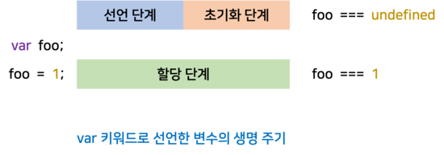
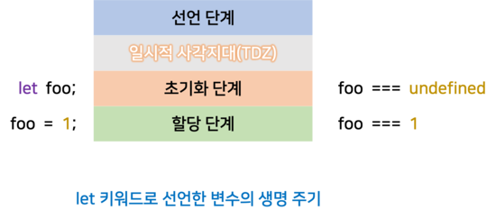

# var 키워드의 문제점

ES5까지 변수를 선언할 수 있는 유일한 방법은 `var` 키워드를 사용하는 것이었다. 먼저 `var` 키워드를 사용하면 생기는 여러 문제점에 대해 알아보자.

### 변수 중복 선언 허용

var 키워드로 선언한 변수는 중복 선언이 가능하다. 다음 코드를 보자.

```js
var x = 1;
var y = 1;

var x = 100;
var y;

console.log(x); // 100
console.log(y); // 1
```

변수 `x`, `y`는 중복으로 선언되었다. 이처럼 `var` 키워드를 사용하면 초기화문 유무에 따라 다르게 동작한다. 초기화문이 있는 변수 선언은 var 키워드가 없는 것처럼 동작하고 초기화문이 없는 변수 선언은 무시된다.

### 함수 레벨 스코프

`var` 키워드로 선언한 변수는 함수 레벨 스코프(Function-Level Scope)를 따른다. 함수 외부에서 var 키워드로 선언한 변수는 코드 블록 내에서 선언해도 모두 전역 변수가 된다. 아래 코드를 보자.

```js
var i = 10;

for (var i = 0; i < 5; i++) {
  console.log(i); // 0 1 2 3 4
}

console.log(i); // 5
```

`var` 키워드는 함수 레벨 스코프를 따르므로 for 문 안에 선언된 변수 `i`는 전역 변수가 된다. 따라서 처음에 초기화된 변수 `i`를 무시하게 된다. 이처럼 함수 레벨 스코프는 전역 변수 선언을 남발할 가능성을 높인다.

### 변수 호이스팅

`var` 키워드로 선언한 변수는 변수 호이스팅에 의해 변수 선언문 이전에 참조할 수 있다. 단, 할당문 이전에 변수를 참조하면 `undefined`를 반환한다.

```js
console.log(foo); // undefined

foo = 123;

console.log(foo); // 123

var foo;
```

# let 키워드

var 키워드의 단점을 보완하기 위해 ES6에서는 `let`과 `const`를 도입했다. `var` 키워드와의 차이점을 중심으로 살펴보자.

### 변수 중복 선언 금지

`var` 키워드로 동일한 이름의 변수를 중복 선언해도 아무런 에러가 발생하지 않는다. 하지만 `let` 키워드로 이름이 같은 변수를 중복 선언하면 `Syntax Error`가 발생한다.

```js
let foo = 123;
let foo = 456; // SyntaxError: Identifier 'foo' has already been declared
```

### 블록 레벨 스코프

`var` 키워드로 선언한 변수는 함수의 코드 블록만을 지역 스코프로 인정하는 함수 레벨 스코프를 따른다. 하지만 `let` 키워드로 선언한 변수는 모든 코드 블록(if, for 문, 함수, try/catch 문 등)을 지역 스코프로 인정하는 블록 레벨 스코프(Block-Level Scope)를 따른다.

```js
let foo = 1; // 전역 변수

{
  let foo = 2; // 지역 변수
  let bar = 3; // 지역 변수
}

console.log(foo); // 1
console.log(bar); // ReferenceError: bar is not defined
```

위 예제에서 전역에 선언된 `foo` 변수와 코드 블록 안에 선언된 변수 `foo`는 다른 별개의 변수다. 또한 `bar` 변수도 블록 레벨 스코프를 갖는 지역 변수다. 따라서 코드 블록 외부에서 참조할 수 없어 `Reference Error`가 발생한다.

### 변수 호이스팅

var 키워드로 선언한 변수는 런타임 이전에 자바스크립트 엔진에 의해 암묵적으로 `선언 단계`와 `초기화 단계`가 한 번에 진행된다. 런타임 이전에 스코프에 변수를 등록하면서 변수를 `undefined`로 초기화한다. 따라서 변수 선언문 이전에 변수에 접근해도 에러가 발생하지 않고 `undefined`를 반환하는 것이다.

```js
console.log(foo); // undefined

var foo;
console.log(foo); // undefined

foo = 1;
console.log(foo); // 1
```

<br />



<br />

let 키워드로 선언한 변수는 `선언 단계`와 `초기화 단계`가 분리되어 진행된다. **선언 단계**는 런타임 이전에 자바스크립트 엔진에 의해 암묵적으로 먼저 실행되지만, **초기화 단계**는 변수 선언문에 도달했을 때 실행된다. 초기화 단계가 실행되기 이전에 변수에 접근하려 하면 Reference Error가 발생한다. 즉, let 키워드로 선언한 변수는 스코프의 시작 지점부터 초기화 지점까지 변수를 참조할 수 없다. 이 스코프의 시작 지점부터 초기화 지점까지 변수를 참조할 수 없는 구간을 **일시적 사각지대(Temporal Dead Zone, TDZ)**라고 부른다.

```js
console.log(foo); // ReferenceError: foo is not defined

let foo;
console.log(foo); // undefined

foo = 1;
console.log(foo); // 1
```

let, const 키워드로 선언한 변수도 변수 호이스팅이 발생하는 것은 변함이 없다. 단, let, const 키워드로 선언한 변수는 런타임에 컨트롤이 변수 선언문에 도달하기 전까지 일시적 사각지대에 빠지기 때문에 참조할 수 없다.

```js
let foo = 1;
{
  console.log(foo); // ReferenceError: Cannot access 'foo' before initialization
  let foo = 2;
}
```

<br />



<br />

### 전역 객체와 let

var 키워드로 선언한 전역 변수와 전역 함수, 그리고 선언하지 않은 변수에 값을 할당한 암묵적 전역은 전역 객체 `window`의 프로퍼티가 된다. 전역 객체의 프로퍼티를 참조할 때 window를 생략할 수 있다.

```js
// 전역 변수
var x = 1;
// 암묵적 전역
y = 2;

// var 키워드로 선언한 전역 변수 x는 전역 객체 window의 프로퍼티가 된다.
console.log(window.x); // 1
// 전역 객체의 프로퍼티를 참조할 때 window를 생략할 수 있다.
console.log(x); // 1

// 암묵적 전역은 전역 객체 window의 프로퍼티가 된다.
console.log(y); // 2
```

_let 키워드로 선언한 변수는 전역 객체의 프로퍼티가 아니다._ let 키워드로 선언한 전역 변수는 전역 렉시컬 환경의 선언적 환경 레코드에 존재하게 된다. 따라서 window.foo와 같이 접근할 수 없다. 이 내용은 [[자바스크립트] 실행 컨텍스트(Execution Context)란?](https://chamdom.blog/execution-context) 에서 자세히 설명되어 있다.

```js
let x = 1;

// let, const 키워드로 선언한 변수는 전역 객체 window의 프로퍼티가 아니다.
console.log(window.x); // undefined
console.log(x); // 1
```

# const 키워드

`const` 키워드는 **상수(constant)**를 선언하기 위해 사용한다. const 키워드의 특징은 let 키워드와 대부분 같다. 따라서 let 키워드와 다른 점을 중심으로 알아보자.

### 선언과 초기화

const 키워드로 선언한 변수는 반드시 선언과 동시에 초기화해야 한다. 그렇지 않으면 `Syntax Error`가 발생한다.

```js
const x = 1;
const y; // SyntaxError: Missing initializer in const declaration
```

const 키워드는 let 키워드와 같이 블록 레벨 스코프를 가지며, 변수 호이스팅이 발생하지 않는 것처럼 동작한다.

```js
{
  // 변수 호이스팅이 발생하지 않는 것처럼 동작한다.
  console.log(foo);
  // ReferenceError: Cannot access 'foo' before initialization

  const foo = 1;
  console.log(foo); // 1
}

// 블록 레벨 스코프를 갖는다.
console.log(foo); // ReferenceError: foo is not defined
```

### 재할당 금지

`var` 또는 `let` 키워드로 선언한 변수는 변수 재할당에 자유로우나 `const` 키워드로 선언한 변수는 재할당이 금지된다.

```js
const foo = 1;
foo = 2; // TypeError: Assignment to constant variable.
```

`const` 키워드로 선언된 변수에 원시 값을 할당하면 원시 값은 **변경할 수 없는 값(immutable value)**이고 const 키워드에 의해 재할당이 금지되므로 할당된 값을 변경할 방법은 없다. 따라서 상수를 표현하는 데 사용하기도 한다. 상수는 상태 유지와 가독성, 유지보수의 편의를 위해 사용된다.

```js
const TAX_RATE = 0.1;

// 세전 가격
let preTaxPrice = 100;

// 세후 가격
let afterTaxPrice = preTaxPrice + preTaxPrice * TAX_RATE;
console.log(afterTaxPrice); // 110
```

`const` 키워드로 변수를 선언한다고 해서 모두 불변이 되는 것은 아닌데, `const` 키워드로 선언된 변수에 객체를 할당한 경우가 그렇다. 원시 값은 재할당 없이 값을 변경할 방법이 없지만 **변경할 수 있는 값(mutable value)**인 객체는 재할당 없이도 직접 변경이 가능하다. _const 키워드는 재할당을 금지할 뿐 불변을 의미하지 않는다._

```js
const person = {
  name: 'Kim',
};

person.name = 'Roh';

console.log(person.name); // "Roh"
```

# var vs. let vs. const

- ES6를 사용한다면 var 키워드는 사용하지 않는다.
- 재할당이 필요한 경우에 한정해 let 키워드를 사용한다. 이때 변수의 스코프는 최대한 좁게 만든다.
- 변경이 발생하지 않고 읽기 전용으로 사용하는 원시 값과 객체에는 const 키워드를 사용한다.

<br />

---

# 참고

- https://poiemaweb.com/
- 모던 자바스크립트 Deep Dive
