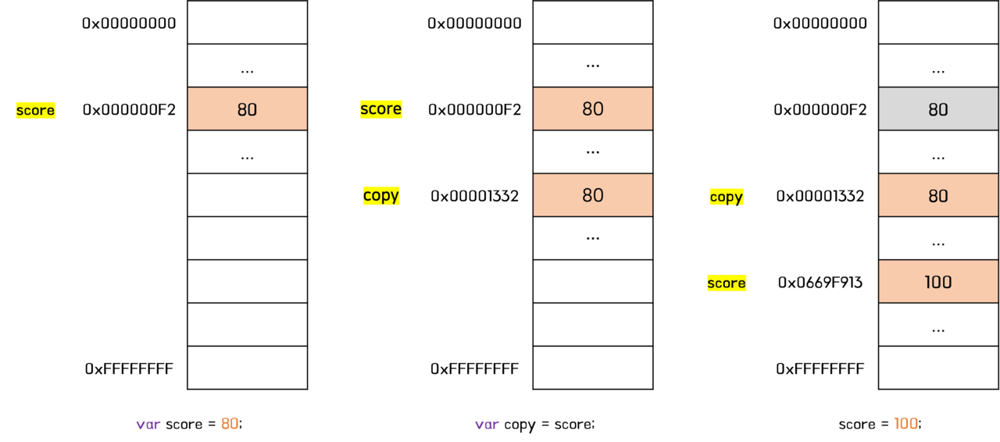
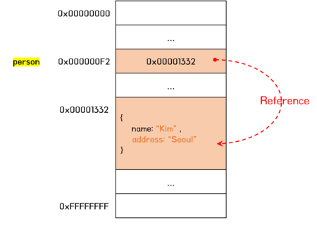
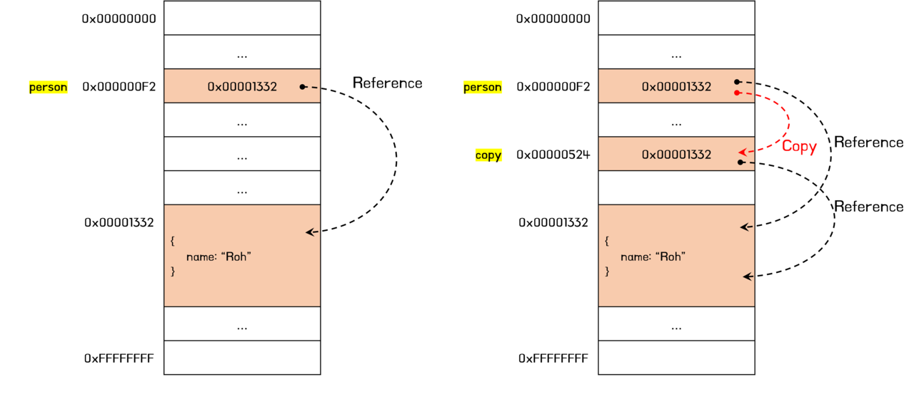

# 원시 타입

**원시 타입의 값(원시 값)**은 변경 불가능한 값(Immutable Value)이다. 즉, 읽기 전용(read-only) 값이다.

원시 값은 변경 불가능한 값이기 때문에 값을 직접 변경할 수 없다. 따라서 변수 값을 변경하기 위해서는 새로운 메모리 공간을 확보하고 재할당할 값을 저장한 후, 변수가 가리키고 있던 메모리 공간의 주소를 변경한다. 값의 이런 특성을 **불변성(immutability)**이라 한다.

"원시 값은 변경 불가능하다."는 말은 **원시 값 자체를 변경할 수 없다는 것이지 변수 값을 변경할 수 없다는 것이 아니다.** _변경 불가능하다는 것은 변수가 아니라 값에 대한 진술이다._ 변수는 언제든지 재할당을 통해 값을 변경(엄밀히 말하면 교체)할 수 있다. 그렇기 때문에 **변수**라고 부른다.

## 값에 의한 전달

다음 코드를 살펴보자.

```js
var score = 80;
var copy = score;

console.log(score); // 80
console.log(copy); // 80

score = 100;

console.log(score); // 100
console.log(copy); // 80
```

변수에 원시 값을 갖는 변수를 할당하면 할당받은 변수(copy)에는 할당되는 변수(score)의 **원시 값**이 복사되어 전달된다. 이를 **값에 의한 전달**이라 한다. 따라서 위 코드에서 변수 `copy`에는 변수 `score`의 값 80이 복사되어 전달된다.

위 코드의 과정을 그림을 통해 살펴보자.



그림을 보면 알 수 있듯이 `score` 변수와 `copy` 변수의 값 `80`은 **서로 다른 메모리 공간에 저장된 별개의 값이다.** 따라서 `score` 변수의 값을 변경해도 `copy` 변수의 값에는 어떠한 영향도 주지 않는다.

이처럼 _값의 의한 전달은 값을 전달하는 것이 아니라 메모리 주소를 전달한다._ 메모리 주소를 통해 메모리 공간에 접근하면 값을 참조할 수 있기 때문에 식별자(변수)는 메모리 주소를 가리키지만 값에 접근할 수 있는 것이다.

# 객체 타입

**객체 타입의 값**은 변경 가능한 값(mutable value)다.

객체는 프로퍼티의 개수가 정해져 있지 않으며, 동적으로 추가되고 삭제할 수 있다. 또한 프로퍼티의 값에도 제약이 없다. 따라서 객체는 원시 값과 같이 메모리 공간의 크기를 사전에 정해 둘 수 없다.

```js
var person = {
  name: 'Roh',
};
```


원시 값을 할당한 변수를 참조하면 메모리에 저장되어 있는 원시 값에 접근한다. 하지만 객체를 할당한 변수를 참조하면 메모리에 저장되어 있는 참조 값을 통해 실제 객체에 접근한다. **참조값은 생성된 객체가 실제로 저장된 메모리 공간의 주소이다.**

객체는 변경 가능한 값이므로 메모리에 저장된 객체를 직접 수정할 수 있다. 위 코드의 객체를 변경해보자.

```js
var person = {
  name: 'Roh',
};
person.name = 'Kim';
person.address = 'Seoul';
```



이처럼 _객체를 할당한 변수는 재할당 없이 객체를 직접 변경할 수 있다._ 즉, 재할당 없이 프로퍼티를 동적으로 추가, 수정, 삭제가 가능하다. 이때 객체를 할당한 변수에 재할당을 하지 않았으므로 **객체를 할당한 변수의 참조 값은 변경되지 않는다.**

## 참조에 의한 전달

객체를 생성하고 관리하는 방식은 복잡하며 비용이 많이 드는 일이다. 만약 객체를 원시 값처럼 이전 값을 복사해서 새로 생성한다면 메모리를 효율적으로 사용하기 어렵고 선능이 나빠진다. 메모리를 효율적으로 사용하고 성능을 향상시키기 위해 객체는 변경 가능한 값으로 설계되어 있다. 객체의 이러한 구조 때문에 부작용이 발생하는데 그것은 **여러 개의 식별자가 하나의 객체를 공유할 수 있다는 것**이다.

객체의 식별자 공유를 자세히 알아보자.

```js
var person = {
  name: 'Roh',
};

// 참조 값을 복사
var copy = person;

console.log(person === copy); // true
```

객체를 가리키는 원본 변수(person)를 다른 변수(copy)에 할당하면 원본의 **참조 값**이 복사되어 전달 된다. 이를 **참조에 의한 전달**이라 한다.

<br />



원본 `person`과 사본 `copy`는 저장된 메모리 주소는 다르지만 동일한 참조 값을 갖는다. 이것은 **두 개의 식별자가 하나의 객체를 공유한다는 것**을 의미한다. 따라서 원본 또는 사본 중 어느 한쪽에서 객체를 변경하면 서로 영향을 주고받는다.

<br />

---

# 정리

### 원시 타입

- 원시 타입의 값은 변경 불가능한 값이다.
- 변수에 원시 값을 복사하면 메모리 주소에 저장되어 있는 값이 복사된다. 이를 값에 의한 전달이라 한다.
- 원본 변수의 값과 복사된 변수의 값은 서로 다른 메모리 공간에 저장되어 있다. 따라서 어느 한 쪽의 값을 변경하더라도 서로 영향을 받지 않는다.

### 객체 타입

- 객체 타입의 값은 변경 가능한 값이다.
- 변수에 객체를 복사하면 메모리 주소에 저장되어 있는 참조 값이 복사된다. 이를 참조에 의한 전달이라 한다.
- 원본 변수와 복사된 변수는 서로 다른 메모리 주소에 저장되어 있지만 모두 동일한 객체를 가리킨다. 따라서 어느 한 쪽의 값을 변경하면 서로 영향을 받게 된다.

<br />

**값에 의한 전달**과 **참조에 의한 전달**은 식별자가 기억하는 메모리 공간에 저장되어 있는 값을 복사해서 전달한다는면에서 동일하다. 다만 변수에 저장되어 있는 값이 원시 값이냐 참조 값이냐의 차이만 있을 뿐이다. 따라서 _자바스크립트에는 참조에 의한 전달은 존재하지 않고 값에 의한 전달만이 존재한다고 말할 수 있다._

자바스크립트에는 이 같은 동작 방식을 설명하는 정확한 용어가 존재하지 않는다. 이런 이유로 **공유에 의한 전달**이라고 표현하는 경우도 있다. 하지만 이 용어도 ECMAScript 사양에 정의된 공식적인 용어는 아니며 자바스크립트의 동작 방식을 정확히 설명하지 못한다.

또한, 자바스크립트에는 **포인터(pointer)**가 존재하지 않기 때문에 포인터가 존재하는 다른 프로그래밍 언어의 "참조에 의한 전달"과 의미가 정확히 일치하지 않는다는 점을 유의해야 한다.

<br />

---

# 참고

- https://poiemaweb.com/
- 모던 자바스크립트 Deep Dive
