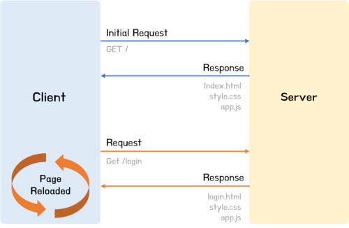
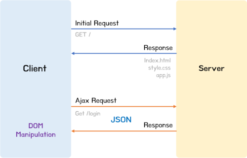

# Ajax란?

**Ajax(Asynchronous JavaScript and XML)**는 브라우저에서 제공하는 Web API인 **XMLHttpRequest 객체**를 이용해서 브러우저가 서버와 비동기 통신을 하여 웹페이지의 전체가 아닌 일부분만을 갱신하는 프로그래밍 방식을 말한다. 요약하자면 JavaScript를 사용한 비동기 통신, 클라이언트와 서버간에 XML 데이터를 주고받는 기술이라고 할 수 있다.

Ajax가 등장하기 이전의 웹페이지는 html 태그로 시작해서 html 태그로 끝나는 완전한 HTML을 서버로부터 전송받아 웹페이지 전체를 처음부터 다시 렌더링하는 방식으로 동작했다.

- 변경할 필요가 없는 부분까지 포함된 완전한 HTML을 서버로부터 매번 다시 전송받기 때문에 불필요한 데이터 통신이 발생한다.
- 변경할 필요가 없는 부분까지 다시 렌더링하게 된다. 이때 화면이 순간적으로 깜박이는 현상이 발생한다.
- 클라이언트와 서버와의 통신이 **동기 방식**으로 동작하기 때문에 서버로부터 응답이 있을 때까지 다음 처리는 블로킹된다.

Ajax의 등장으로 서버로부터 웨페이지의 변경에 필요한 데이터만 비동기 방식으로 전송받을 수 있게되었다. 따라서 웹페이지에서 변경할 필요가 없는 부분은 다시 렌더링하지 않고, 변경이 필요한 부분만 렌더링하는 방식이 가능해졌다. 이를 통해 브라우저에서도 데스크톱 애플리케이션과 유사한 빠른 퍼포먼스와 부드러운 화면 전환이 가능해졌다.

- 변경할 부분을 갱신하는 데 필요한 데이터만 서버로부터 전송받기 때문에 불필요한 데이터 통신이 발생하지 않는다.
- 변경할 필요가 없는 부분은 다시 렌더링하지 않는다. 따라서 화면이 순간적으로 깜빡이는 현상이 발생하지 않는다.
- 클라이언트와 서버와의 통신이 **비동기 방식**으로 동작하기 때문에 서버에게 요청을 보낸 이후 블로킹이 발생하지 않는다.

# Ajax의 장단점

### Ajax의 장점

- 웹페이지의 속도향상.
- 서버의 처리가 완료 될때까지 기다리지 않고 처리 가능하다.(비동기 방식)
- 서버에서 데아터만 전송하면 되므로 전체적인 코딩의 양이 줄어든다.
- 기존 웹에서는 불가능했던 다양한 UI를 가능하게 해준다.(필요한 부분만 렌더링)

### Ajax의 단점

- 히스토리 관리가 안 된다(보안에 좀 더 신경을 써야한다).
- 연속으로 데이터를 요청하면 서버 부하가 증가할 수 있다.
- XMLHttpRequest를 통해 통신을 하는 경우 사용자에게 아무런 진행 정보가 주어지지 않는다. 이로 인해 아직 요청이 완료되지 않았는데 사용자가 페이지를 떠나거나 오작동할 우려가 있다.

 

---

# 참고

- https://poiemaweb.com/js-ajax
- https://coding-factory.tistory.com/143
- 모던 자바스크립트 Deep Dive
