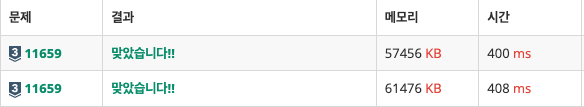

# 문제

[11659: 구간 합 구하기 4](https://www.acmicpc.net/problem/11659)

### 문제 설명

수 N개가 주어졌을 때, i번째 수부터 j번째 수까지 합을 구하는 프로그램을 작성하시오.

### 입력

첫째 줄에 수의 개수 `N`과 합을 구해야 하는 횟수 `M`이 주어진다. 둘째 줄에는 `N`개의 수가 주어진다. 수는 1,000보다 작거나 같은 자연수이다. 셋째 줄부터 M개의 줄에는 합을 구해야 하는 구간 `i`와 `j`가 주어진다.

### 출력

총 `M`개의 줄에 입력으로 주어진 `i`번째 수부터 `j`번째 수까지 합을 출력한다.

### 제한

- 1 ≤ `N` ≤ 100,000
- 1 ≤ `M` ≤ 100,000
- 1 ≤ `i` ≤ `j` ≤ `N`

### 입출력

<div class='flex-wrapper'>
<div>

#### 입력

```text
5 3
5 4 3 2 1
1 3
2 4
5 5
```

</div>
<div>

#### 출력

```text
12
9
1
```

</div>
</div>

# 코드

```js
const input = require('fs')
  .readFileSync(process.platform === 'linux' ? '/dev/stdin' : './input.txt')
  .toString()
  .trim()
  .split('\n');

const list = input[1].split(' ').map(Number);
const testCase = input.slice(2).map(val => val.split(' ').map(Number));

const answer = [];
const totalSum = [0];
let tmp = 0;

for (const num of list) {
  tmp += num;
  totalSum.push(tmp);
}

for (const [start, end] of testCase) {
  answer.push(totalSum[end] - totalSum[start - 1]);
}

console.log(answer.join('\n'));
```

# reduce 메서드 활용 풀이

```js
const input = require('fs')
  .readFileSync(process.platform === 'linux' ? '/dev/stdin' : './input.txt')
  .toString()
  .trim()
  .split('\n');

const list = input[1].split(' ').map(Number);
const testCase = input.slice(2).map(val => val.split(' ').map(Number));

const totalSum = list.reduce(
  (acc, cur) => {
    acc.push(acc[acc.length - 1] + cur);
    return acc;
  },
  [0],
);

const answer = testCase.reduce((acc, [start, end]) => {
  acc.push(totalSum[end] - totalSum[start - 1]);
  return acc;
}, []);

console.log(answer.join('\n'));
```



시간과 메모리가 약간 감소했다.
