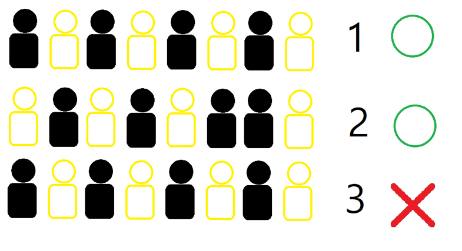

# 문제

[15787번: 기차가 어둠을 헤치고 은하수를](https://www.acmicpc.net/problem/15787)

### 문제 설명

`N`개의 기차가 어둠을 헤치고 은하수를 건너려고 한다.

기차는 20개의 일렬로 된 좌석이 있고, 한 개의 좌석에는 한 명의 사람이 탈 수 있다.

기차의 번호를 1번부터 `N`번으로 매길 때, 어떠한 기차에 대하여 `M`개의 명령이 주어진다.

명령의 종류는 4가지로 다음과 같다.

- 1 i x : `i`번째 기차에(1 ≤ `i` ≤ `N`) `x`번째 좌석에(1 ≤ `x` ≤ 20) 사람을 태워라. 이미 사람이 타있다면 , 아무런 행동을 하지 않는다.
- 2 i x : `i`번째 기차에 `x`번째 좌석에 앉은 사람은 하차한다. 만약 아무도 그자리에 앉아있지 않았다면, 아무런 행동을 하지 않는다.
- 3 i : `i`번째 기차에 앉아있는 승객들이 모두 한칸씩 뒤로간다. `k`번째 앉은 사람은 `k+1`번째로 이동하여 앉는다. 만약 20번째 자리에 사람이 앉아있었다면 그 사람은 이 명령 후에 하차한다.
- 4 i : `i`번째 기차에 앉아있는 승객들이 모두 한칸씩 앞으로간다. `k`번째 앉은 사람은 `k-1`번째 자리로 이동하여 앉는다. 만약 1번째 자리에 사람이 앉아있었다면 그 사람은 이 명령 후에 하차한다.

<br/>

M번의 명령 후에 1번째 기차부터 순서대로 한 기차씩 은하수를 건너는데 조건이 있다.

기차는 순서대로 지나가며 기차가 지나갈 때 승객이 앉은 상태를 목록에 기록하며 이미 목록에 존재하는 기록이라면 해당 기차는 은하수를 건널 수 없다.

<br/>

예를 들면, 다음 그림을 예로 들었을 때, 1번째 기차와 같이 승객이 앉은 상태는 기록되지 않았기 때문에 은하수를 건널 수있다. 2번째 기차와 같은 상태도 기록되지 않았기 때문에 2번째 기차도 은하수를 건널 수 있다. 3번째 기차는 1번째 기차와 승객이 앉은 상태가 같으므로 은하수를 건널 수 없다.

<div class="resize-wrapper">



</div>

처음에 주어지는 기차에는 아무도 사람이 타지 않는다.

은하수를 건널 수 있는 기차의 수를 출력하시오.

### 입력

입력의 첫째 줄에 기차의 수 `N`(1 ≤ N ≤ 100000)과 명령의 수 `M`(1 ≤ M ≤ 100000)가 주어진다. 이후 두 번째 줄부터 M+1번째 줄까지 각 줄에 명령이 주어진다.

### 출력

은하수를 건널 수 있는 기차의 수를 출력하시오.

### 입출력

<div class='flex-wrapper'>
<div>

#### 예제 입력

```text
5 5
1 1 1
1 1 2
1 2 2
1 2 3
3 1
```

</div>
<div>

#### 예제 출력

```text
2
```

</div>
</div>

# 코드

```js
const input = require('fs')
  .readFileSync(process.platform === 'linux' ? '/dev/stdin' : './input.txt')
  .toString()
  .trim()
  .split('\n')
  .map(line => line.split(' ').map(Number));

const [N, _] = input.shift();
const train = Array.from({ length: N }, () => Array(20).fill(0));

for (const [op, i, x] of input) {
  if (op === 1) {
    train[i - 1][x - 1] = 1;
  } else if (op === 2) {
    train[i - 1][x - 1] = 0;
  } else if (op === 3) {
    train[i - 1].pop();
    train[i - 1].unshift(0);
  } else if (op === 4) {
    train[i - 1].shift();
    train[i - 1].push(0);
  }
}

const trainSet = new Set();

train.forEach(train => {
  trainSet.add(train.toString());
});

console.log(trainSet.size);
```
