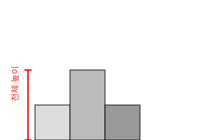
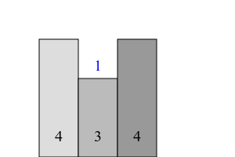

# 문제

[16931번: 겉넓이 구하기](https://www.acmicpc.net/problem/16931)

### 문제 설명

크기가 $N \times M$인 종이가 있고, 종이는 $1\times1$ 크기의 칸으로 나누어져 있다. 이 종이의 각 칸 위에 $1\times1\times1$ 크기의 정육면체를 놓아 3차원 도형을 만들었다.

<div class='resize-wrapper'>


</div>

종이의 각 칸에 놓인 정육면체의 개수가 주어졌을 때, 이 도형의 겉넓이를 구하는 프로그램을 작성하시오.

### 입력

첫째 줄에 종이의 크기 `N`, `M`이 주어진다. 둘째 줄부터 `N`개의 줄에는 종이의 각 칸에 놓인 정육면체의 수가 주어진다.

### 출력

첫째 줄에 도형의 겉넓이를 출력한다.

### 제한

- 1 ≤ `N`, `M` ≤ 100
- 1 ≤ 종이의 한 칸에 놓인 정육면체의 수 ≤ 100

### 입출력

<div class='flex-wrapper'>
<div>

#### 예제 입력

```text
1 1
1
```

</div>
<div>

#### 예제 출력

```text
6
```

</div>
</div>

<div class='flex-wrapper'>
<div>

#### 예제 입력 2

```text
3 3
1 3 4
2 2 3
1 2 4
```

</div>
<div>

#### 예제 출력 2

```text
60
```

</div>
</div>

# 코드

```js
const input = require('fs')
  .readFileSync(process.platform === 'linux' ? '/dev/stdin' : './input.txt')
  .toString()
  .trim()
  .split('\n');

const [N, M] = input.shift().split(' ').map(Number);
const block = input.map(line => line.split(' ').map(Number));

const up = N * M;

let back = 0;
for (let i = 0; i < M; i++) {
  for (let j = 0; j < N; j++) {
    if (j === 0) back += block[j][i];
    else {
      if (block[j - 1][i] < block[j][i]) back += block[j][i] - block[j - 1][i];
    }
  }
}

let left = 0;
for (let i = 0; i < N; i++) {
  for (let j = 0; j < M; j++) {
    if (j === 0) left += block[i][j];
    else {
      if (block[i][j - 1] < block[i][j]) left += block[i][j] - block[i][j - 1];
    }
  }
}

console.log(2 * (up + back + left));
```

# 문제 풀이

이 문제는 3차원 블록 구조물의 겉넓이를 구하는 문제다. 모든 면을 구할 필요 없이 윗면, 뒷면, 왼쪽면만 계산하고 각각 2를 곱한 후 합하면 된다.

그 이유는 직육면체 구조에서 서로 마주보는 면(윗면과 아랫면, 앞면과 뒷면, 왼쪽면과 오른쪽면)이 완전히 동일한 크기와 모양을 가지고 있기 때문이다.

이러한 대칭성을 이용하면 계산량을 절반으로 줄이면서도 정확한 겉넓이를 구할 수 있다.

<br/>

먼저 윗면의 넓이를 구한다. 이는 항상 `N * M`이다.

```js
// 윗면의 넓이를 계산한다. (항상 N * M ).
const up = N * M;
```

<br/>

블록 구조물을 뒤에서 바라보는 방식으로 설정했다. 즉, 구조물의 뒷면을 왼쪽에서 오른쪽으로(M 순회), 그리고 각 열에 대해(N 순회) 탐색한다.

```js
let back = 0;
for (let i = 0; i < M; i++) {
  for (let j = 0; j < N; j++) {
    if (j === 0) back += block[j][i];
    else {
      if (block[j - 1][i] < block[j][i]) back += block[j][i] - block[j - 1][i];
    }
  }
}
```

<div class='resize-wrapper'>



</div>

첫 번째 행은 각 열의 바닥부터 시작하는 블록이다. 이 블록의 전체 높이가 곧 그 열에서 보이는 면의 **최소 높이**가 된다.

위 그림에서 볼 수 있듯이, 각 열의 <u>첫 번째 블록 높이는 항상 전체가 겉넓이에 포함된다.</u> 따라서 이 높이를 그대로 더해준다.

<div class='resize-wrapper'>



</div>

단순히 한쪽 면에서 최댓값을 더하는 것이 아니다. 위 그림처럼 중간에 더 작은 값이 있는 경우, 그 값은 가려져서 보이지 않게 되므로 카운트되지 않는 면들이 생기게 된다.

따라서 막대들을 순회하면서 이전 값과 비교했을 때 크기가 커진다면, 그 차이만큼 면이 추가된 것이므로 이를 더해줘야 한다.

<br/>

왼쪽면에서 바라보는 것도 계산하는 과정은 같다. 대신 보는 각도가 달라지므로 배열을 순회하는 순서가 뒷면(back)에서 하는 것과 차이가 있다.

```js
let left = 0;
for (let i = 0; i < N; i++) {
  for (let j = 0; j < M; j++) {
    // ...
  }
}
```

윗면, 뒷면, 왼쪽면의 면적을 계산했으니 이제 이 들의 합을 `*2` 해주면 된다.

```js
console.log(2 * (up + back + left));
```
