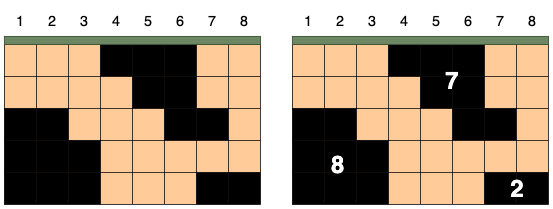
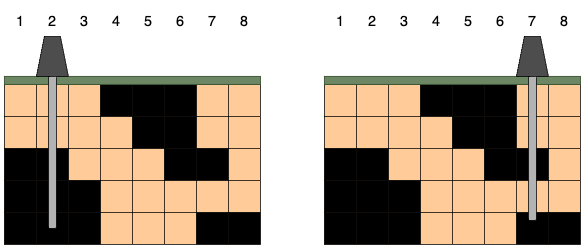

# 문제

[연습문제 - 석유 시추](https://school.programmers.co.kr/learn/courses/30/lessons/250136)

### 문제 설명

세로길이가 `n` 가로길이가 `m`인 격자 모양의 땅 속에서 석유가 발견되었습니다. 석유는 여러 덩어리로 나누어 묻혀있습니다. 당신이 시추관을 수직으로 단 하나만 뚫을 수 있을 때, 가장 많은 석유를 뽑을 수 있는 시추관의 위치를 찾으려고 합니다. 시추관은 열 하나를 관통하는 형태여야 하며, 열과 열 사이에 시추관을 뚫을 수 없습니다.



예를 들어 가로가 8, 세로가 5인 격자 모양의 땅 속에 위 그림처럼 석유가 발견되었다고 가정하겠습니다. 상, 하, 좌, 우로 연결된 석유는 하나의 덩어리이며, 석유 덩어리의 크기는 덩어리에 포함된 칸의 수입니다. 그림에서 석유 덩어리의 크기는 왼쪽부터 8, 7, 2입니다.



시추관은 위 그림처럼 설치한 위치 아래로 끝까지 뻗어나갑니다. 만약 시추관이 석유 덩어리의 일부를 지나면 해당 덩어리에 속한 모든 석유를 뽑을 수 있습니다. 시추관이 뽑을 수 있는 석유량은 시추관이 지나는 석유 덩어리들의 크기를 모두 합한 값입니다. 시추관을 설치한 위치에 따라 뽑을 수 있는 석유량은 다음과 같습니다.

<div class="resize-wrapper">

| 시추관의 위치 | 획득한 덩어리 | 총 석유량 |
| :-----------: | :-----------: | :-------: |
|       1       |      [8]      |     8     |
|       2       |      [8]      |     8     |
|       3       |      [8]      |     8     |
|       4       |      [7]      |     7     |
|       5       |      [7]      |     7     |
|       6       |      [7]      |     7     |
|       7       |    [7, 2]     |     9     |
|       8       |      [2]      |     2     |

</div>
오른쪽 그림처럼 7번 열에 시추관을 설치하면 크기가 7, 2인 덩어리의 석유를 얻어 뽑을 수 있는 석유량이 9로 가장 많습니다.

석유가 묻힌 땅과 석유 덩어리를 나타내는 2차원 정수 배열 `land`가 매개변수로 주어집니다. 이때 시추관 하나를 설치해 뽑을 수 있는 가장 많은 석유량을 return 하도록 solution 함수를 완성해 주세요.

### 제한사항

- 1 ≤ land의 길이 = 땅의 세로길이 = n ≤ 500
  - 1 ≤ land[i]의 길이 = 땅의 가로길이 = m ≤ 500
  - land[i][j]는 i+1행 j+1열 땅의 정보를 나타냅니다.
  - land[i][j]는 0 또는 1입니다.
  - land[i][j]가 0이면 빈 땅을, 1이면 석유가 있는 땅을 의미합니다.

정확성 테스트 케이스 제한사항

- 1 ≤ land의 길이 = 땅의 세로길이 = n ≤ 100
  - 1 ≤ land[i]의 길이 = 땅의 가로길이 = m ≤ 100

효율성 테스트 케이스 제한사항

- 주어진 조건 외 추가 제한사항 없습니다.

### 입출력 예

| land                                                                                                                                         | result |
| -------------------------------------------------------------------------------------------------------------------------------------------- | ------ |
| [[0, 0, 0, 1, 1, 1, 0, 0], [0, 0, 0, 0, 1, 1, 0, 0], [1, 1, 0, 0, 0, 1, 1, 0], [1, 1, 1, 0, 0, 0, 0, 0], [1, 1, 1, 0, 0, 0, 1, 1]]           | 9      |
| [[1, 0, 1, 0, 1, 1], [1, 0, 1, 0, 0, 0], [1, 0, 1, 0, 0, 1], [1, 0, 0, 1, 0, 0], [1, 0, 0, 1, 0, 1], [1, 0, 0, 0, 0, 0], [1, 1, 1, 1, 1, 1]] | 16     |

# 코드

```js
function solution(land) {
  const N = land.length;
  const M = land[0].length;
  const visited = Array.from({ length: N }, () => Array(M).fill(false));
  const directions = [
    [-1, 0],
    [0, 1],
    [1, 0],
    [0, -1],
  ];

  const oils = Array(M).fill(0);

  function isValid(x, y) {
    return x >= 0 && x < N && y >= 0 && y < M;
  }

  function bfs(i, j) {
    const queue = [[i, j]];
    visited[i][j] = true;
    let size = 0;
    const columnSet = new Set();

    while (queue.length > 0) {
      const [x, y] = queue.shift();
      size++;
      columnSet.add(y);

      for (const [dx, dy] of directions) {
        const nx = x + dx;
        const ny = y + dy;

        if (!isValid(nx, ny)) continue;
        if (land[nx][ny] === 1 && !visited[nx][ny]) {
          queue.push([nx, ny]);
          visited[nx][ny] = true;
        }
      }
    }

    for (const column of columnSet) {
      oils[column] += size;
    }
  }

  for (let i = 0; i < N; i++) {
    for (let j = 0; j < M; j++) {
      if (land[i][j] === 1 && !visited[i][j]) {
        bfs(i, j);
      }
    }
  }

  let max = 0;
  for (let i = 0; i < M; i++) {
    if (oils[i] > max) {
      max = oils[i];
    }
  }

  return max;
}
```

# 문제 풀이

이 문제는 2차원 배열로 표현된 땅에서 석유 덩어리를 찾고, 각 열에 시추관을 놓았을 때 얻을 수 있는 최대 석유량을 구하는 문제다. 일반적인 `BFS`로는 단순히 연결된 석유 덩어리의 크기만 구할 수 있지만, 이 문제에서는 각 열별로 얻을 수 있는 석유량을 계산해야 한다.

<br/>

이를 위해 `Set` 자료구조를 추가했다. `BFS` 탐색 중 각 칸의 열 번호를 이 `Set`에 추가함으로써, 하나의 석유 덩어리가 어떤 열들에 걸쳐있는지 파악할 수 있다.

그리고 `BFS` 탐색이 끝난 후, 해당 덩어리의 크기를 `Set`에 포함된 모든 열의 석유량에 더해준다. 이렇게 함으로써 각 열에 시추관을 놓았을 때 얻을 수 있는 석유량을 정확히 계산할 수 있을 것이다.

#### bfs 코드 구현

```js
const oils = Array(M).fill(0);
// ...

function bfs(i, j) {
  // ...

  // 현재 석유 덩어리가 차지하는 열들의 집합
  const columnSet = new Set();

  while (queue.length > 0) {
    // ...

    // 현재 열 번호를 집합에 추가
    columnSet.add(y);

    // ...
  }

  // 이 석유 덩어리가 차지하는 모든 열에 대해
  for (const column of columnSet) {
    // 해당 열의 석유량에 현재 덩어리의 크기를 더함
    oils[column] += size;
  }
}
```

일반적인 BFS함수에 `columnSet`이라는 `Set`을 추가한다. 이를 통해 현재 탐색 중인 석유 덩어리가 걸쳐있는 모든 열 번호를 저장한다. `Set`을 사용함으로써 중복 없이 열 번호만를 저장할 수 있다.

동시에 `size` 변수를 통해 현재 석유 덩어리의 크기를 계산한다. 이는 각 열의 석유량을 계산할 때 사용된다.

<br/>

BFS 탐색이 끝난 후, `columnSet`에 저장된 모든 열에 대해 반복문을 돌며 `oils[column] += size`를 실행하여 해당 열의 석유량에 현재 덩어리의 크기를 더한다.

이렇게 하는 이유는 석유 시추의 특성 때문이다. 어느 한 열에 시추관을 내리면 그 열과 연결된 모든 석유를 얻을 수 있기 때문에, 하나의 석유 덩어리가 여러 열에 걸쳐 있다면 그 덩어리의 전체 크기가 각 열의 석유량이기 때문이다.

#### 최댓값 return

```js
let max = 0;
for (let i = 0; i < M; i++) {
  if (oils[i] > max) {
    max = oils[i];
  }
}

return max;
```
