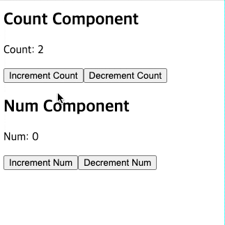
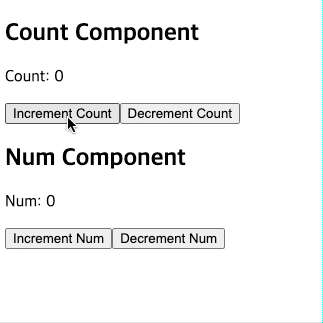

# 들어가며

지금까지 Redux toolkit을 사용하면서 `useSelector`를 잘못 사용하고 있다는 것을 알게되었다. 다음과 같이 구조 분해 할당으로 `useSelector`를 사용하고 있었다.

```js
const { data, loading, error } = useSelector(state => state.user);
```

구조 분해 할당으로 `useSelector`를 사용하면 어떤 문제가 생기는지, 그리고 어떻게 최적화할 수 있을지 이번 포스팅에서 다뤄보려고 한다.

# useSelector의 동작 원리

먼저, 예제 코드를 통해서 `useSelector`가 어떻게 동작하는지 간략하게 알아보자.

```js
import { useSelector } from 'react-redux';

function ExampleComponent() {
  const { count } = useSelector(state => state.counter);

  return <div>Count: {count}</div>;
}
```

#### 1. 렌더링 될 때 selector 함수를 실행

`useSelector`는 컴포넌트가 렌더링 되거나 action이 dispatch 될 때마다 **selector 함수**를 실행한다.

위 코드에서 **selector 함수**는 `state => state.counter`다. 이 함수는 redux store의 state를 매개변수로 받아서 state를 가공한 후 반환한다. `useSelector`는 selector 함수의 반환값을 반환한다.

<blockquote type="quote">
<i>
  "useSelector accepts a single function, which we call a selector function. A
  selector is a function that takes the entire Redux store state as its
  argument, reads some value from the state, and returns that result."
</i>
&nbsp; - &nbsp;
<a href="https://redux.js.org/tutorials/fundamentals/part-5-ui-react">
   Redux 공식문서
</a>
<br />
<br />

useSelector는 선택자 함수라고 부르는 단일 함수를 인자로 받는다. 선택자는 전체
Redux 스토어 상태를 인자로 받아, 특정 값을 상태(state)에서 읽어 그 결과를
반환하는 함수다.

</blockquote>

#### 2. selector 함수의 반환값을 비교

action이 dispatch 되면 redux store의 state가 변경된다. 이때 <u>`useSelector`는 이전 selector 함수의 반환값과 현재 selector 함수의 반환값을 비교</u>한다.

#### 3. 컴포넌트 리렌더링

비교 결과 두 값이 다르다면 컴포넌트를 리렌더링한다. 만약 두 값이 같다면 컴포넌트를 리렌더링하지 않는다.

# Redux의 참조 동등성 검사와 업데이트

위에서 설명한 바와 같이, Redux는 selector 함수의 반환값을 비교한다. 이 비교는 어떻게 이루어질까?

<blockquote title="주의사항" variant="warning">

_"useSelector compares its results using strict `===` reference comparisons, so the component will re-render any time the selector result is a new reference! This means that if you create a new reference in your selector and return it, your component could re-render every time an action has been dispatched, even if the data really isn't different."_

useSelector는 참조 비교(`===`)를 사용하여 결과를 비교한다. 따라서 선택자의 결과가 새로운 참조일 때마다 컴포넌트가 다시 렌러딩된다! 이는 선택자에게 새로운 참조를 생성하여 반환할 경우, 실제 데이터에 변화가 없더라도 액션이 디스패치될 때마다 컴포넌트가 다시 렌더링될 수 있음을 의미한다.

</blockquote>

Redux는 **reference equality checks(참조 동등성 검사)**를 한다. 얕은 비교(shallow comparison)를 하는것은 아니지만 자바스크립트의 특징으로 인해 문제가 발생할 수 있다.

JavaScript는 원시 타입의 값은 값 자체를 비교하기 때문에 실제로 값이 변경되었을 때만 다르다고 판단한다. 하지만, <u>객체는 참조 값(메모리 주소)을 비교하므로 내용이 같더라도 새로운 객체나 배열을 생성하면 다른 참조로 간주</u>된다.

<blockquote variant="info">

자바스크립트가 객체 타입(참조 값)을 어떻게 비교하는지 [JavaScript: 원시 타입과 객체 타입](https://chamdom.blog/primitive-and-object/)에서 자세히 다루니 참고하면 좋을 것 같다.

</blockquote>

# 구조 분해 할당의 문제점

사실 구조 분해로 상태 변수를 사용하는 것이 문제가 아니다. <u>selector 함수의 반환 값이 객체 타입일 때가 문제가 발생</u>하는 것이다. (객체나 배열을 사용할 때 디스트럭처링은 자연스럽게 따라오는 문법이지만, 실제 문제의 원인은 selector 함수에 있다.)

<br />

<iframe
  src="https://codesandbox.io/embed/dt99g2?view=editor+%2B+preview&module=%2Fsrc%2FApp.tsx&expanddevtools=1"
  style="width:100%; height: 500px; border:0; border-radius: 4px; overflow:hidden;"
  title="useSelector-optimization"
  allow="accelerometer; ambient-light-sensor; camera; encrypted-media; geolocation; gyroscope; hid; microphone; midi; payment; usb; vr; xr-spatial-tracking"
  sandbox="allow-forms allow-modals allow-popups allow-presentation allow-same-origin allow-scripts"
></iframe>

<br />
<br />

위 예제를 보면 `CountComponent`와 `NumComponent`는 각 컴포넌트에서 사용하는 변수만을 사용한다. 하지만, selector 함수의 반환값이 객체 타입이기 때문에, 객체의 일부가 변경되어도 매 렌더링마다 새로운 객체 참조가 생성된다.

<br />

<p align="center">



</p>

`NumComponent`에서 `num` 값만 사용하고 있다. 그런데 `CountComponent`에서 `count` 값이 변경되면 `state.counter` 객체 전체가 새로운 참조를 가지게 되어 `NumComponent`도 리렌더링되는 것을 수 있다.

다른 상황으로는, 실제로 `count`나 `num` 값이 전혀 변경되지 않았더라도, Redux 액션으로 인해 리듀서가 새로운 상태 객체를 반환하면 (예: `return { ...state };`), 이 역시 새로운 객체 참조를 생성하여 불필요한 리렌더링을 유발할 수 있다.

# useSelector 최적화 방법

잘못 사용했던 `useSelector`로 인해 불필요한 렌더링이 발생하지 않도록 최적화하는 방법을 알아보자.

## useSelector를 여러번 사용하기

가장 간단한 해결 방법은 `useSelector`를 여러 번 사용하는 것이다. 코드가 조금 길어지긴 하지만, 아래와 같이 각 상태값을 개별적으로 선택하면 된다.

```js
const num = useSelector(state => state.counter.num);
const count = useSelector(state => state.counter.count);
```

`useSelector`를 여러 번 사용하면, 각 selector 함수가 반환하는 값이 원시 타입이기 때문에 상태 변경 여부를 보다 정확히 판단할 수 있다. 여기서 중요한 것은 `useSelector`를 여러 번 사용하는 것이 아니라, <u>selector 함수가 반환하는 값이 원시 타입이어야 한다는 점</u>이다.

## shallowEqual 사용하기

두 번째 방법은 `useSelector`의 두 번째 매개변수로 `shallowEqual`을 사용하는 것이다.

### shallowEqual

`useSelector`는 두 번째 매개변수로 **equalityFn 함수** 를 받는다. 이 함수는 두 값이 같은지 비교하는 역할을 한다. 직접 만든 비교 함수를 사용할 수도 있고, react-redux에서 제공하는 `shallowEqual`을 사용할 수도 있다.

```ts
export declare const useSelector: <TState = unknown, Selected = unknown>(
  selector: (state: TState) => Selected,
  equalityFn?: EqualityFn<Selected> | undefined,
) => Selected;
```

### shallowEqual의 동작 방식

shallowEqual은 객체의 가장 바깥쪽 값만을 비교한다. 예를 들어, 다음과 같은 객체가 있다고 가정해보자.

```js
const obj = {
  a: { x: 1, y: 2 },
  b: 3,
  c: [4, 5, 6],
};
```

`shallowEqual`은 `obj.a`, `obj.b`, `obj.c`만 비교하고, `obj.a.x`, `obj.a.y`와 같은 객체 내부의 값들은 비교 대상이 아니다. 따라서, 전역 상태가 복잡한 구조의 객체로 관리된다면 최대한 상태를 작은 조각(원시 타입)으로 나누어 관리하거나, 직접 비교 함수를 만들어 사용하는 것이 좋다.

<blockquote variant="warning">

현재 글을 쓰는 시점으로 `shallowEqual`을 사용해서 최적화를 시킬 수 있는 상황이 딱히 떠오르지 않는다..🥲<br/>
`shallowEqual`을 사용하기 위해서 최적화하는 코드를 보여주기 위해 약간 억지스러운(실제로
개발할 때 사용하지 않을) 예제 코드를 작성했다.

</blockquote>

이제 `shallowEqual`로 최적화하기 위해서 조금 코드를 바꿔보겠다.

```js
const NumComponent = () => {
  const dispatch = useAppDispatch();
  const { num } = useAppSelector(state => ({ num: state.counter.num }));

  // ...
};
```

위 코드는 매번 새로운 객체를 생성하므로 불필요한 렌더링을 발생시킨다. 따라서 다음 코드와 같이 `shallowEqual`을 추가해준다.

```js
import { shallowEqual } from 'react-redux';

const NumComponent = () => {
  const dispatch = useAppDispatch();
  const { num } = useAppSelector(
    state => ({ num: state.counter.num }),
    shallowEqual,
  );

  // ...
};
```

수정한 예제 코드는 다음과 같다.

<iframe
  src="https://codesandbox.io/embed/q2zl4k?view=editor+%2B+preview&module=%2Fsrc%2FApp.tsx&expanddevtools=1"
  style="width:100%; height: 500px; border:0; border-radius: 4px; overflow:hidden;"
  title="useSelector-optimization-2"
  allow="accelerometer; ambient-light-sensor; camera; encrypted-media; geolocation; gyroscope; hid; microphone; midi; payment; usb; vr; xr-spatial-tracking"
  sandbox="allow-forms allow-modals allow-popups allow-presentation allow-same-origin allow-scripts"
></iframe>

<p align="center">



</p>

<br />

---

<br />

# createSelector

앞서 `useSelector`를 효율적으로 사용하는 방법에 대해 살펴봤다. 이제 복잡한 계산이 반복되는 상황에서 성능을 더 최적화할 수 있는 방법을 알아보자. 특히, 상태 변경이 자주 발생하는 경우, 매번 동일한 계산을 수행하는 것은 비효율적일 수 있다. 이런 상황에서 유용하게 사용할 수 있는 것이 바로 `createSelector`다.

## createSelector란?

`createSelector`는 Reselect 라이브러리에서 제공하는 함수로, Redux Toolkit에 내장되어 있어 별도로 설치할 필요 없이 사용할 수 있다. 이 함수를 사용하면 **메모이제이션(memoization)**을 통해 연산의 결과를 재사용할 수 있다.

`createSelector` 함수는 다음의 두 가지 주요 인자를 받는다.

#### 입력 선택자들(input selectors)

Redux의 전체 상태를 받아서 필요한 부분만을 추출하는 함수들이다. 배열로 감싸면 여러 개의 입력 선택자를 제공할 수 있다. 각 입력 선택자의 결과는 결과 함수의 인자로 순서대로 제공된다. 배열로 감싸지 않으면 하나의 입력 선택자만을 제공할 수 있다. 이 입력 선택자의 결과는 결과 함수의 첫번째 인자로 제공된다.

#### 결과 함수(result function)

이 함수는 입력 선택자들이 반환하는 값들을 인자로 받아서, 복잡한 계산을 수행하고 그 결과를 반환한다. 이 함수는 입력 선택자들이 반환하는 값들이 변경되었을 때만 다시 호출된다.

`createSelector`는 각 입력 선택자가 반환하는 값들이 이전과 같으면 이전에 계산한 결과를 재사용하고, 그렇지 않으면 결과 함수를 호출하여 새로운 결과를 계산한다.

```js
// 개별 상태 속성을 선택하는 기본 선택자들
const selectA = state => state.a;
const selectB = state => state.b;
const selectC = state => state.c;

// createSelector를 사용하여 메모이즈된 선택자 생성 (입력 선택자들을 배열로 전달)
const selectABC = createSelector([selectA, selectB, selectC], (a, b, c) => {
  return a + b + c;
});

// 선택자 함수를 호출하여 결과 얻기
const abc = selectABC(state);

// 동일한 기능을 하는 다른 방식의 createSelector 사용 (입력 선택자들을 개별 인자로 전달)
// 이 방식은 위의 selectABC와 동일하게 작동함
const selectABC2 = createSelector(selectA, selectB, selectC, (a, b, c) => {
  return a + b + c;
});
```

## createSelector로 최적화하기

앞서 설명한 `createSelector`의 개념을 실제 애플리케이션에 적용하여 성능을 최적화하는 방법을 살펴보자.

#### 최적화 전 코드

아래는 장바구니에 담긴 상품의 총 가격과 개수를 계산하는 일반적인 코드다.

```js
import { useSelector } from 'react-redux';

// 장바구니에 담긴 상품의 개수
const itemsCount = useSelector(state =>
  state.cart.cartItems.reduce(
    (quantity, item) => quantity + Number(item.quantity),
    0,
  ),
);
// 장바구니에 담긴 상품의 총 가격
const cartSubtotal = useSelector(state =>
  state.cart.cartItems.reduce(
    (price, item) => price + item.price * item.quantity,
    0,
  ),
);
```

이 코드의 문제점은 다음과 같다

1. 상태가 변경될 때마다 매번 복잡한 계산을 수행한다.
2. cartItems와 무관한 상태 변경에도 불필요하게 재계산된다.
3. 동일한 cartItems에 대해 중복 계산이 발생할 수 있다.

이러한 문제는 특히 상품 수가 많거나 상태 업데이트가 빈번할 때 성능 저하를 야기할 수 있다.

#### createSelector를 사용한 최적화

createSelector를 사용하여 위 코드를 최적화해보자.

```js
import { useSelector } from 'react-redux';
import { createSelector } from '@reduxjs/toolkit';

const storedCartItems = state => state.cart.cartItems;

const storedCartItemsCount = createSelector(storedCartItems, cartItems =>
  cartItems.reduce((quantity, item) => quantity + Number(item.quantity), 0),
);
const storedCartSubtotal = createSelector(storedCartItems, cartItems =>
  cartItems.reduce((price, item) => price + item.price * item.quantity, 0),
);

// 컴포넌트에서 사용
const itemsCount = useSelector(storedCartItemsCount);
const cartSubtotal = useSelector(storedCartSubtotal);
```

`selectCartItems`는 기본 선택자로 Redux 상태에서 `cartItems`만을 선택한다. `selectCartItemsCount`와 `selectCartSubtotal`은 `createSelector`를 사용하여 메모이즈되기 때문에, `cartItems`가 변경될 때만 새로운 값을 계산한다. 만약 cartItems가 변경되지 않았다면, 이전에 계산된 결과를 그대로 반환하게 된다.

이러한 방식으로 `createSelector`를 활용하면 복잡한 계산을 효율적으로 관리하고 애플리케이션의 전반적인 성능을 향상시킬 수 있다. 특히 대규모 애플리케이션이나 복잡한 상태 구조를 가진 프로젝트에서 그 효과가 더욱 두드러지며, 리액트 컴포넌트의 불필요한 리렌더링을 줄이는 데 큰 도움이 될 것이다.

<br />
<br />

---

<br />

# 마치며

redux를 처음 공부할때, 공식문서를 정독하지 않고 예제를 통해서 급하게 배운탓에 `useSelector`를 잘못 사용하고 있었다. 이번 포스팅을 통해서 `useSelector`와 `createSelector`를 사용하여 최적화하는 방법을 알게되었다. 급하게 새로운 기술을 사용해야 한다면 공식문서를 정독할 시간이 없을 수도 있지만, "왜?"라는 질문을 끊임없이 스스로에게 던지면서 공부해야겠다.

당연한 코드는 없다. 습관대로 코드를 작성하지 말고, 질문을 던지면서 생각하면서 코딩하자. 멍청한 나야.🙃

<br />

# 참고

- [React Redux - useselector](https://react-redux.js.org/api/hooks#useselector)
- [memoizing-selectors-with-createselector](hhttps://redux.js.org/tutorials/fundamentals/part-7-standard-patterns#memoizing-selectors-with-createselector)
- [Redux toolkit - useselector](https://redux-toolkit.js.org/api/createSelector)
- [Reselect API documentation](https://github.com/reduxjs/reselect)
- [React 에서 useSelector 최적화 하는 3가지 방법.](https://blog.woolta.com/categories/1/posts/200)
- [react.vlpt.us - useSelector 최적화](https://react.vlpt.us/redux/08-optimize-useSelector.html)
