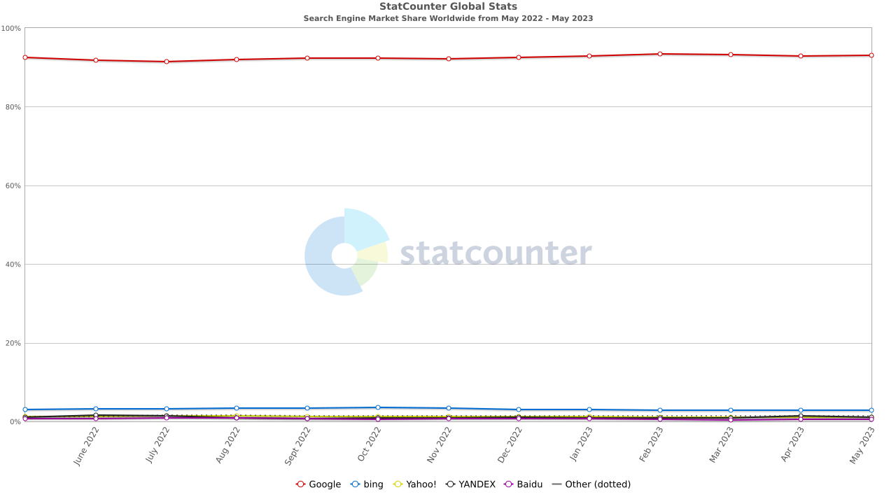
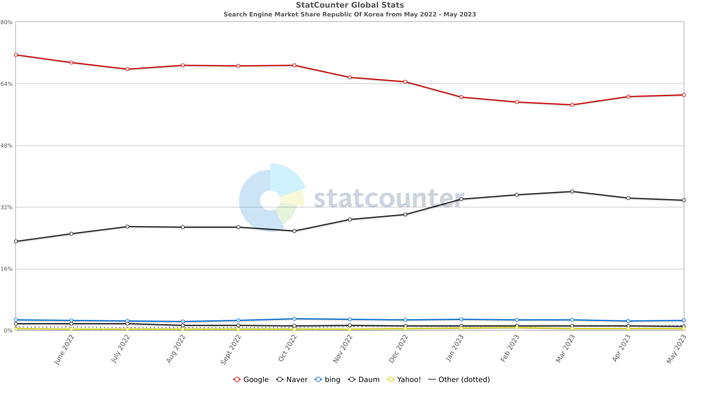
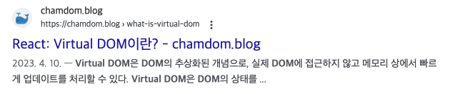

Gatsby 블로그를 제작하면서 구글 검색에 노출 시키기 위해서 SEO를 알게되었고, 좀 더 자세히 알아보고 이 글을 정리하게 되었다.




글로벌 검색엔진 점유율은 구글이 90%가 넘는 압도적인 점유율을 차지하고 있다. 또한 국내에서도 60% 이상의 점유율을 차지하고 있다. 따라서 구글 SEO를 기준으로 글을 작성하였다.

구글은 검색 순위 시스템이 유용하고 관련성 높은 정보를 제공하는지 평가하는 데 사용되는 E-A-T라는 개념을 사용한다. E-A-T는 다음과 같다.

- **E**xpertise(전문성)
- **A**uthoritativeness(권위)
- **T**rustworthiness(신뢰성)

2022년도에는 **E**에 Experience(경험)이 추가되었다. [링크](https://developers.google.com/search/blog/2022/12/google-raters-guidelines-e-e-a-t?hl=ko)

# 검색엔진 최적화(SEO)란?

**검색엔진 최적화(SEO, Search Engine Optimization)**란, 웹사이트를 최적화하여 검색 엔진의 자연스러운 검색 결과에서 더 높은 순위를 얻을 수 있도록 하는 것을 의미한다.

SEO에는 두 가지 주요 목표가 있다. 첫째는 사용자의 의도를 충족시킬 수 있는 고품질의 콘텐츠를 만들고 가치있는 정보를 제공하여 사용자 만족도를 높이 것이다. 둘째는 검색 엔진이 웹사이트를 찾고, 색인화하고, 콘텐츠를 이해할 수 있도록 돕는 것 즉, 검색엔진에 제대로 콘텐츠 내용을 전달하는 것이다.

## 검색엔진 처리 과정

구글 검색 엔진은 웹을 탐색하고 콘텐츠를 수집하여 인덱스를 생성하는 복잡한 시스템으로 동작한다. 이 과정은 크롤링, 인덱싱, 순위 결정이라는 세 가지 주요 단계로 나뉜다.

1. **크롤링:** 크롤링은 구글의 웹 크롤러(또는 "스파이더")가 인터넷을 브라우징하고, 웹 페이지의 각 URL을 발견하고 추적하는 과정이다. 크롤러는 이러한 페이지를 추적하고, 새롭게 추가되거나 수정된 페이지를 발견할 때마다 이를 수집한다.

2. **인덱싱:** 크롤링이 완료되면, 수집된 페이지는 구글의 인덱스에 추가된다. 인덱스는 웹의 거대한 데이터베이스로, 사용자의 검색 쿼리에 응답하는데 사용된다. 인덱싱 중에, 구글은 페이지의 콘텐츠(텍스트, 이미지 등)와 메타데이터(타이틀 태그, 메타 설명 등)를 분석한다. 이 과정에서 구글은 페이지의 주제를 이해하고, 사용자의 특정 검색 쿼리에 페이지가 얼마나 관련이 있는지 결정한다. 여기서 키워드의 중요성이 드러난다. 검색 쿼리와 관련된 키워드를 포함하고 있는 페이지가 해당 쿼리에 대한 결과로 나타날 가능성이 높다.

3. **순위 결정:** 검색 쿼리가 수행되면, 구글은 인덱스에서 가장 관련성이 높은 페이지를 찾아 순위를 매긴다. 이 과정에서 구글은 수많은 요인을 고려한다. 예를 들어, 페이지의 콘텐츠와 메타데이터, 페이지의 신뢰성, 페이지의 사용자 경험 등이다. 이러한 요인들은 구글의 검색 알고리즘에 의해 결정된다. 구글은 검색 알고리즘을 비밀로 하고 있기 때문에, SEO 전문가들은 검색 알고리즘을 이해하고, 검색 순위를 높이기 위한 최적의 전략을 개발하기 위해 노력하고 있다.

# 검색엔진 최적화를 위한 작업

## title 태그

```html
<title>검색엔진 최적화(SEO)란 무엇인가?</title>
```

`title` 태그는 웹 페이지의 `<head>` 태그 내에 위치하며 웹 페이지의 제목을 정의한다. `title` 태그는 검색 결과에 표시되는 페이지의 제목을 나타내므로 검색 엔진 최적화에 중요하다.

## 메타태그(Meta Tag)

메타태그는 웹 페이지의 정보를 설명하는 태그이다. 메타태그는 웹 페이지의 HTML 코드에 추가되며, 웹 브라우저에는 표시되지 않는다. 대신, 메타태그는 웹 페이지의 정보를 검색 엔진에 전달하는 데 사용된다. 메타태그는 웹 페이지의 제목, 설명, 키워드 등을 포함한다.

### description 태그



```html
<meta name="description" content="....." />
```

`description` 태그는 메타 디스크립션이라고 부르는데, 웹페이지의 설명을 요약하는 짧은 문장이다. 검색엔진의 검색 결과 순위에 평가항목으로 거의 무시하기 떄문에 검색 키워드를 여러번 반복하더라도 검색 순위에 영향을 미치지 않는다. 하지만 사용자가 검색 결과를 보고 웹 페이지를 방문할지 결정하는 데 중요한 역할을 한다. 따라서 메타 디스크립션은 웹 페이지의 콘텐츠를 요약하고, 사용자의 관심을 끌기 위해 사용자에게 유용한 정보를 제공해야 한다.

### keyword 태그

```html
<meta name="keyword" content="HTML, CSS, JavaScript" />
```

`keyword` 태그는 HTML 문서에서 웹 페이지의 주요 키워드를 나열하는 데 사용된다. 이 태그는 웹 페이지가 어떤 주제에 관한 것인지를 검색 엔진에게 알려주는 역할을 한다.

그러나 이 태그는 과거에 키워드 스태핑(페이지를 랭크시키기 위해 무려한 키워드 사용)과 같은 악용 사례 때문에, 현재 대부분의 주요 검색 엔진들이 무시하게 되었다. 이로 인해 현재 SEO에 별로 영향을 미치지 않는다.

### robots 태그

웹 페이지가 검색 엔진에 의해 어떻게 처리되어야 하는지를 알려주는 메타 태그로, 검색 엔진 크롤러가 페이지를 인덱싱하거나, 링크를 따라가거나, 페이지의 특정 버전을 사용하는 것을 제어할 수 있다.

크롤러에게 웹 페이지를 읽어가서 색인하도록 허락하는 `index`

```html
<meta name="robots" content="index" />
```

크롤러에게 웹 페이지를 읽어가지 않도록하는 `noindex`

```html
<meta name="robots" content="noindex" />
```

크롤러에게 페이지 내의 링크로 연결된 웹 페이지로 이동하는 것을 허락하는 `follow`

```html
<meta name="robots" content="follow" />
```

크롤러에게 페이지 내의 링크로 연결된 웹 페이지로 이동을 허락하지 않는 `nofollow`

```html
<meta name="robots" content="nofollow" />
```

`robots` 태그가 없는 경우, 대부분의 검색 엔진은 페이지를 인덱싱하고, 링크를 따라가는 것을 기본값으로 한다. 따라서 이 태그는 주로 페이지를 인덱싱하거나, 링크를 따라가는 것을 **제한**하려는 경우에 사용된다.

## 오픈 그래프(Open Graph) 태그

Open Graph 태그는 웹 페이지가 소셜 미디어 플랫폼에서 어떻게 표시되는지 제어하는데 사용되는 메타 태그다. Open Graph 프로토콜은 원래 Facebook에 의해 만들어졌지만, 이제는 다양한 소셜 미디어 플랫폼에서 지원한다.

Open Graph 태그는 웹 페이지의 `<head>` 섹션 내에 위치하며, 각 태그는 og:라는 접두어로 시작한다.

웹페이지의 제목을 나타내는 `og:title`

```html
<meta property="og:title" content="....." />
```

웹페이지의 설명을 나타내는 `og:description`

```html
<meta property="og:description" content="....." />
```

웹페이지의 URL을 나타내는 `og:url`

```html
<meta property="og:url" content="https://chamdom.blog" />
```

웹페이지의 썸네일 이미지를 나타내는 `og:image`

```html
<meta property="og:image" content="https://chamdom.blog/og-image.png" />
```

# 마치며

SEO에 대해서 알아보면서 블로그를 제작하면서 놓쳤던 부분들을 알게되었다. 메타 태그가 검색 결과 상위 랭크로 올리는데 큰 영향을 미치지 않는다는 것도 알게 되었다. 양질의 컨텐츠를 제공하는 것이 우선되어야 하고 그때 메타 태그가 더해지면 빛을 바랄 수 있을 것이다. 이 블로그를 제작하면서 SEO 설정을 하는 방법을 정리해 두었으니 [관련 포스팅](https://chamdom.blog/gatsby-blog-seo/)을 참고하면 좋을 것 같다.

<br />

---

# 참고

- [메타 태그를 통한 검색엔진 최적화 (SEO)](https://www.daleseo.com/html-meta-tags-for-seo/)
- [검색엔진 최적화(SEO)란?](https://yozm.wishket.com/magazine/detail/1540/)
- [What Is SEO And Why Is It Important?](https://www.reliablesoft.net/what-is-search-engine-optimization-and-why-is-it-important/)
