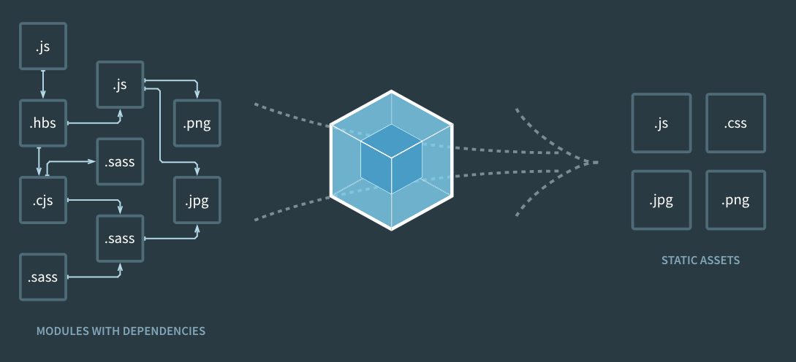

# 웹팩(Webpack) 이란?

**웹팩(Webpack)**은 모듈 번들러(Module Bundler)로, 웹 애플리케이션을 구성하는 자원(HTML, CSS, JavaScript, Images, 폰트 등)을 모두 모듈로 보고 이를 조합해 병합된 하나의 결과물을 만드는 도구다. Webpack은 자바스크립트 애플리케이션을 위한 모듈 번들러이지만, CSS, HTML, 폰트 등 다양한 자원을 모듈로 사용할 수 있다. Webpack은 자바스크립트 애플리케이션을 위한 모듈 번들러이지만, CSS, HTML, 폰트 등 다양한 자원을 모듈로 사용할 수 있다.

# Webpack의 구성요소

### Entry

Entry는 웹팩에서 웹 자원을 변환하기 위해 필요한 최초 진입점이자 자바스크립트 파일이다. Entry 파일에서 웹팩은 의존성 그래프를 생성하고, 이를 통해 웹 자원을 변환한다. Entry 파일은 웹팩 설정 파일(webpack.config.js)에서 `entry` 속성을 통해 설정할 수 있다.

```js
// webpack.config.js
module.exports = {
  entry: './src/index.js',
};
```

### Output

Output은 웹팩을 통해 변환된 결과물의 파일 경로와 이름을 설정한다. Output은 웹팩 설정 파일(webpack.config.js)에서 `output` 속성을 통해 설정할 수 있다.

- **path:** 번들링된 결과물의 위치를 설정.
- **filename:** 번들링된 결과물의 파일 이름을 설정.

```js
// webpack.config.js
module.exports = {
  output: {
    path: path.resolve(__dirname, 'dist'),
    filename: 'bundle.js',
    // filename: '[name].[contenthash].bundle.js',
    chunkFilename: '[name].[contenthash].chunk.bundle.js',
    publicPath: '/',
  },
};
```

`filename`을 `[name].[contenthash].js` 로 설정하면, 파일이 변경될 때마다 새로운 파일명으로 생성된다. 이렇게 하면, 브라우저 캐시를 피할 수 있다. <br/>
`chunkFilename` 옵션을 사용하면, 웹팩이 코드 스플리팅을 통해 생성한 청크 파일의 이름을 설정할 수 있다. chunkFilename 옵션을 설정하지 않으면, filename 옵션을 사용한다.<br/>
`publicPath` 옵션은 웹팩이 생성한 번들 파일을 참조할 때 사용하는 경로를 설정한다. publicPath 옵션을 설정하지 않으면, 기본값으로 `output.path`가 사용된다.

> **✍🏻 filename을 [name].[contenthash].js 로 설정하는 이유**
>
> filename을 `[name].[contenthash].js`로 설정하는 이유는, **파일 캐싱**을 활용하여 브라우저 캐시를 잘 활용할 수 있기 때문이다.
>
> filename 속성은 Webpack에서 출력 파일 이름을 설정하는 속성이다. [name]은 entry의 이름으로 대체되며, [contenthash]는 파일 내용에 따라 생성된 고유 해시 값이다.
>
> `[contenthash]`**는 파일 내용이 변경되지 않은 경우 이전 파일과 같은 해시 값이 생성된다.** 이는 브라우저가 파일 캐시를 재활용할 수 있도록 해준다. 따라서, 파일 내용이 변경되지 않는 한 브라우저는 이전에 캐시된 파일을 사용하게 된다. 즉, 캐시된 파일을 사용하므로 브라우저의 로딩 속도가 빨라지고 서버의 부하가 줄일 수 있다.

### Loader

Loader는 웹팩에서 웹 자원을 변환할 때 사용하는 속성이다. Loader는 웹팩 설정 파일(webpack.config.js)에서 `module.rules` 속성을 통해 설정할 수 있다.

**기본적으로 webpack은 JavaScript와 JSON 파일만 이해할 수 있다. 하지만 Loader를 사용하면 웹팩이 다른 타입의 파일들도 처리할 수 있도록 도와준다.**

- **test:** 변환할 파일의 확장자를 설정.
- **exclude:** 제외할 파일 또는 폴더를 설정.
- **use:** 적용할 Loader를 설정.

```js
// webpack.config.js
module.exports = {
  module: {
    rules: [
      {
        test: /\.js$/,
        exclude: /node_modules/,
        use: ['babel-loader'],
      },
    ],
  },
};
```

### Plugin

Plugin은 웹팩의 기본적인 동작에 추가적인 기능을 제공한다. Plugin은 웹팩 설정 파일(webpack.config.js)에서 `plugins` 속성을 통해 설정할 수 있다.
Plugin을 사용하면 다음과 같은 작업을 할 수 있다.

**1. 번들된 결과물의 최적화 작업** <br/>
`UglifyJSPlugin`을 사용하여 JavaScript 코드를 압축하고 난독화할 수 있고, `OptimizeCSSAssetsPlugin`을 사용하여 CSS 코드를 압축할 수 있다.

```js
// webpack.config.js
const UglifyJSPlugin = require('uglifyjs-webpack-plugin');
const OptimizeCSSAssetsPlugin = require('optimize-css-assets-webpack-plugin');

module.exports = {
  optimization: {
    minimizer: [new UglifyJSPlugin(), new OptimizeCSSAssetsPlugin()],
  },
};
```

**2. 환경 변수 주입** <br/>
`DefinePlugin`을 사용하여 환경 변수를 주입하여 애플리케이션의 설정을 변경할 수 있다.

```js
// webpack.config.js
module.exports = {
  plugins: [
    new webpack.DefinePlugin({
      'process.env.NODE_ENV': JSON.stringify('production'),
    }),
  ],
};
```

**3. 번들 파일 분석** <br/>
`BundleAnalyzerPlugin`을 사용하여 번들 파일의 구성 요소 및 파일 크기 등을 시각적으로 분석할 수 있다.

```js
// webpack.config.js
const BundleAnalyzerPlugin =
  require('webpack-bundle-analyzer').BundleAnalyzerPlugin;

module.exports = {
  plugins: [new BundleAnalyzerPlugin()],
};
```

**4. HTML 파일 생성** <br/>
`HtmlWebpackPlugin`을 사용하여 HTML 파일을 자동으로 생성하고 번들링된 결과물을 자동으로 추가할 수 있다.

```js
// webpack.config.js
const HtmlWebpackPlugin = require('html-webpack-plugin');

module.exports = {
  plugins: [
    new HtmlWebpackPlugin({
      template: './public/index.html',
    }),
  ],
};
```

**5. 번들 파일 이름 변경** <br/>
`HashedModuleIdsPlugin`을 사용하여 번들 파일의 이름을 변경할 수 있고, `MiniCssExtractPlugin`을 사용하여 CSS 파일의 이름을 변경할 수 있다.

```js
// webpack.config.js
const MiniCssExtractPlugin = require('mini-css-extract-plugin');

module.exports = {
  plugins: [
    new MiniCssExtractPlugin({
      filename: '[name].[contenthash].css',
    }),
  ],
};
```

**6. 번들 파일 복사** <br/>
`CopyWebpackPlugin`을 사용하여 번들 파일을 복사할 수 있다.

```js
// webpack.config.js
const CopyWebpackPlugin = require('copy-webpack-plugin');

module.exports = {
  plugins: [
    new CopyWebpackPlugin({
      patterns: [
        {
          from: 'public',
          globOptions: {
            ignore: ['**/index.html'],
          },
        },
      ],
    }),
  ],
};
```

위에서 언급한 Plugin 말고도 다양한 Plugin이 존재한다. 자세한 내용은 [Webpack Plugin](https://webpack.js.org/plugins/)을 참고하자.

### Mode

Webpack의 mode는 빌드 모드를 설정하는 속성이다. mode는 웹팩 설정 파일(webpack.config.js)에서 `mode` 속성을 통해 설정할 수 있다. `mode` 속성은 `development`, `production`, `none` 중 하나를 설정할 수 있다.

**1. development** <br/>
`mode`를 `development`로 설정하면 웹팩은 **개발 환경에서 최적화된 빌드를 수행한다.** 개발용 빌드에서는 디버깅이 용이하도록 소스 맵을 제공하고, 빌드 속도를 높이기 위해 번들 파일의 크기를 줄이는 최적화 작업을 수행하지 않는다.

**2. production** <br/>
`mode`를 `production`로 설정하면 웹팩은 **배포 환경에서 최적화된 빌드를 수행한다.** 배포용 빌드에서는 최적화된 코드를 생성하여 파일 크기를 줄이고, 불필요한 코드를 제거하여 빌드 속도를 높인다. 또한, 개발용 빌드에서는 제공하지 않는 코드 난독화와 같은 보안 관련 기능을 제공한다.

**3. none** <br/>
`mode`를 `none`으로 설정하면 웹팩은 **아무 설정도 적용하지 않는다.** `mode`를 `none`으로 설정하면 `mode`를 설정하지 않은 것과 동일한 결과를 얻는다.

# Webpack Dev Server를 사용한 개발 환경 구성

**Webpack Dev Server**는 Webpack에서 제공하는 개발 서버로, 개발 과정에서 빠르게 변화를 확인하고 디버깅할 수 있는 환경을 제공한다. Webpack Dev Server를 사용하면, 소스 코드 변경 사항이 발생할 때마다 자동으로 다시 빌드하여 브라우저에 반영되므로 개발 생산성을 높일 수 있다. 즉, 새로고침을 할 필요 없이 코드를 수정하면 브라우저에 반영된다.

Webpack Dev Server를 사용한 개발 환경 구성 방법은 다음과 같다.

**1. Webpack Dev Server 설치**

```bash
npm i -D webpack-dev-server
# or
yarn add -D webpack-dev-server
```

**2. Webpack 설정 파일에 Webpack Dev Server 설정 추가**

```js
// webpack.config.js
module.exports = {
  // ...
  devServer: {
    contentBase: path.join(__dirname, 'dist'),
    compress: true,
    port: 3000,
  },
};
```

위 설정은 Webpack Dev Server가 `dist` 디렉토리를 기준으로 정적 파일을 제공하고, 압축을 사용하며, 포트 번호를 3000으로 설정한다는 의미다. Webpack Dev Server는 기본적으로 `8080` 포트를 사용하므로, 만약 기본 포트가 이미 사용 중이라면 다른 포트를 사용해야 한다.

`contentBase` 옵션을 사용하여 정적 파일을 제공할 디렉토리를 지정할 수 있다. 이 옵션을 사용하지 않으면 Webpack Dev Server는 `webpack.config.js` 파일이 위치한 디렉토리를 기준으로 정적 파일을 제공한다. 만약 `contentBase` 옵션을 사용하지 않고 `dist` 디렉토리를 기준으로 정적 파일을 제공하고 싶다면, 다음과 같이 `webpack.config.js` 파일을 수정하면 된다.

```js
// webpack.config.js
module.exports = {
  // ...
  devServer: {
    contentBase: path.join(__dirname, 'dist'),
    compress: true,
    port: 3000,
  },
  output: {
    path: path.join(__dirname, 'dist'),
    filename: '[name].bundle.js',
  },
};
```

**3. Webpack Dev Server 실행**

```bash
npx webpack-dev-server
# or
yarn webpack-dev-server
```

위 명령어를 실행하면 Webpack Dev Server가 실행된다. 이제 `http://localhost:3000`으로 접속하면, `dist` 디렉토리에 있는 정적 파일을 제공받을 수 있다. 또한, `dist` 디렉토리에 있는 파일이 변경되면 자동으로 브라우저에 반영된다.
